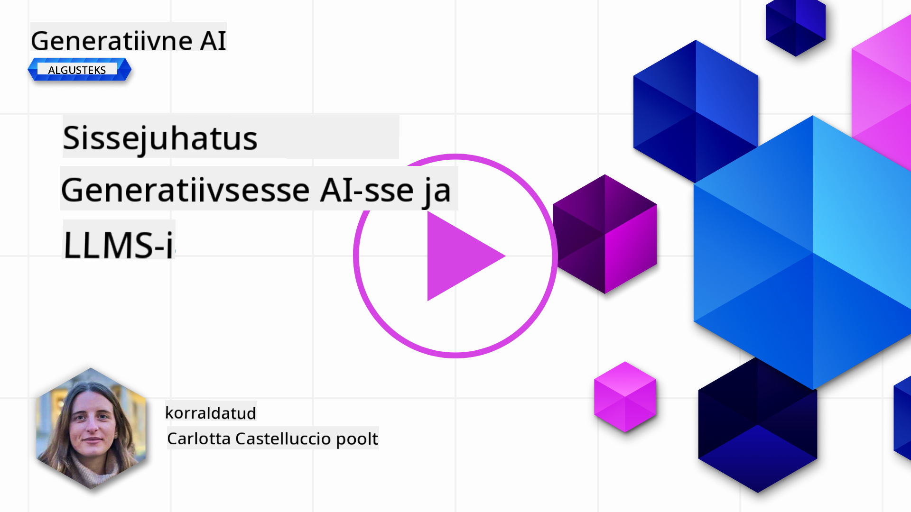
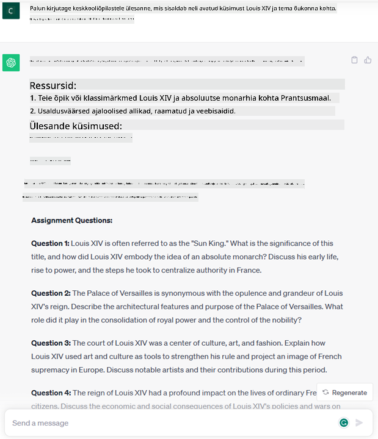
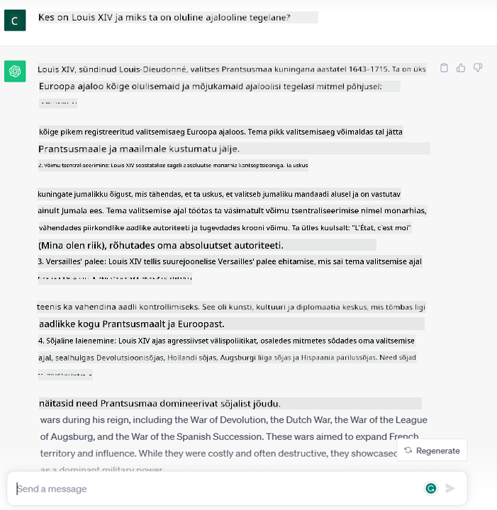
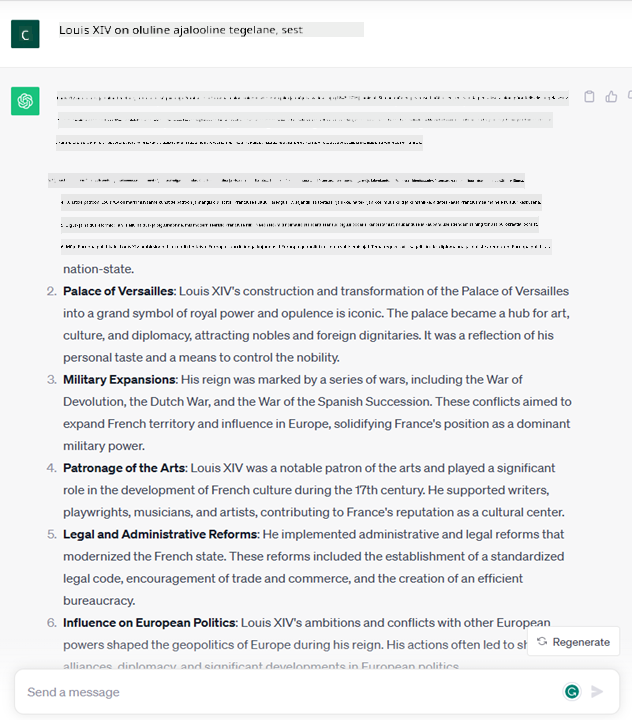
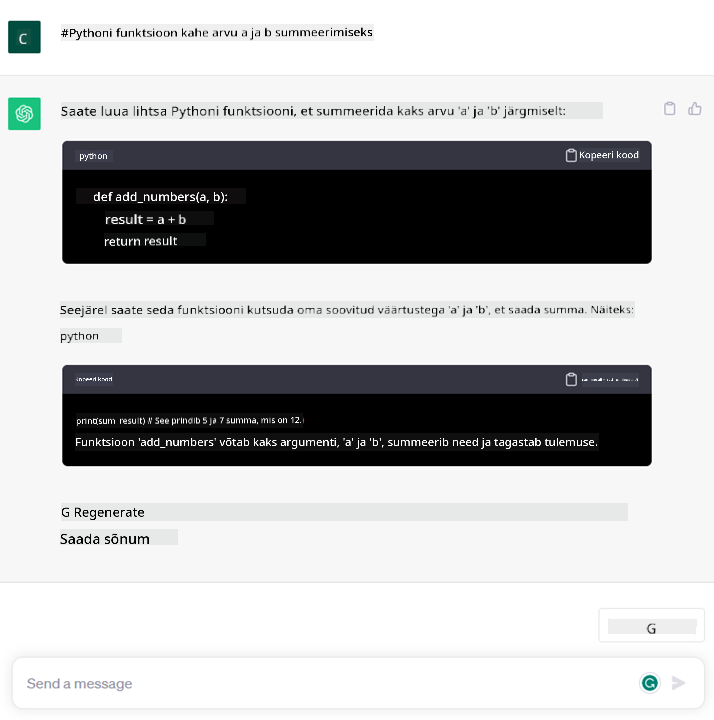

<!--
CO_OP_TRANSLATOR_METADATA:
{
  "original_hash": "f53ba0fa49164f9323043f1c6b11f2b1",
  "translation_date": "2025-10-11T11:18:20+00:00",
  "source_file": "01-introduction-to-genai/README.md",
  "language_code": "et"
}
-->
# Sissejuhatus generatiivsesse tehisintellekti ja suurtesse keelemudelitesse

_(Klõpsake ülaloleval pildil, et vaadata selle õppetunni videot)_

Generatiivne tehisintellekt on tehisintellekti tüüp, mis suudab luua teksti, pilte ja muud tüüpi sisu. Mis teeb selle tehnoloogia nii hämmastavaks, on see, et see demokratiseerib tehisintellekti – igaüks saab seda kasutada, sisestades lihtsalt tekstilise juhise, näiteks loomulikus keeles kirjutatud lause. Teil ei ole vaja õppida programmeerimiskeeli nagu Java või SQL, et midagi väärtuslikku saavutada – piisab, kui kasutate oma keelt, väljendate, mida soovite, ja tehisintellekti mudel pakub teile ettepaneku. Selle rakendused ja mõju on tohutud – saate kirjutada või mõista aruandeid, koostada rakendusi ja palju muud, seda kõike sekunditega.

Selles õppekavas uurime, kuidas meie idufirma kasutab generatiivset tehisintellekti, et avada uusi võimalusi haridusmaailmas, ning kuidas me tegeleme selle rakendamisega seotud sotsiaalsete mõjude ja tehnoloogiliste piirangutega.

## Sissejuhatus

Selles õppetükis käsitleme:

- Ärisituatsiooni tutvustus: meie idufirma idee ja missioon.
- Generatiivne tehisintellekt ja kuidas me jõudsime praegusesse tehnoloogilisse maastikku.
- Suure keelemudeli sisemine toimimine.
- Suurte keelemudelite peamised võimed ja praktilised kasutusjuhtumid.

## Õpieesmärgid

Pärast selle õppetunni läbimist mõistate:

- Mis on generatiivne tehisintellekt ja kuidas töötavad suured keelemudelid.
- Kuidas saate kasutada suuri keelemudeleid erinevateks kasutusjuhtudeks, keskendudes haridussituatsioonidele.

## Stsenaarium: meie hariduslik idufirma

Generatiivne tehisintellekt (AI) esindab tehisintellekti tehnoloogia tippu, nihutades piire, mida kunagi peeti võimatuks. Generatiivsetel AI-mudelitel on mitmeid võimeid ja rakendusi, kuid selles õppekavas uurime, kuidas see revolutsioneerib haridust läbi väljamõeldud idufirma. Viitame sellele idufirmale kui _meie idufirma_. Meie idufirma tegutseb hariduse valdkonnas, omades ambitsioonikat missiooni:

> _parandada õppimise kättesaadavust globaalsel tasandil, tagades võrdse juurdepääsu haridusele ja pakkudes igale õppijale vastavalt tema vajadustele isikupärastatud õpikogemusi_.

Meie idufirma meeskond on teadlik, et me ei suuda seda eesmärki saavutada ilma ühe tänapäeva võimsaima tööriistata – suurte keelemudeliteta (LLM-id).

Generatiivne tehisintellekt on oodatud revolutsioneerima viisi, kuidas me täna õpime ja õpetame, pakkudes õpilastele virtuaalseid õpetajaid, kes on saadaval 24 tundi ööpäevas, pakkudes tohutul hulgal teavet ja näiteid, ning võimaldades õpetajatel kasutada uuenduslikke tööriistu oma õpilaste hindamiseks ja tagasiside andmiseks.

Alustuseks määratleme mõned põhimõisted ja terminid, mida kasutame kogu õppekava jooksul.

## Kuidas me jõudsime generatiivse tehisintellektini?

Hoolimata viimasel ajal generatiivsete AI-mudelite väljakuulutamisega kaasnenud erakordsest _hüppest_, on see tehnoloogia olnud aastakümneid arendamisel, ulatudes esimestest uurimispüüdlustest 1960. aastatesse. Oleme nüüd jõudnud punkti, kus tehisintellektil on inimlikud kognitiivsed võimed, nagu vestlus, mida näitavad näiteks [OpenAI ChatGPT](https://openai.com/chatgpt) või [Bing Chat](https://www.microsoft.com/edge/features/bing-chat?WT.mc_id=academic-105485-koreyst), mis kasutab samuti GPT-mudelit veebipõhisteks Bing-vestlusteks.

Tagasi vaadates koosnesid AI esimesed prototüübid kirjutusmasinal põhinevatest vestlusrobotitest, mis tuginesid ekspertide rühmalt saadud teadmistebaasile, mis oli arvutisse esitatud. Teadmistebaasi vastused käivitati sisendteksti märksõnade abil.  
Kuid peagi sai selgeks, et selline lähenemine, kasutades kirjutusmasinal põhinevaid vestlusroboteid, ei olnud hästi skaleeritav.

### Statistiline lähenemine tehisintellektile: masinõpe

Murrang toimus 1990. aastatel, kui tekstianalüüsis hakati rakendama statistilist lähenemist. See viis uute algoritmide – tuntud kui masinõpe – väljatöötamiseni, mis suutsid õppida mustreid andmetest ilma otsese programmeerimiseta. See lähenemine võimaldas masinatel simuleerida inimkeele mõistmist: statistiline mudel treeniti tekst-sildi paaride põhjal, võimaldades mudelil klassifitseerida tundmatut sisendteksti eelnevalt määratletud sildiga, mis esindas sõnumi kavatsust.

### Neuraalvõrgud ja kaasaegsed virtuaalsed assistendid

Viimastel aastatel on riistvara tehnoloogiline areng, mis võimaldab töödelda suuremaid andmemahtusid ja keerukamaid arvutusi, soodustanud tehisintellekti uurimistööd, viies arenenud masinõppe algoritmide, mida tuntakse neuraalvõrkude või süvaõppe algoritmidena, väljatöötamiseni.

Neuraalvõrgud (eriti korduvad neuraalvõrgud – RNN-id) parandasid oluliselt loomuliku keele töötlemist, võimaldades tekstide tähendust esitada sisukamal viisil, väärtustades sõna konteksti lauses.

See tehnoloogia toetas virtuaalsete assistentide arengut, mis sündisid uue sajandi esimesel kümnendil ja olid väga osavad inimkeele tõlgendamises, vajaduste tuvastamises ja tegevuste sooritamises nende rahuldamiseks – näiteks vastates eelnevalt määratletud skriptiga või kasutades kolmanda osapoole teenust.

### Tänapäev, generatiivne tehisintellekt

Nii jõudsimegi tänapäeva generatiivse tehisintellektini, mida võib pidada süvaõppe alamhulgaks.

Pärast aastakümneid kestnud uurimistööd tehisintellekti valdkonnas ületas uus mudeli arhitektuur – nimega _Transformer_ – RNN-ide piirangud, olles võimeline vastu võtma palju pikemaid tekstijadasid sisendina. Transformerid põhinevad tähelepanumehhanismil, mis võimaldab mudelil anda erinevatele sisenditele erineva kaalu, pöörates rohkem tähelepanu seal, kus on kõige olulisem teave, sõltumata nende järjekorrast tekstijadas.

Enamik hiljutisi generatiivseid AI-mudeleid – tuntud ka kui suured keelemudelid (LLM-id), kuna need töötavad tekstisisendite ja -väljunditega – põhinevad just sellel arhitektuuril. Huvitav nende mudelite juures – mis on treenitud tohutul hulgal märgistamata andmetel, mis pärinevad erinevatest allikatest nagu raamatud, artiklid ja veebilehed – on see, et neid saab kohandada väga erinevate ülesannete jaoks ning need suudavad genereerida grammatiliselt korrektset teksti, mis jätab loomingulise mulje. Seega ei ole need mudelid mitte ainult oluliselt parandanud masina võimet mõista sisendteksti, vaid võimaldavad ka originaalse vastuse loomist inimkeeles.

## Kuidas töötavad suured keelemudelid?

Järgmises peatükis uurime erinevat tüüpi generatiivseid AI-mudeleid, kuid praegu vaatame, kuidas töötavad suured keelemudelid, keskendudes OpenAI GPT (Generative Pre-trained Transformer) mudelitele.

- **Tokeniseerija, tekst numbriteks**: Suured keelemudelid võtavad sisendiks teksti ja genereerivad väljundiks teksti. Kuid kuna need on statistilised mudelid, töötavad need palju paremini numbrite kui tekstijadadega. Seetõttu töödeldakse iga mudelile antud sisend esmalt tokeniseerija abil. Token on tekstitükk – koosnedes muutuvast arvust tähemärkidest, nii et tokeniseerija peamine ülesanne on jagada sisend tokenite massiiviks. Seejärel kaardistatakse iga token tokeni indeksiga, mis on algse tekstitüki täisarvuline kodeering.

- **Väljundtokenite ennustamine**: Arvestades n tokenit sisendina (kus maksimaalne n varieerub mudelist sõltuvalt), suudab mudel ennustada ühe tokeni väljundina. See token lisatakse seejärel järgmise iteratsiooni sisendisse, moodustades laieneva akna mustri, mis võimaldab paremat kasutajakogemust, saades vastuseks ühe (või mitu) lauset. See selgitab, miks, kui olete kunagi ChatGPT-d kasutanud, võisite märgata, et mõnikord tundub, nagu see peatuks lause keskel.

- **Valikuprotsess, tõenäosusjaotus**: Väljundtoken valitakse mudeli poolt vastavalt selle tõenäosusele esineda pärast praegust tekstijada. See on tingitud asjaolust, et mudel ennustab tõenäosusjaotuse kõigi võimalike ‘järgmiste tokenite’ üle, mis arvutatakse selle treeningu põhjal. Kuid mitte alati ei valita jaotusest kõige tõenäolisemat tokenit. Selle valiku juurde lisatakse teatud määral juhuslikkust, nii et mudel käitub mitte-deterministlikul viisil – me ei saa täpselt sama väljundit sama sisendi korral. See juhuslikkuse määr lisatakse, et simuleerida loomingulise mõtlemise protsessi, ja seda saab häälestada mudeli parameetri nimega temperatuur.

## Kuidas meie idufirma saaks kasutada suuri keelemudeleid?

Nüüd, kui mõistame paremini suure keelemudeli sisemist toimimist, vaatame mõningaid praktilisi näiteid kõige tavalisematest ülesannetest, mida need suudavad üsna hästi täita, keskendudes meie äristsenaariumile.  
Me ütlesime, et suure keelemudeli peamine võime on _luua teksti nullist, alustades loomulikus keeles kirjutatud tekstilisest sisendist_.

Aga millist tüüpi tekstiline sisend ja väljund?  
Suure keelemudeli sisendit nimetatakse promptiks, samas kui väljundit nimetatakse completion'iks, mis viitab mudeli mehhanismile genereerida järgmine token, et täiendada praegust sisendit. Me süveneme hiljem sellesse, mis on prompt ja kuidas seda kujundada nii, et mudelist maksimaalselt kasu saada. Kuid praegu ütleme lihtsalt, et prompt võib sisaldada:

- **Juhist**, mis täpsustab, millist tüüpi väljundit me mudelilt ootame. See juhis võib mõnikord sisaldada näiteid või lisateavet.

  1. Artikli, raamatu, tootearvustuste jms kokkuvõte koos struktureerimata andmetest saadud ülevaadetega.
    
    
  
  2. Loominguline ideede genereerimine ja artikli, essee, ülesande või muu kujundamine.
      
     

- **Küsimust**, mis esitatakse vestluse vormis agendiga.
  
  

- **Tekstilõiku, mida täiendada**, mis on kaudselt abipalve kirjutamisel.
  
  

- **Koodilõiku** koos selgituse ja dokumentatsiooni küsimisega või kommentaari, mis palub genereerida koodilõigu konkreetse ülesande täitmiseks.
  
  

Ülaltoodud näited on üsna lihtsad ja ei ole mõeldud suurte keelemudelite võimete ammendavaks demonstreerimiseks. Need on mõeldud näitama generatiivse tehisintellekti kasutamise potentsiaali, eriti, kuid mitte ainult, hariduskontekstis.

Samuti ei ole generatiivse AI mudeli väljund täiuslik ja mõnikord võib mudeli loomingulisus töötada selle vastu, tulemuseks on väljund, mis on sõnade kombinatsioon, mida inimkasutaja võib tõlgendada reaalsuse moonutusena või mis võib olla solvav. Generatiivne tehisintellekt ei ole intelligentne – vähemalt mitte intelligentsuse laiemas tähenduses, mis hõlmab kriitilist ja loomingulist mõtlemist või emotsionaalset intelligentsust; see ei ole deterministlik ja see ei ole usaldusväärne, kuna väljamõeldised, nagu valed viited, sisu ja väited, võivad olla kombineeritud õige teabega ja esitatud veenval ning enesekindlal viisil. Järgmistes õppetundides tegeleme kõigi nende piirangutega ja vaatame, mida saame teha nende leevendamiseks.

## Ülesanne

Teie ülesanne on lugeda rohkem [generatiivsest tehisintellektist](https://en.wikipedia.org/wiki/Generative_artificial_intelligence?WT.mc_id=academic-105485-koreyst) ja proovida tuvastada valdkond, kuhu lisaksite täna generatiivse tehisintellekti, kus seda veel ei ole. Kuidas oleks mõju erinev võrreldes "vana viisi" kasutamisega, kas saaksite teha midagi, mida varem ei saanud, või oleksite kiirem? Kirjutage 300-sõnaline kokkuvõte sellest, milline oleks teie unistuste AI-idufirma, ja lisage pealkirjad nagu "Probleem", "Kuidas ma kasutaksin AI-d", "Mõju" ja soovi korral äriplaan.

Kui teete selle ülesande, võite olla valmis kandideerima Microsofti inkubaatorisse, [Microsoft for Startups Founders Hub](https://www.microsoft.com/startups?WT.mc_id=academic-105485-koreyst), kus pakume krediite nii Azure'ile, OpenAI-le, mentorlusele ja palju muule – vaadake järele!

## Teadmiste kontroll

Mis on tõsi suurte keelemudelite kohta?

1. Saate iga kord täpselt sama vastuse.
2. See teeb asju täiuslikult, on suurepärane arvude liitmisel, töötava koodi loomisel jne.
3. Vastus võib varieeruda hoolimata sama prompti kasutamisest. See on ka suurepärane esimese mustandi andmiseks, olgu see tekst või kood. Kuid peate tulemusi parandama.

V: 3, LLM on mitte-deterministlik, vastus varieerub, kuid selle varieeruvust saab kontrollida temperatuuri seadistuse abil. Samuti ei tohiks oodata, et see teeb asju täiuslikult – see on siin selleks, et teha teie eest raske töö, mis sageli tähendab, et saate hea esimese katse, mida peate järk-järgult täiustama.

## Suurepärane töö! Jätkake teekonda

Pärast selle õppetunni lõpetamist vaadake meie [Generatiivse tehisintellekti õppekollektsiooni](https://aka.ms/genai-collection?WT.mc_id=academic-105485-koreyst), et jätkata oma teadmiste arendamist generatiivse tehisintellekti vallas!
Liigu 2. õppetundi, kus uurime, kuidas [avastada ja võrrelda erinevaid LLM-i tüüpe](../02-exploring-and-comparing-different-llms/README.md?WT.mc_id=academic-105485-koreyst)!

---

**Lahtiütlus**:  
See dokument on tõlgitud AI tõlketeenuse [Co-op Translator](https://github.com/Azure/co-op-translator) abil. Kuigi püüame tagada täpsust, palume arvestada, et automaatsed tõlked võivad sisaldada vigu või ebatäpsusi. Algne dokument selle algses keeles tuleks pidada autoriteetseks allikaks. Olulise teabe puhul soovitame kasutada professionaalset inimtõlget. Me ei vastuta selle tõlke kasutamisest tulenevate arusaamatuste või valesti tõlgenduste eest.