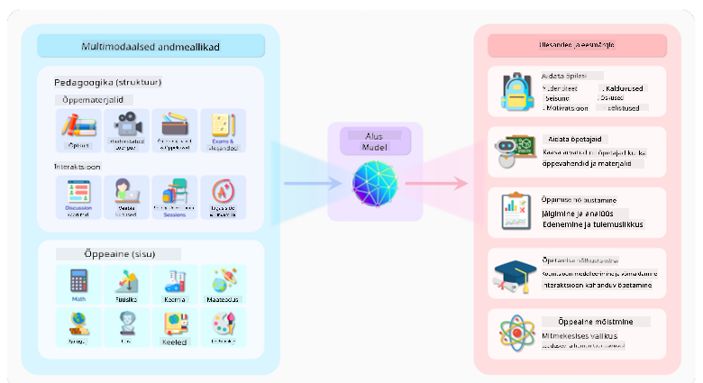
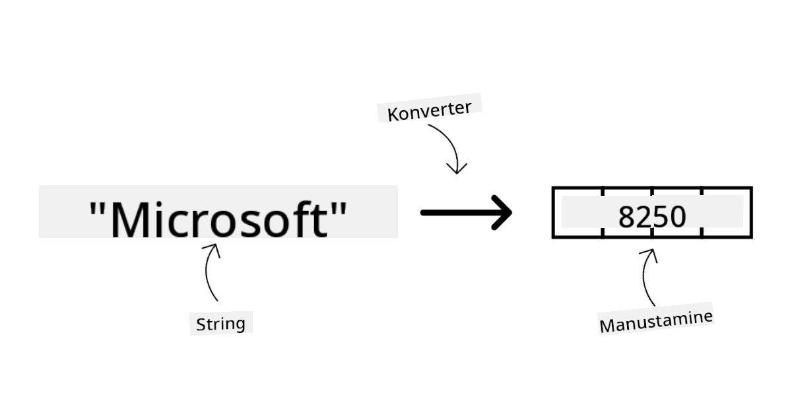
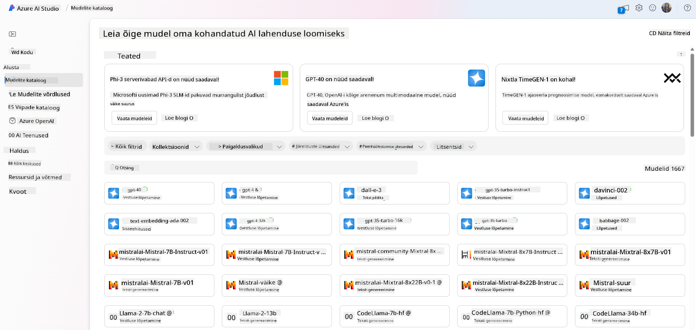
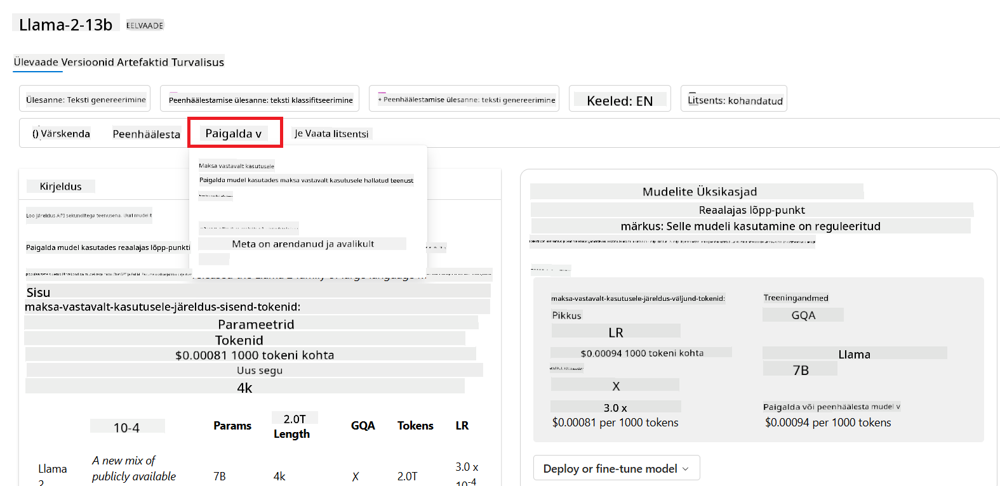
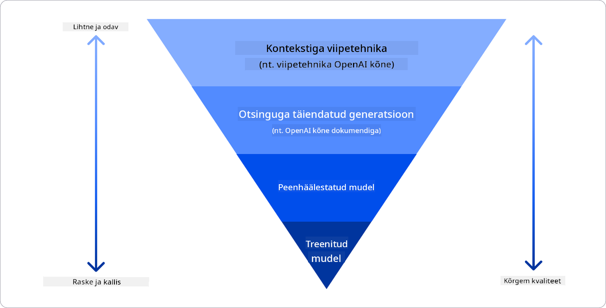

<!--
CO_OP_TRANSLATOR_METADATA:
{
  "original_hash": "e2f686f2eb794941761252ac5e8e090b",
  "translation_date": "2025-10-11T11:48:29+00:00",
  "source_file": "02-exploring-and-comparing-different-llms/README.md",
  "language_code": "et"
}
-->
# Uurimine ja erinevate LLM-ide võrdlemine

> _Klõpsake ülaloleval pildil, et vaadata selle õppetunni videot_

Eelmises õppetunnis nägime, kuidas generatiivne tehisintellekt muudab tehnoloogilist maastikku, kuidas suured keelemudelid (LLM-id) töötavad ja kuidas ettevõte - näiteks meie idufirma - saab neid oma kasutusjuhtumites rakendada ja kasvada! Selles peatükis võrdleme ja vastandame erinevaid suuri keelemudeleid (LLM-e), et mõista nende eeliseid ja puudusi.

Meie idufirma järgmine samm on uurida LLM-ide praegust maastikku ja mõista, millised neist sobivad meie kasutusjuhtumile.

## Sissejuhatus

Selles õppetunnis käsitletakse:

- Erinevaid LLM-e praeguses maastikus.
- Mudelite testimist, iteratsiooni ja võrdlemist Azure'is vastavalt teie kasutusjuhtumile.
- Kuidas LLM-i juurutada.

## Õpieesmärgid

Pärast selle õppetunni läbimist suudate:

- Valida oma kasutusjuhtumile sobiva mudeli.
- Mõista, kuidas testida, iteratsiooni teha ja mudeli jõudlust parandada.
- Teada, kuidas ettevõtted mudeleid juurutavad.

## Erinevate LLM-ide mõistmine

LLM-e saab liigitada nende arhitektuuri, treeningandmete ja kasutusjuhtumi alusel. Nende erinevuste mõistmine aitab meie idufirmal valida õige mudeli konkreetse olukorra jaoks ning mõista, kuidas testida, iteratsiooni teha ja jõudlust parandada.

LLM-e on palju erinevaid tüüpe, ja teie mudeli valik sõltub sellest, milleks te neid kasutada soovite, teie andmetest, eelarvest ja muust.

Sõltuvalt sellest, kas soovite mudeleid kasutada teksti, heli, video, pildigeneratsiooni jne jaoks, võite valida erineva tüüpi mudeli.

- **Heli ja kõnetuvastus**. Selleks otstarbeks sobivad suurepäraselt Whisper-tüüpi mudelid, kuna need on üldotstarbelised ja suunatud kõnetuvastusele. Need on treenitud mitmekesistel helidel ja suudavad teha mitmekeelset kõnetuvastust. Lisateavet Whisper-tüüpi mudelite kohta leiate [siit](https://platform.openai.com/docs/models/whisper?WT.mc_id=academic-105485-koreyst).

- **Pildigeneratsioon**. Pildigeneratsiooni jaoks on DALL-E ja Midjourney kaks väga tuntud valikut. DALL-E on saadaval Azure OpenAI kaudu. [Lugege DALL-E kohta rohkem siit](https://platform.openai.com/docs/models/dall-e?WT.mc_id=academic-105485-koreyst) ja ka selle õppekava 9. peatükis.

- **Tekstigeneratsioon**. Enamik mudeleid on treenitud tekstigeneratsiooni jaoks ja teil on lai valik alates GPT-3.5-st kuni GPT-4-ni. Need tulevad erinevate kuludega, kusjuures GPT-4 on kõige kallim. Tasub uurida [Azure OpenAI mänguväljakut](https://oai.azure.com/portal/playground?WT.mc_id=academic-105485-koreyst), et hinnata, millised mudelid sobivad teie vajadustele võimekuse ja kulude osas kõige paremini.

- **Multimodaalsus**. Kui soovite käsitleda mitut tüüpi andmeid sisendis ja väljundis, võiksite uurida mudeleid nagu [gpt-4 turbo koos visiooniga või gpt-4o](https://learn.microsoft.com/azure/ai-services/openai/concepts/models#gpt-4-and-gpt-4-turbo-models?WT.mc_id=academic-105485-koreyst) - OpenAI mudelite uusimad versioonid - mis suudavad kombineerida loomuliku keele töötlemist visuaalse mõistmisega, võimaldades interaktsioone multimodaalsete liideste kaudu.

Mudeli valimine annab teile mõned põhilised võimekused, mis ei pruugi siiski olla piisavad. Sageli on teil ettevõtte spetsiifilised andmed, mida peate kuidagi LLM-ile edastama. Selleks on mitmeid erinevaid lähenemisviise, millest räägime järgmistes osades.

### Foundation Models versus LLM-id

Mõiste Foundation Model (alustamudel) [võeti kasutusele Stanfordi teadlaste poolt](https://arxiv.org/abs/2108.07258?WT.mc_id=academic-105485-koreyst) ja defineeriti kui tehisintellekti mudel, mis järgib teatud kriteeriume, näiteks:

- **Need on treenitud kasutades juhendamata või isejuhendatud õppimist**, mis tähendab, et need on treenitud märgistamata multimodaalsete andmete põhjal ja ei vaja inimeste annotatsioone või andmete märgistamist treeningprotsessi jaoks.
- **Need on väga suured mudelid**, mis põhinevad väga sügavatel närvivõrkudel, mis on treenitud miljardite parameetritega.
- **Need on tavaliselt mõeldud teiste mudelite "aluseks"**, mis tähendab, et neid saab kasutada lähtepunktina teiste mudelite loomiseks, mida saab teha peenhäälestamise teel.

Pildi allikas: [Essential Guide to Foundation Models and Large Language Models | by Babar M Bhatti | Medium
](https://thebabar.medium.com/essential-guide-to-foundation-models-and-large-language-models-27dab58f7404)

Selle eristuse selgitamiseks võtame näiteks ChatGPT. ChatGPT esimese versiooni loomiseks kasutati mudelit GPT-3.5 alustamudelina. See tähendab, et OpenAI kasutas mõningaid vestluspõhiseid andmeid, et luua GPT-3.5 peenhäälestatud versioon, mis oli spetsialiseerunud vestlusstsenaariumides, nagu vestlusrobotid, hästi toimima.

Pildi allikas: [2108.07258.pdf (arxiv.org)](https://arxiv.org/pdf/2108.07258.pdf?WT.mc_id=academic-105485-koreyst)

### Avatud lähtekoodiga versus omandimudelid

Teine viis LLM-ide kategoriseerimiseks on see, kas need on avatud lähtekoodiga või omandimudelid.

Avatud lähtekoodiga mudelid on mudelid, mis on avalikkusele kättesaadavad ja mida saab kasutada igaüks. Need tehakse sageli kättesaadavaks ettevõtte poolt, kes need lõi, või teadlaskonna poolt. Neid mudeleid saab uurida, muuta ja kohandada erinevate LLM-ide kasutusjuhtumite jaoks. Kuid need ei ole alati optimeeritud tootmiskasutuseks ja ei pruugi olla nii jõulised kui omandimudelid. Lisaks võib avatud lähtekoodiga mudelite rahastamine olla piiratud, neid ei pruugita pikaajaliselt hooldada ega uuendada uusimate uuringutega. Populaarsed avatud lähtekoodiga mudelite näited on [Alpaca](https://crfm.stanford.edu/2023/03/13/alpaca.html?WT.mc_id=academic-105485-koreyst), [Bloom](https://huggingface.co/bigscience/bloom) ja [LLaMA](https://llama.meta.com).

Omandimudelid on mudelid, mis kuuluvad ettevõttele ja ei ole avalikkusele kättesaadavad. Need mudelid on sageli optimeeritud tootmiskasutuseks. Kuid neid ei saa uurida, muuta ega kohandada erinevate kasutusjuhtumite jaoks. Lisaks ei ole need alati tasuta saadaval ja nende kasutamiseks võib olla vajalik tellimus või makse. Samuti ei ole kasutajatel kontrolli andmete üle, mida mudeli treenimiseks kasutatakse, mis tähendab, et nad peavad usaldama mudeli omanikku andmete privaatsuse ja vastutustundliku tehisintellekti kasutamise tagamisel. Populaarsed omandimudelite näited on [OpenAI mudelid](https://platform.openai.com/docs/models/overview?WT.mc_id=academic-105485-koreyst), [Google Bard](https://sapling.ai/llm/bard?WT.mc_id=academic-105485-koreyst) või [Claude 2](https://www.anthropic.com/index/claude-2?WT.mc_id=academic-105485-koreyst).

### Embedding versus pildigeneratsioon versus teksti ja koodi generatsioon

LLM-e saab kategoriseerida ka nende genereeritava väljundi järgi.

Embeddings on mudelite komplekt, mis suudab teksti teisendada numbriliseks vormiks, mida nimetatakse embeddinguks, mis on sisendteksti numbriline esitus. Embeddings muudavad masinate jaoks lihtsamaks sõnade või lausete vaheliste seoste mõistmise ja neid saab kasutada sisenditena teistele mudelitele, nagu klassifikatsioonimudelid või klasterdamismudelid, millel on parem jõudlus numbriliste andmete puhul. Embedding-mudeleid kasutatakse sageli ülekandeõppes, kus mudel ehitatakse asendustegevuse jaoks, mille jaoks on palju andmeid, ja seejärel mudeli kaalud (embeddings) kasutatakse uuesti teiste allavoolu ülesannete jaoks. Selle kategooria näide on [OpenAI embeddings](https://platform.openai.com/docs/models/embeddings?WT.mc_id=academic-105485-koreyst).

Pildigeneratsiooni mudelid on mudelid, mis genereerivad pilte. Neid mudeleid kasutatakse sageli pilditöötluseks, pildisünteesiks ja pilditõlkimiseks. Pildigeneratsiooni mudelid on sageli treenitud suurte pildikogumite, nagu [LAION-5B](https://laion.ai/blog/laion-5b/?WT.mc_id=academic-105485-koreyst), põhjal ja neid saab kasutada uute piltide genereerimiseks või olemasolevate piltide redigeerimiseks, kasutades inpainting-, superresolutsiooni- ja värvimistehnikaid. Näited hõlmavad [DALL-E-3](https://openai.com/dall-e-3?WT.mc_id=academic-105485-koreyst) ja [Stable Diffusion mudelid](https://github.com/Stability-AI/StableDiffusion?WT.mc_id=academic-105485-koreyst).

Teksti ja koodi generatsiooni mudelid on mudelid, mis genereerivad teksti või koodi. Neid mudeleid kasutatakse sageli teksti kokkuvõtmiseks, tõlkimiseks ja küsimustele vastamiseks. Tekstigeneratsiooni mudelid on sageli treenitud suurte tekstikogumite, nagu [BookCorpus](https://www.cv-foundation.org/openaccess/content_iccv_2015/html/Zhu_Aligning_Books_and_ICCV_2015_paper.html?WT.mc_id=academic-105485-koreyst), põhjal ja neid saab kasutada uue teksti genereerimiseks või küsimustele vastamiseks. Koodigeneratsiooni mudelid, nagu [CodeParrot](https://huggingface.co/codeparrot?WT.mc_id=academic-105485-koreyst), on sageli treenitud suurte koodikogumite, nagu GitHub, põhjal ja neid saab kasutada uue koodi genereerimiseks või olemasoleva koodi vigade parandamiseks.

### Encoder-Decoder versus ainult Decoder

Rääkides LLM-ide erinevatest arhitektuuridest, kasutame analoogiat.

Kujutage ette, et teie juht andis teile ülesande koostada viktoriin õpilastele. Teil on kaks kolleegi; üks vastutab sisu loomise eest ja teine vastutab selle ülevaatamise eest.

Sisulooja on nagu ainult Decoder mudel, ta saab vaadata teemat ja seda, mida te juba kirjutasite, ning seejärel koostada kursuse selle põhjal. Ta on väga hea kaasahaarava ja informatiivse sisu loomisel, kuid mitte väga hea teema ja õpieesmärkide mõistmisel. Mõned näited Decoder mudelitest on GPT perekonna mudelid, nagu GPT-3.

Ülevaataja on nagu ainult Encoder mudel, ta vaatab kirjutatud kursust ja vastuseid, märkab nendevahelisi seoseid ja mõistab konteksti, kuid ei ole hea sisu genereerimisel. Näide Encoder mudelist oleks BERT.

Kujutage ette, et meil võiks olla keegi, kes suudaks nii viktoriini luua kui ka üle vaadata, see on Encoder-Decoder mudel. Mõned näited oleksid BART ja T5.

### Teenus versus mudel

Räägime nüüd teenuse ja mudeli erinevusest. Teenus on toode, mida pakub pilveteenuse pakkuja ja mis on sageli mudelite, andmete ja muude komponentide kombinatsioon. Mudel on teenuse põhikomponent ja on sageli alustamudel, nagu LLM.

Teenused on sageli optimeeritud tootmiskasutuseks ja neid on sageli lihtsam kasutada kui mudeleid, graafilise kasutajaliidese kaudu. Kuid teenused ei ole alati tasuta saadaval ja nende kasutamiseks võib olla vajalik tellimus või makse, vastutasuks teenuse omaniku seadmete ja ressursside kasutamise eest, kulude optimeerimiseks ja lihtsaks skaleerimiseks. Näide teenusest on [Azure OpenAI Service](https://learn.microsoft.com/azure/ai-services/openai/overview?WT.mc_id=academic-105485-koreyst), mis pakub tasu vastavalt kasutusele, mis tähendab, et kasutajad maksavad proportsionaalselt selle eest, kui palju nad teenust kasutavad. Lisaks pakub Azure OpenAI Service ettevõtte tasemel turvalisust ja vastutustundliku tehisintellekti raamistikku mudelite võimekuse peal.

Mudelid on lihtsalt närvivõrk, koos parameetrite, kaalude ja muuga. See võimaldab ettevõtetel neid kohapeal käitada, kuid vajab seadmete ostmist, struktuuri ehitamist skaleerimiseks ja litsentsi ostmist või avatud lähtekoodiga mudeli kasutamist. Mudel nagu LLaMA on saadaval kasutamiseks, nõudes arvutusvõimsust mudeli käitamiseks.

## Kuidas testida ja iteratsiooni teha erinevate mudelitega, et mõista jõudlust Azure'is

Kui meie meeskond on uurinud LLM-ide praegust maastikku ja tuvastanud mõned head kandidaadid oma stsenaariumide jaoks, on järgmine samm nende testimine oma andmetel ja töökoormusel. See on iteratiivne protsess, mida tehakse katsete ja mõõtmiste abil.
Enamik mudeleid, mida mainisime eelnevates lõikudes (OpenAI mudelid, avatud lähtekoodiga mudelid nagu Llama2 ja Hugging Face transformers), on saadaval [Model Catalog](https://learn.microsoft.com/azure/ai-studio/how-to/model-catalog-overview?WT.mc_id=academic-105485-koreyst) lehel [Azure AI Studio](https://ai.azure.com/?WT.mc_id=academic-105485-koreyst).

[Azure AI Studio](https://learn.microsoft.com/azure/ai-studio/what-is-ai-studio?WT.mc_id=academic-105485-koreyst) on pilveplatvorm, mis on loodud arendajatele generatiivse tehisintellekti rakenduste loomiseks ja kogu arendusprotsessi haldamiseks – alates katsetamisest kuni hindamiseni – ühendades kõik Azure AI teenused ühte mugavasse kasutajaliidesesse. Azure AI Studio Model Catalog võimaldab kasutajal:

- Leida kataloogist huvipakkuv Foundation Model – kas omandatud või avatud lähtekoodiga, filtreerides ülesande, litsentsi või nime järgi. Otsingut lihtsustamiseks on mudelid organiseeritud kollektsioonidesse, nagu Azure OpenAI kollektsioon, Hugging Face kollektsioon ja teised.

- Vaadata mudelikaarti, mis sisaldab üksikasjalikku kirjeldust kavandatud kasutuse ja treeningandmete kohta, koodinäiteid ja hindamistulemusi sisemises hindamisraamatukogus.

- Võrrelda tööstuses saadaval olevate mudelite ja andmekogumite võrdlusaluseid, et hinnata, milline neist vastab äristsenaariumile, kasutades [Model Benchmarks](https://learn.microsoft.com/azure/ai-studio/how-to/model-benchmarks?WT.mc_id=academic-105485-koreyst) paneeli.

- Kohandada mudelit oma treeningandmetega, et parandada mudeli jõudlust konkreetse töökoormuse puhul, kasutades Azure AI Studio katsetamis- ja jälgimisvõimalusi.

- Paigaldada algne eeltreenitud mudel või kohandatud versioon kaugjuhtimisega reaalajas järelduspunkti – hallatud arvutusressurss – või serverivaba API lõpp-punkti – [maksa vastavalt kasutusele](https://learn.microsoft.com/azure/ai-studio/how-to/model-catalog-overview#model-deployment-managed-compute-and-serverless-api-pay-as-you-go?WT.mc_id=academic-105485-koreyst) – et võimaldada rakendustel seda kasutada.

> [!NOTE]
> Kõiki kataloogis olevaid mudeleid ei saa praegu kohandada ja/või maksa vastavalt kasutusele paigaldada. Kontrollige mudelikaarti, et saada teavet mudeli võimaluste ja piirangute kohta.

## LLM-i tulemuste parandamine

Oleme oma idufirma meeskonnaga uurinud erinevaid LLM-e ja pilveplatvormi (Azure Machine Learning), mis võimaldab võrrelda erinevaid mudeleid, hinnata neid testandmetel, parandada jõudlust ja paigaldada neid järelduspunktidesse.

Millal peaksid nad kaaluma mudeli kohandamist, mitte eeltreenitud mudeli kasutamist? Kas on olemas muid lähenemisviise mudeli jõudluse parandamiseks konkreetsetes töökoormustes?

Ettevõtted saavad kasutada mitmeid lähenemisviise, et saavutada LLM-ist soovitud tulemused. LLM-i tootmisesse paigaldamisel saab valida erinevat tüüpi mudeleid, millel on erinevad treenituse tasemed, keerukus, kulud ja kvaliteet. Siin on mõned erinevad lähenemisviisid:

- **Prompt engineering koos kontekstiga**. Idee on anda piisavalt konteksti, et tagada soovitud vastused.

- **Retrieval Augmented Generation, RAG**. Kui teie andmed asuvad näiteks andmebaasis või veebipunktis, saate need asjakohased andmed hankida ja lisada kasutaja päringusse.

- **Kohandatud mudel**. Siin treenitakse mudelit edasi teie enda andmetega, mis muudab mudeli täpsemaks ja vastavaks teie vajadustele, kuid võib olla kulukas.

Pildi allikas: [Four Ways that Enterprises Deploy LLMs | Fiddler AI Blog](https://www.fiddler.ai/blog/four-ways-that-enterprises-deploy-llms?WT.mc_id=academic-105485-koreyst)

### Prompt engineering koos kontekstiga

Eeltreenitud LLM-id töötavad väga hästi üldistel loomuliku keele ülesannetel, isegi kui neile esitatakse lühike päring, näiteks lause lõpetamiseks või küsimusele vastamiseks – nn "null-shot" õppimine.

Kuid mida rohkem kasutaja suudab oma päringut raamida, üksikasjaliku taotluse ja näidetega – kontekstiga –, seda täpsem ja kasutaja ootustele vastavam vastus on. Sel juhul räägime "üks-shot" õppimisest, kui päring sisaldab ainult ühte näidet, ja "vähe-shot" õppimisest, kui see sisaldab mitut näidet. Prompt engineering koos kontekstiga on kõige kulutõhusam lähenemisviis alustamiseks.

### Retrieval Augmented Generation (RAG)

LLM-idel on piirang, et nad saavad kasutada ainult treeningu ajal kasutatud andmeid vastuse genereerimiseks. See tähendab, et nad ei tea midagi treeningprotsessi järgselt toimunud faktidest ega pääse ligi mitteavalikule teabele (näiteks ettevõtte andmetele). 

Seda saab ületada RAG-i abil, mis täiendab päringut väliste andmetega dokumentide osade kujul, arvestades päringu pikkuse piiranguid. Seda toetavad vektorandmebaasi tööriistad (nagu [Azure Vector Search](https://learn.microsoft.com/azure/search/vector-search-overview?WT.mc_id=academic-105485-koreyst)), mis otsivad kasulikke osasid eelnevalt määratletud andmeallikatest ja lisavad need päringu konteksti.

See tehnika on väga kasulik, kui ettevõttel pole piisavalt andmeid, aega ega ressursse LLM-i kohandamiseks, kuid soovitakse siiski parandada jõudlust konkreetse töökoormuse puhul ja vähendada valeandmete riski, st reaalsuse moonutamist või kahjuliku sisu loomist.

### Kohandatud mudel

Kohandamine on protsess, mis kasutab ülekandeõpet, et "kohandada" mudelit allavoolu ülesandele või konkreetse probleemi lahendamiseks. Erinevalt vähe-shot õppimisest ja RAG-ist loob see uue mudeli, millel on uuendatud kaalud ja nihked. See nõuab treeningnäidete komplekti, mis koosneb ühest sisendist (päring) ja sellega seotud väljundist (täitmine). 

See oleks eelistatud lähenemisviis, kui:

- **Kasutatakse kohandatud mudeleid**. Ettevõte soovib kasutada kohandatud vähem võimekaid mudeleid (näiteks sisumudeleid) pigem kui kõrge jõudlusega mudeleid, mis toob kaasa kulutõhusama ja kiirema lahenduse.

- **Arvestatakse latentsust**. Latentsus on oluline konkreetse kasutusjuhtumi puhul, mistõttu ei ole võimalik kasutada väga pikki päringuid või näidete arvu, mida mudel peaks õppima, ei mahu päringu pikkuse piirangusse.

- **Püsitakse ajakohasena**. Ettevõttel on palju kõrgekvaliteedilisi andmeid ja tõeseid silte ning ressursse, et hoida neid andmeid aja jooksul ajakohasena.

### Treenitud mudel

LLM-i nullist treenimine on kahtlemata kõige raskem ja keerukam lähenemisviis, mis nõuab tohutul hulgal andmeid, kvalifitseeritud ressursse ja sobivat arvutusvõimsust. Seda võimalust tuleks kaaluda ainult juhul, kui ettevõttel on valdkonnaspetsiifiline kasutusjuhtum ja suur hulk valdkonnakeskseid andmeid.

## Teadmiste kontroll

Milline võiks olla hea lähenemisviis LLM-i täitmiste tulemuste parandamiseks?

1. Prompt engineering koos kontekstiga
1. RAG
1. Kohandatud mudel

A:3, kui teil on aega, ressursse ja kvaliteetseid andmeid, on kohandamine parem valik, et püsida ajakohasena. Kui aga soovite asju parandada ja teil pole aega, tasub esmalt kaaluda RAG-i.

## 🚀 Väljakutse

Lugege rohkem, kuidas saate [kasutada RAG-i](https://learn.microsoft.com/azure/search/retrieval-augmented-generation-overview?WT.mc_id=academic-105485-koreyst) oma ettevõtte jaoks.

## Suurepärane töö, jätkake õppimist

Pärast selle õppetunni läbimist vaadake meie [Generatiivse AI õppekollektsiooni](https://aka.ms/genai-collection?WT.mc_id=academic-105485-koreyst), et jätkata generatiivse AI teadmiste täiendamist!

Liikuge edasi 3. õppetundi, kus vaatame, kuidas [ehitada generatiivset AI-d vastutustundlikult](../03-using-generative-ai-responsibly/README.md?WT.mc_id=academic-105485-koreyst)!

---

**Vastutusest loobumine**:  
See dokument on tõlgitud AI tõlketeenuse [Co-op Translator](https://github.com/Azure/co-op-translator) abil. Kuigi püüame tagada täpsust, palume arvestada, et automaatsed tõlked võivad sisaldada vigu või ebatäpsusi. Algne dokument selle algses keeles tuleks pidada autoriteetseks allikaks. Olulise teabe puhul soovitame kasutada professionaalset inimtõlget. Me ei vastuta selle tõlke kasutamisest tulenevate arusaamatuste või valesti tõlgenduste eest.