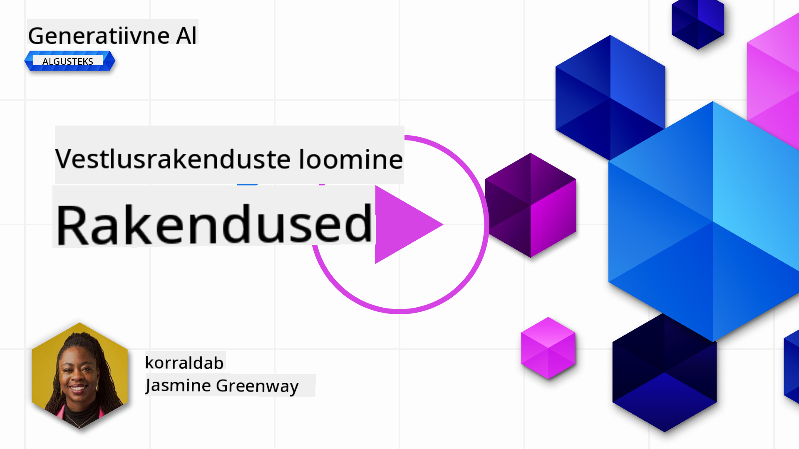
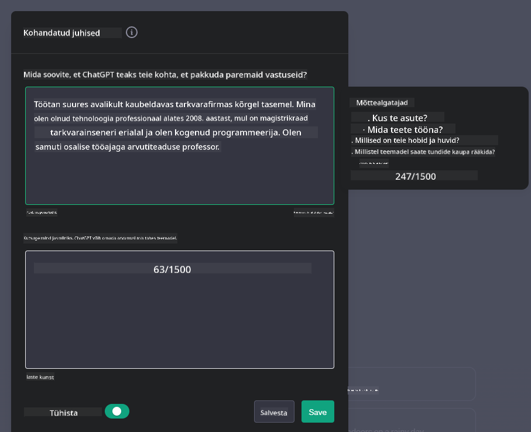

<!--
CO_OP_TRANSLATOR_METADATA:
{
  "original_hash": "ea4bbe640847aafbbba14dae4625e9af",
  "translation_date": "2025-10-11T11:38:48+00:00",
  "source_file": "07-building-chat-applications/README.md",
  "language_code": "et"
}
-->
# Generatiivse tehisintellekti jõul töötavate vestlusrakenduste loomine

[](https://aka.ms/gen-ai-lessons7-gh?WT.mc_id=academic-105485-koreyst)

> _(Klõpsa ülaloleval pildil, et vaadata selle õppetunni videot)_

Nüüd, kui oleme näinud, kuidas luua tekstigeneratsiooni rakendusi, vaatame lähemalt vestlusrakendusi.

Vestlusrakendused on muutunud meie igapäevaelu lahutamatuks osaks, pakkudes rohkem kui lihtsalt juhusliku vestluse võimalust. Need on olulised klienditeeninduses, tehnilises toetamises ja isegi keerukates nõustamissüsteemides. Tõenäoliselt olete hiljuti saanud abi mõnest vestlusrakendusest. Kui integreerime nendesse platvormidesse arenenud tehnoloogiaid, nagu generatiivne tehisintellekt, suureneb nii keerukus kui ka väljakutsed.

Mõned küsimused, millele peame vastama, on:

- **Rakenduse loomine**. Kuidas ehitada ja integreerida need tehisintellekti jõul töötavad rakendused konkreetsete kasutusjuhtude jaoks tõhusalt?
- **Jälgimine**. Kuidas tagada, et rakendused töötavad kõrgeima kvaliteediga, nii funktsionaalsuse kui ka [vastutustundliku tehisintellekti kuue põhimõtte](https://www.microsoft.com/ai/responsible-ai?WT.mc_id=academic-105485-koreyst) järgimise osas?

Automatiseerimise ja sujuvate inimese-masina interaktsioonide ajastul muutub oluliseks mõista, kuidas generatiivne tehisintellekt muudab vestlusrakenduste ulatust, sügavust ja kohanemisvõimet. Selles õppetunnis uurime arhitektuuri aspekte, mis toetavad neid keerukaid süsteeme, süveneme meetoditesse, kuidas neid kohandada valdkonnapõhiste ülesannete jaoks, ja hindame meetrikaid ning kaalutlusi, mis on olulised vastutustundliku tehisintellekti rakendamiseks.

## Sissejuhatus

Selles õppetunnis käsitletakse:

- Tehnikaid vestlusrakenduste tõhusaks loomiseks ja integreerimiseks.
- Kohandamise ja peenhäälestamise rakendamist rakendustes.
- Strateegiaid ja kaalutlusi vestlusrakenduste tõhusaks jälgimiseks.

## Õppeeesmärgid

Selle õppetunni lõpuks oskate:

- Kirjeldada kaalutlusi vestlusrakenduste loomisel ja integreerimisel olemasolevatesse süsteemidesse.
- Kohandada vestlusrakendusi konkreetsete kasutusjuhtude jaoks.
- Tuvastada peamisi meetrikaid ja kaalutlusi tehisintellekti jõul töötavate vestlusrakenduste kvaliteedi tõhusaks jälgimiseks ja säilitamiseks.
- Tagada, et vestlusrakendused kasutavad tehisintellekti vastutustundlikult.

## Generatiivse tehisintellekti integreerimine vestlusrakendustesse

Vestlusrakenduste täiustamine generatiivse tehisintellekti abil ei seisne ainult nende targemaks muutmises; see hõlmab nende arhitektuuri, jõudluse ja kasutajaliidese optimeerimist, et pakkuda kvaliteetset kasutajakogemust. See hõlmab arhitektuuriliste alustalade, API integratsioonide ja kasutajaliidese kaalutluste uurimist. See osa pakub teile terviklikku teekaarti nende keerukate maastike navigeerimiseks, olgu siis nende integreerimine olemasolevatesse süsteemidesse või nende ehitamine iseseisvate platvormidena.

Selle osa lõpuks olete varustatud teadmistega vestlusrakenduste tõhusaks loomiseks ja integreerimiseks.

### Vestlusrobot või vestlusrakendus?

Enne kui sukeldume vestlusrakenduste loomisse, võrdleme "vestlusroboteid" ja "tehisintellekti jõul töötavaid vestlusrakendusi", mis täidavad erinevaid rolle ja funktsioone. Vestlusroboti peamine eesmärk on automatiseerida konkreetseid vestlusülesandeid, nagu korduma kippuvatele küsimustele vastamine või paki jälgimine. Seda juhib tavaliselt reeglipõhine loogika või keerukad tehisintellekti algoritmid. Tehisintellekti jõul töötav vestlusrakendus on seevastu palju laiem keskkond, mis on loodud hõlbustama erinevaid digitaalse suhtluse vorme, nagu tekst-, hääl- ja videovestlused inimkasutajate vahel. Selle määravaks omaduseks on generatiivse tehisintellekti mudeli integreerimine, mis simuleerib nüansirikkaid, inimlaadseid vestlusi, genereerides vastuseid mitmesuguste sisendite ja kontekstuaalsete vihjete põhjal. Generatiivse tehisintellekti jõul töötav vestlusrakendus suudab osaleda avatud domeeni aruteludes, kohaneda arenevate vestluskontekstidega ja isegi luua loomingulisi või keerukaid dialooge.

Allolev tabel toob välja peamised erinevused ja sarnasused, et aidata meil mõista nende unikaalseid rolle digitaalses suhtluses.

| Vestlusrobot                          | Generatiivse tehisintellekti jõul töötav vestlusrakendus |
| ------------------------------------- | ------------------------------------------------------- |
| Ülesandekeskne ja reeglipõhine        | Kontekstitundlik                                       |
| Sageli integreeritud suurematesse süsteemidesse | Võib majutada ühte või mitut vestlusrobotit            |
| Piiratud programmeeritud funktsioonidega | Kasutab generatiivse tehisintellekti mudeleid          |
| Spetsialiseeritud ja struktureeritud interaktsioonid | Võimeline avatud domeeni aruteludeks                   |

### Eelvalmistatud funktsioonide kasutamine SDK-de ja API-de abil

Vestlusrakenduse loomisel on suurepärane esimene samm hinnata, mis juba olemas on. SDK-de ja API-de kasutamine vestlusrakenduste loomiseks on mitmel põhjusel kasulik strateegia. Hästi dokumenteeritud SDK-de ja API-de integreerimisega positsioneerite oma rakenduse strateegiliselt pikaajalise edu saavutamiseks, lahendades mastaapsuse ja hooldusega seotud probleeme.

- **Kiirendab arendusprotsessi ja vähendab kulusid**: Tuginedes eelvalmistatud funktsioonidele, mitte kulukale protsessile nende ise ehitamisel, saate keskenduda oma rakenduse muudele aspektidele, mida peate olulisemaks, näiteks äriloogikale.
- **Parem jõudlus**: Kui ehitate funktsionaalsust nullist, küsite lõpuks endalt: "Kuidas see skaleerub? Kas see rakendus suudab toime tulla äkilise kasutajate sissevooluga?" Hästi hooldatud SDK-d ja API-d sisaldavad sageli lahendusi nendele probleemidele.
- **Lihtsam hooldus**: Uuendused ja täiustused on lihtsamad, kuna enamik API-sid ja SDK-sid nõuavad lihtsalt teegi värskendamist, kui ilmub uuem versioon.
- **Juurdepääs tipptasemel tehnoloogiale**: Mudelite kasutamine, mis on peenhäälestatud ja treenitud ulatuslike andmekogumite põhjal, annab teie rakendusele loomuliku keele võimekuse.

SDK või API funktsionaalsusele juurdepääs hõlmab tavaliselt loa saamist pakutavate teenuste kasutamiseks, mis toimub sageli unikaalse võtme või autentimistunnuse kaudu. Kasutame OpenAI Python Library't, et uurida, kuidas see välja näeb. Saate seda ise proovida järgmises [OpenAI märkmikus](./python/oai-assignment.ipynb?WT.mc_id=academic-105485-koreyst) või [Azure OpenAI Services märkmikus](./python/aoai-assignment.ipynb?WT.mc_id=academic-105485-koreys) selle õppetunni jaoks.

```python
import os
from openai import OpenAI

API_KEY = os.getenv("OPENAI_API_KEY","")

client = OpenAI(
    api_key=API_KEY
    )

chat_completion = client.chat.completions.create(model="gpt-3.5-turbo", messages=[{"role": "user", "content": "Suggest two titles for an instructional lesson on chat applications for generative AI."}])
```

Ülaltoodud näide kasutab GPT-3.5 Turbo mudelit, et täita sisend, kuid märkige, et API võti on seadistatud enne seda. Kui te võtit ei seadistaks, saaksite vea.

## Kasutajakogemus (UX)

Üldised UX-põhimõtted kehtivad vestlusrakenduste puhul, kuid siin on mõned täiendavad kaalutlused, mis muutuvad eriti oluliseks masinõppe komponentide tõttu.

- **Ebaselguse lahendamise mehhanism**: Generatiivse tehisintellekti mudelid genereerivad aeg-ajalt ebaselgeid vastuseid. Funktsioon, mis võimaldab kasutajatel selgitust küsida, võib olla kasulik, kui nad selle probleemiga kokku puutuvad.
- **Konteksti säilitamine**: Arenenud generatiivse tehisintellekti mudelid suudavad vestluse konteksti meeles pidada, mis võib olla kasutajakogemuse oluline vara. Kasutajatele konteksti kontrollimise ja haldamise võimaluse andmine parandab kasutajakogemust, kuid toob kaasa riski säilitada tundlikku kasutajateavet. Kaalutlused selle kohta, kui kaua seda teavet säilitatakse, näiteks säilitamispoliitika kehtestamine, võivad tasakaalustada konteksti vajadust privaatsuse vastu.
- **Isikupärastamine**: AI mudelite võime õppida ja kohaneda pakub kasutajale individuaalset kogemust. Kasutajakogemuse kohandamine funktsioonide, nagu kasutajaprofiilid, kaudu mitte ainult ei pane kasutajat end mõistetuna tundma, vaid aitab tal leida konkreetseid vastuseid, luues tõhusama ja rahuldustpakkuvama interaktsiooni.

Üks näide isikupärastamisest on OpenAI ChatGPT "Kohandatud juhiste" seaded. See võimaldab teil anda teavet enda kohta, mis võib olla teie sisendite konteksti jaoks oluline. Siin on näide kohandatud juhistest.



See "profiil" palub ChatGPT-l luua õppetund seotud loendite kohta. Märkige, et ChatGPT arvestab, et kasutaja võib soovida põhjalikumat õppetundi, lähtudes tema kogemusest.


### Microsofti süsteemisõnumite raamistik suurte keelemudelite jaoks

[Microsoft on pakkunud juhiseid](https://learn.microsoft.com/azure/ai-services/openai/concepts/system-message#define-the-models-output-format?WT.mc_id=academic-105485-koreyst) tõhusate süsteemisõnumite kirjutamiseks LLM-ide vastuste genereerimisel, jagatuna neljaks valdkonnaks:

1. Mudeli sihtrühma, võimekuste ja piirangute määratlemine.
2. Mudeli väljundi formaadi määratlemine.
3. Konkreetsete näidete pakkumine, mis demonstreerivad mudeli soovitud käitumist.
4. Täiendavate käitumispiirangute pakkumine.

### Juurdepääsetavus

Olgu kasutajal nägemis-, kuulmis-, motoorika- või kognitiivsed häired, hästi kujundatud vestlusrakendus peaks olema kõigile kasutatav. Järgmine loetelu jagab konkreetseid funktsioone, mis on suunatud juurdepääsetavuse parandamisele erinevate kasutajate vajaduste jaoks.

- **Funktsioonid nägemispuudega kasutajatele**: Kõrge kontrastsusega teemad ja muudetava suurusega tekst, ekraanilugeja ühilduvus.
- **Funktsioonid kuulmispuudega kasutajatele**: Teksti kõneks ja kõne tekstiks funktsioonid, visuaalsed vihjed heliteavituste jaoks.
- **Funktsioonid motoorikapuudega kasutajatele**: Klaviatuuri navigatsiooni tugi, häälkäsklused.
- **Funktsioonid kognitiivsete häiretega kasutajatele**: Lihtsustatud keelevalikud.

## Kohandamine ja peenhäälestamine valdkonnapõhiste keelemudelite jaoks

Kujutage ette vestlusrakendust, mis mõistab teie ettevõtte erikeelt ja ennustab kasutajate tavapäraseid päringuid. Siin on kaks lähenemist, mida tasub mainida:

- **DSL-mudelite kasutamine**. DSL tähistab valdkonnapõhist keelt. Võite kasutada nn DSL-mudelit, mis on treenitud konkreetse valdkonna mõistmiseks ja selle kontseptsioonide käsitlemiseks.
- **Peenhäälestamine**. Peenhäälestamine on protsess, kus mudelit treenitakse edasi konkreetsete andmetega.

## Kohandamine: DSL-i kasutamine

Valdkonnapõhiste keelemudelite (DSL-mudelite) kasutamine võib parandada kasutajate kaasatust, pakkudes spetsialiseeritud ja kontekstuaalselt asjakohaseid interaktsioone. See on mudel, mis on treenitud või peenhäälestatud konkreetse valdkonnaga seotud teksti mõistmiseks ja genereerimiseks. DSL-mudeli kasutamise võimalused varieeruvad selle nullist treenimisest kuni olemasolevate mudelite kasutamiseni SDK-de ja API-de kaudu. Teine võimalus on peenhäälestamine, mis hõlmab olemasoleva eeltreenitud mudeli kohandamist konkreetse valdkonna jaoks.

## Kohandamine: Peenhäälestamine

Peenhäälestamist kaalutakse sageli siis, kui eeltreenitud mudel jääb spetsialiseeritud valdkonnas või konkreetse ülesande puhul alla.

Näiteks meditsiinilised päringud on keerulised ja nõuavad palju konteksti. Kui meditsiinitöötaja diagnoosib patsienti, tugineb see mitmetele teguritele, nagu elustiil või olemasolevad haigusseisundid, ja võib isegi toetuda hiljutistele meditsiinilistele ajakirjadele, et oma diagnoosi kinnitada. Sellistes nüansirikkates olukordades ei saa üldotstarbeline tehisintellekti vestlusrakendus olla usaldusväärne allikas.

### Näide: meditsiiniline rakendus

Mõelge vestlusrakendusele, mis on loodud meditsiinitöötajate abistamiseks, pakkudes kiireid viiteid ravijuhistele, ravimite koostoimetele või hiljutistele uurimistulemustele.

Üldotstarbeline mudel võib olla piisav, et vastata põhilistele meditsiinilistele küsimustele või anda üldist nõu, kuid see võib hätta jääda järgmistes olukordades:

- **Väga spetsiifilised või keerulised juhtumid**. Näiteks võib neuroloog küsida rakenduselt: "Millised on praegused parimad tavad ravimiresistentse epilepsia raviks lastel?"
- **Hiljutiste edusammude puudumine**. Üldotstarbeline mudel võib hätta jääda, pakkudes ajakohast vastust, mis hõlmab neuroloogia ja farmakoloogia viimaseid edusamme.

Sellistel juhtudel võib mudeli peenhäälestamine spetsialiseeritud meditsiinilise andmekogumiga oluliselt parandada selle võimet käsitleda neid keerukaid meditsiinilisi päringuid täpsemalt ja usaldusväärsemalt. See nõuab juurdepääsu suurele ja asjakohasele andmekogumile, mis esindab valdkonnapõhiseid väljakutseid ja küsimusi, mida tuleb lahendada.

## Kaalutlused kvaliteetse tehisintellekti juhitud vestluskogemuse jaoks

See osa toob välja "kvaliteetsete" vestlusrakenduste kriteeriumid, mis hõlmavad tegevusvõimeliste meetrikate kogumist ja raamistiku järgimist, mis kasutab tehisintellekti tehnoloogiat vastutustundlikult.

### Peamised meetrikad

Rakenduse kõrge kvaliteedi säilitamiseks on oluline jälgida peamisi meetrikaid ja kaalutlusi. Need mõõtmised tagavad mitte ainult rakenduse funktsionaalsuse, vaid hindavad ka tehisintellekti mudeli ja kasutajakogemuse kvaliteeti. Allpool on loetelu, mis hõlmab põhilisi, tehisintellekti ja kasutajakogemuse meetrikaid, mida tasub kaaluda.

| Metrika                        | Definitsioon                                                                                                             | Kaalutlused vestlusrakenduse arendajale                                   |
| ----------------------------- | ---------------------------------------------------------------------------------------------------------------------- | ------------------------------------------------------------------------- |
| **Tööaeg**                    | Mõõdab aega, mil rakendus on kasutajatele operatiivne ja ligipääsetav.                                                   | Kuidas minimeerite seisakuid?                                             |

| **Anomaaliate tuvastamine**   | Tööriistad ja tehnikad ebatavaliste mustrite tuvastamiseks, mis ei vasta ootuspärasele käitumisele.                        | Kuidas reageerid anomaaliatele?                                           |

### Vastutustundliku tehisintellekti praktikate rakendamine vestlusrakendustes

Microsofti vastutustundliku tehisintellekti lähenemine on määratlenud kuus põhimõtet, mis peaksid suunama tehisintellekti arendamist ja kasutamist. Allpool on toodud põhimõtted, nende definitsioonid ning asjad, mida vestlusrakenduse arendaja peaks arvesse võtma ja miks need on olulised.

| Põhimõtted             | Microsofti definitsioon                               | Vestlusrakenduse arendaja kaalutlused                                  | Miks see on oluline                                                                     |
| ---------------------- | ----------------------------------------------------- | ---------------------------------------------------------------------- | -------------------------------------------------------------------------------------- |
| Õiglus                | Tehisintellekti süsteemid peaksid kohtlema kõiki inimesi õiglaselt. | Veendu, et vestlusrakendus ei diskrimineeri kasutajaandmete põhjal.    | Usalduse ja kaasavuse loomine kasutajate seas; väldib õiguslikke tagajärgi.             |
| Usaldusväärsus ja ohutus | Tehisintellekti süsteemid peaksid toimima usaldusväärselt ja ohutult. | Rakenda testimist ja turvameetmeid, et vähendada vigu ja riske.        | Tagab kasutajate rahulolu ja hoiab ära võimaliku kahju.                                 |
| Privaatsus ja turvalisus | Tehisintellekti süsteemid peaksid olema turvalised ja austama privaatsust. | Rakenda tugevat krüpteerimist ja andmekaitsemeetmeid.                  | Kaitseb tundlikke kasutajaandmeid ja tagab vastavuse privaatsusseadustele.              |
| Kaasavus              | Tehisintellekti süsteemid peaksid andma kõigile võimaluse ja kaasama inimesi. | Kujunda kasutajaliides, mis on ligipääsetav ja lihtne kasutada erinevatele kasutajatele. | Tagab, et rakendust saavad tõhusalt kasutada laiemad kasutajagrupid.                    |
| Läbipaistvus          | Tehisintellekti süsteemid peaksid olema arusaadavad.   | Paku selget dokumentatsiooni ja põhjendusi tehisintellekti vastuste kohta. | Kasutajad usaldavad süsteemi rohkem, kui nad mõistavad, kuidas otsuseid tehakse.        |
| Vastutus              | Inimesed peaksid olema tehisintellekti süsteemide eest vastutavad. | Loo selge protsess tehisintellekti otsuste auditeerimiseks ja parendamiseks. | Võimaldab pidevat täiustamist ja vigade korral parandusmeetmete rakendamist.            |

## Ülesanne

Vaata [ülesannet](../../../07-building-chat-applications/python), mis viib sind läbi mitmete harjutuste, alates esimestest vestlusviipade käivitamisest kuni teksti klassifitseerimise ja kokkuvõtete tegemiseni. Pane tähele, et ülesanded on saadaval erinevates programmeerimiskeeltes!

## Tubli töö! Jätka teekonda

Pärast selle õppetunni lõpetamist tutvu meie [Generatiivse tehisintellekti õppekogumikuga](https://aka.ms/genai-collection?WT.mc_id=academic-105485-koreyst), et jätkata oma teadmiste arendamist generatiivse tehisintellekti vallas!

Liigu edasi 8. õppetundi, et näha, kuidas alustada [otsingurakenduste loomist](../08-building-search-applications/README.md?WT.mc_id=academic-105485-koreyst)!

---

**Lahtiütlus**:  
See dokument on tõlgitud AI tõlketeenuse [Co-op Translator](https://github.com/Azure/co-op-translator) abil. Kuigi püüame tagada täpsust, palume arvestada, et automaatsed tõlked võivad sisaldada vigu või ebatäpsusi. Algne dokument selle algses keeles tuleks pidada autoriteetseks allikaks. Olulise teabe puhul soovitame kasutada professionaalset inimtõlget. Me ei vastuta selle tõlke kasutamisest tulenevate arusaamatuste või valesti tõlgenduste eest.