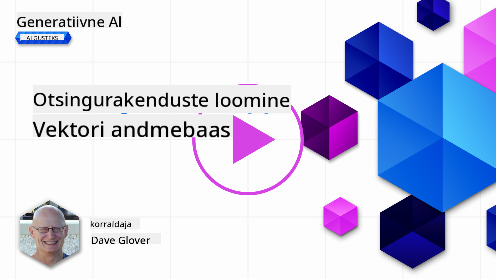
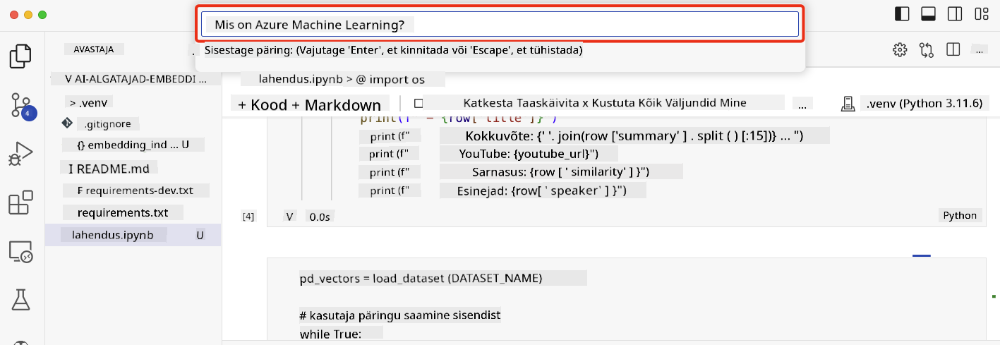

<!--
CO_OP_TRANSLATOR_METADATA:
{
  "original_hash": "d46aad0917a1a342d613e2c13d457da5",
  "translation_date": "2025-10-11T11:24:21+00:00",
  "source_file": "08-building-search-applications/README.md",
  "language_code": "et"
}
-->
# Otsingurakenduste loomine

[](https://aka.ms/gen-ai-lesson8-gh?WT.mc_id=academic-105485-koreyst)

> > _Klõpsa ülaloleval pildil, et vaadata selle õppetunni videot_

LLM-id (suured keelemudelid) ei piirdu ainult vestlusrobotite ja tekstigeneratsiooniga. Nende abil on võimalik luua ka otsingurakendusi, kasutades sisendvektoreid ehk Embeddings. Embeddings on andmete numbrilised esitused, mida tuntakse ka vektorite nime all, ja neid saab kasutada semantilise otsingu jaoks.

Selles õppetunnis loome otsingurakenduse meie haridusalgatuse jaoks. Meie algatus on mittetulundusühing, mis pakub tasuta haridust arengumaade õpilastele. Algatusel on suur hulk YouTube'i videoid, mida õpilased saavad kasutada tehisintellekti õppimiseks. Meie eesmärk on luua otsingurakendus, mis võimaldab õpilastel otsida YouTube'i videoid, sisestades küsimuse.

Näiteks võib õpilane sisestada küsimuse "Mis on Jupyter Notebookid?" või "Mis on Azure ML?" ja otsingurakendus tagastab nimekirja YouTube'i videotest, mis on küsimusega seotud. Veelgi enam, rakendus tagastab lingi video sellele kohale, kus küsimusele vastatakse.

## Sissejuhatus

Selles õppetunnis käsitleme:

- Semantiline vs märksõnaotsing.
- Mis on tekstivektorid (Text Embeddings).
- Tekstivektorite indeksi loomine.
- Tekstivektorite indeksi otsimine.

## Õppeesmärgid

Pärast õppetunni läbimist oskad:

- Eristada semantilist otsingut märksõnaotsingust.
- Selgitada, mis on tekstivektorid.
- Luua rakenduse, mis kasutab vektoreid andmete otsimiseks.

## Miks luua otsingurakendus?

Otsingurakenduse loomine aitab sul mõista, kuidas kasutada vektoreid andmete otsimiseks. Samuti õpid, kuidas luua otsingurakendust, mida õpilased saavad kasutada teabe kiireks leidmiseks.

Õppetund sisaldab YouTube'i transkriptsioonide vektorindeksit Microsofti [AI Show](https://www.youtube.com/playlist?list=PLlrxD0HtieHi0mwteKBOfEeOYf0LJU4O1) YouTube'i kanalilt. AI Show on YouTube'i kanal, mis õpetab tehisintellekti ja masinõpet. Vektorindeks sisaldab kõigi YouTube'i transkriptsioonide vektoreid kuni oktoobrini 2023. Kasutad vektorindeksit, et luua otsingurakendus meie algatuse jaoks. Rakendus tagastab lingi video sellele kohale, kus küsimusele vastatakse. See on suurepärane viis, kuidas õpilased saavad kiiresti vajaliku teabe.

Allpool on näide semantilisest päringust küsimusele "Kas Azure ML-i saab kasutada koos RStudio-ga?". Vaata YouTube'i URL-i, näed, et URL sisaldab ajatemplit, mis viib sind video sellele kohale, kus küsimusele vastatakse.


## Mis on semantiline otsing?

Võid küsida, mis on semantiline otsing? Semantiline otsing on otsingutehnika, mis kasutab päringu sõnade tähendust, et tagastada asjakohased tulemused.

Siin on näide semantilisest otsingust. Oletame, et otsid autot ja sisestad otsingusse "minu unistuste auto". Semantiline otsing mõistab, et sa ei `unistaks` autost, vaid otsid oma `ideaalset` autot. Semantiline otsing mõistab sinu kavatsust ja tagastab asjakohased tulemused. Alternatiiviks on `märksõnaotsing`, mis otsiks sõna-sõnalt unistusi autode kohta ja tagastaks sageli ebaolulisi tulemusi.

## Mis on tekstivektorid?

[Tekstivektorid](https://en.wikipedia.org/wiki/Word_embedding?WT.mc_id=academic-105485-koreyst) on tekstiesitustehnika, mida kasutatakse [loomuliku keele töötlemises](https://en.wikipedia.org/wiki/Natural_language_processing?WT.mc_id=academic-105485-koreyst). Tekstivektorid on tekstide semantilised numbrilised esitused. Vektoreid kasutatakse andmete esitamiseks viisil, mis on masinale lihtne mõista. Tekstivektorite loomiseks on palju mudeleid, kuid selles õppetunnis keskendume vektorite genereerimisele OpenAI Embedding Model abil.

Näiteks kujuta ette, et järgmine tekst on transkriptsioon ühest AI Show YouTube'i kanali episoodist:

```text
Today we are going to learn about Azure Machine Learning.
```

Edastame teksti OpenAI Embedding API-le ja see tagastab järgmise vektori, mis koosneb 1536 numbrist ehk vektorist. Iga number vektoris esindab teksti erinevat aspekti. Lühiduse huvides on siin vektori esimesed 10 numbrit.

```python
[-0.006655829958617687, 0.0026128944009542465, 0.008792596869170666, -0.02446001023054123, -0.008540431968867779, 0.022071078419685364, -0.010703742504119873, 0.003311325330287218, -0.011632772162556648, -0.02187200076878071, ...]
```

## Kuidas luuakse vektorindeks?

Selle õppetunni vektorindeks loodi mitme Python-skripti abil. Leiad skriptid koos juhistega kausta 'scripts' [README](./scripts/README.md?WT.mc_id=academic-105485-koreyst) failist. Skripte ei ole vaja käivitada, kuna vektorindeks on juba ette valmistatud.

Skriptid teevad järgmised toimingud:

1. Laetakse alla iga YouTube'i video transkriptsioon [AI Show](https://www.youtube.com/playlist?list=PLlrxD0HtieHi0mwteKBOfEeOYf0LJU4O1) esitusloendist.
2. Kasutades [OpenAI Functions](https://learn.microsoft.com/azure/ai-services/openai/how-to/function-calling?WT.mc_id=academic-105485-koreyst), tehakse katse tuvastada kõneleja nimi YouTube'i transkriptsiooni esimesest 3 minutist. Kõneleja nimi salvestatakse vektorindeksisse nimega `embedding_index_3m.json`.
3. Transkriptsioonitekst jagatakse **3-minutilisteks tekstisegmentideks**. Segment sisaldab umbes 20 sõna kattuvust järgmise segmendiga, et tagada, et segmendi vektor ei katkeks ja pakkuda paremat otsingukonteksti.
4. Iga tekstisegment edastatakse OpenAI Chat API-le, et kokku võtta tekst 60 sõnaga. Kokkuvõte salvestatakse samuti vektorindeksisse `embedding_index_3m.json`.
5. Lõpuks edastatakse segmendi tekst OpenAI Embedding API-le. Embedding API tagastab vektori, mis koosneb 1536 numbrist ja esindab segmendi semantilist tähendust. Segment koos OpenAI vektoriga salvestatakse vektorindeksisse `embedding_index_3m.json`.

### Vektorandmebaasid

Õppetunni lihtsuse huvides salvestatakse vektorindeks JSON-faili nimega `embedding_index_3m.json` ja laaditakse Pandas DataFrame'i. Tootmiskeskkonnas salvestatakse vektorindeks aga vektorandmebaasi, näiteks [Azure Cognitive Search](https://learn.microsoft.com/training/modules/improve-search-results-vector-search?WT.mc_id=academic-105485-koreyst), [Redis](https://cookbook.openai.com/examples/vector_databases/redis/readme?WT.mc_id=academic-105485-koreyst), [Pinecone](https://cookbook.openai.com/examples/vector_databases/pinecone/readme?WT.mc_id=academic-105485-koreyst), [Weaviate](https://cookbook.openai.com/examples/vector_databases/weaviate/readme?WT.mc_id=academic-105485-koreyst) jne.

## Kosinuse sarnasuse mõistmine

Oleme õppinud tekstivektorite kohta, järgmine samm on õppida, kuidas kasutada tekstivektoreid andmete otsimiseks ja eriti leida päringule kõige sarnasemad vektorid, kasutades kosinuse sarnasust.

### Mis on kosinuse sarnasus?

Kosinuse sarnasus on mõõt, mis hindab kahe vektori sarnasust. Seda nimetatakse ka `lähima naabri otsinguks`. Kosinuse sarnasuse otsingu tegemiseks tuleb päringu tekst _vektoriseerida_ OpenAI Embedding API abil. Seejärel arvutatakse _kosinuse sarnasus_ päringu vektori ja iga vektori vahel vektorindeksis. Pea meeles, et vektorindeksis on vektor iga YouTube'i transkriptsiooni tekstisegmendi jaoks. Lõpuks sorteeritakse tulemused kosinuse sarnasuse järgi ja tekstisegmendid, mille kosinuse sarnasus on kõige suurem, on päringule kõige sarnasemad.

Matemaatilisest vaatenurgast mõõdab kosinuse sarnasus kahe vektori vahelist nurka mitmemõõtmelises ruumis. See mõõtmine on kasulik, sest kui kaks dokumenti on Eukleidese kauguse järgi kaugel, võivad nad siiski olla väiksema nurga all ja seega suurema kosinuse sarnasusega. Lisateavet kosinuse sarnasuse valemite kohta leiad [Cosine similarity](https://en.wikipedia.org/wiki/Cosine_similarity?WT.mc_id=academic-105485-koreyst).

## Esimese otsingurakenduse loomine

Järgmisena õpime, kuidas luua otsingurakendust, kasutades vektoreid. Otsingurakendus võimaldab õpilastel otsida videot, sisestades küsimuse. Rakendus tagastab nimekirja videotest, mis on küsimusega seotud. Rakendus tagastab ka lingi video sellele kohale, kus küsimusele vastatakse.

See lahendus on loodud ja testitud Windows 11, macOS ja Ubuntu 22.04 operatsioonisüsteemides, kasutades Python 3.10 või uuemat versiooni. Pythonit saab alla laadida [python.org](https://www.python.org/downloads/?WT.mc_id=academic-105485-koreyst).

## Ülesanne - otsingurakenduse loomine, et aidata õpilasi

Tutvustasime meie algatust õppetunni alguses. Nüüd on aeg võimaldada õpilastel luua otsingurakendus oma ülesannete jaoks.

Selles ülesandes loome Azure OpenAI teenused, mida kasutatakse otsingurakenduse loomiseks. Loome järgmised Azure OpenAI teenused. Ülesande täitmiseks on vaja Azure'i tellimust.

### Azure Cloud Shelli käivitamine

1. Logi sisse [Azure'i portaalis](https://portal.azure.com/?WT.mc_id=academic-105485-koreyst).
2. Valige Azure'i portaali paremas ülanurgas Cloud Shelli ikoon.
3. Valige keskkonna tüübiks **Bash**.

#### Ressursigrupi loomine

> Nendes juhistes kasutame ressursigruppi nimega "semantic-video-search" East US piirkonnas.
> Ressursigrupi nime saab muuta, kuid ressurside asukoha muutmisel kontrollige [mudelite saadavuse tabelit](https://aka.ms/oai/models?WT.mc_id=academic-105485-koreyst).

```shell
az group create --name semantic-video-search --location eastus
```

#### Azure OpenAI teenuse ressursi loomine

Azure Cloud Shellis käivitage järgmine käsk, et luua Azure OpenAI teenuse ressurss.

```shell
az cognitiveservices account create --name semantic-video-openai --resource-group semantic-video-search \
    --location eastus --kind OpenAI --sku s0
```

#### Lõpp-punkti ja võtmete hankimine rakenduse jaoks

Azure Cloud Shellis käivitage järgmised käsud, et hankida Azure OpenAI teenuse ressursi lõpp-punkt ja võtmed.

```shell
az cognitiveservices account show --name semantic-video-openai \
   --resource-group  semantic-video-search | jq -r .properties.endpoint
az cognitiveservices account keys list --name semantic-video-openai \
   --resource-group semantic-video-search | jq -r .key1
```

#### OpenAI vektormudeli juurutamine

Azure Cloud Shellis käivitage järgmine käsk, et juurutada OpenAI vektormudel.

```shell
az cognitiveservices account deployment create \
    --name semantic-video-openai \
    --resource-group  semantic-video-search \
    --deployment-name text-embedding-ada-002 \
    --model-name text-embedding-ada-002 \
    --model-version "2"  \
    --model-format OpenAI \
    --sku-capacity 100 --sku-name "Standard"
```

## Lahendus

Avage [lahenduse märkmik](./python/aoai-solution.ipynb?WT.mc_id=academic-105485-koreyst) GitHub Codespaces'is ja järgige Jupyter Notebooki juhiseid.

Kui käivitate märkmiku, palutakse teil sisestada päring. Sisendkast näeb välja selline:



## Tubli töö! Jätka õppimist

Pärast selle õppetunni läbimist vaata meie [Generatiivse tehisintellekti õppekollektsiooni](https://aka.ms/genai-collection?WT.mc_id=academic-105485-koreyst), et jätkata oma teadmiste arendamist!

Liigu edasi 9. õppetundi, kus uurime, kuidas [luua pildigeneratsiooni rakendusi](../09-building-image-applications/README.md?WT.mc_id=academic-105485-koreyst)!

---

**Lahtiütlus**:  
See dokument on tõlgitud AI tõlketeenuse [Co-op Translator](https://github.com/Azure/co-op-translator) abil. Kuigi püüame tagada täpsust, palume arvestada, et automaatsed tõlked võivad sisaldada vigu või ebatäpsusi. Algne dokument selle algses keeles tuleks pidada autoriteetseks allikaks. Olulise teabe puhul soovitame kasutada professionaalset inimtõlget. Me ei vastuta selle tõlke kasutamisest tulenevate arusaamatuste või valesti tõlgenduste eest.