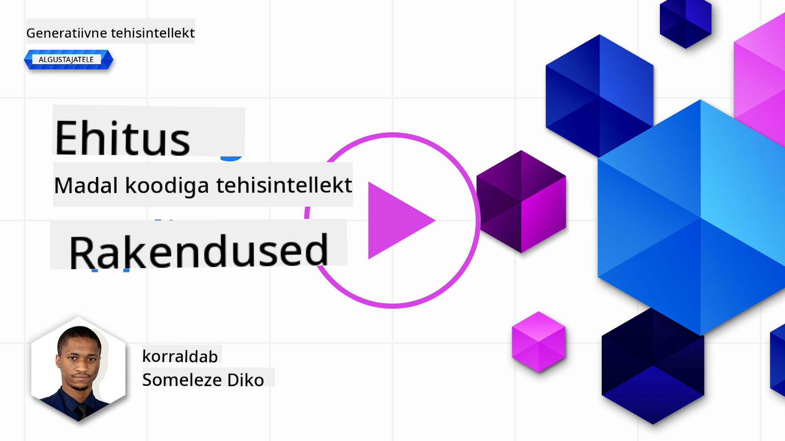
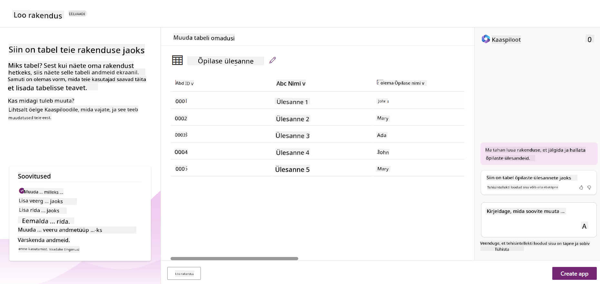
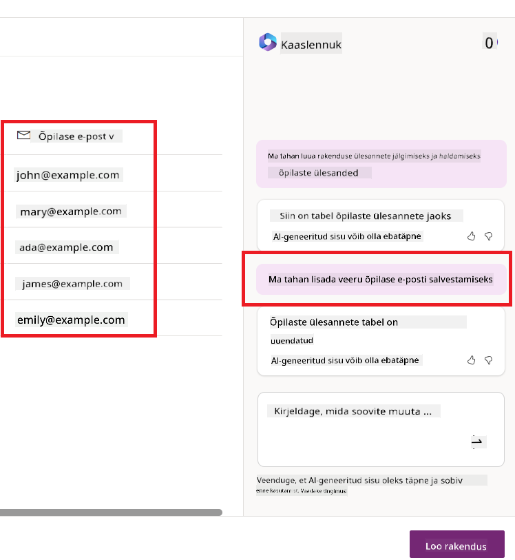
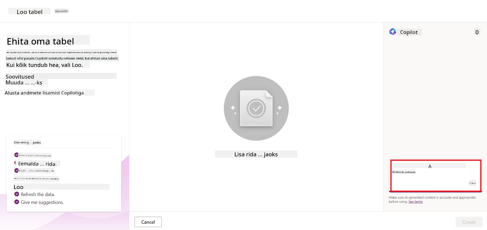
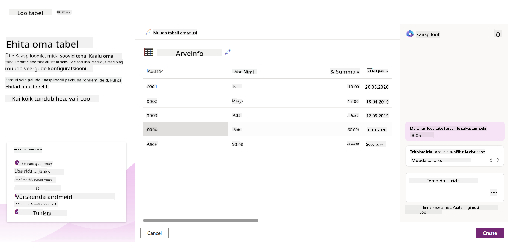
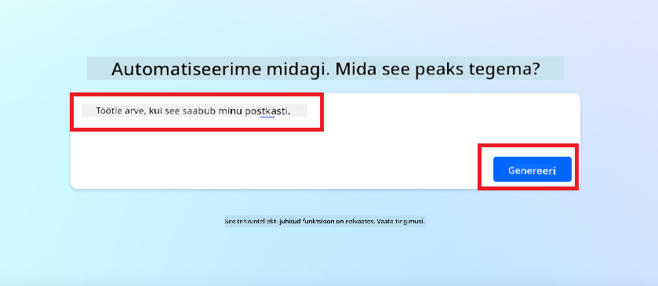
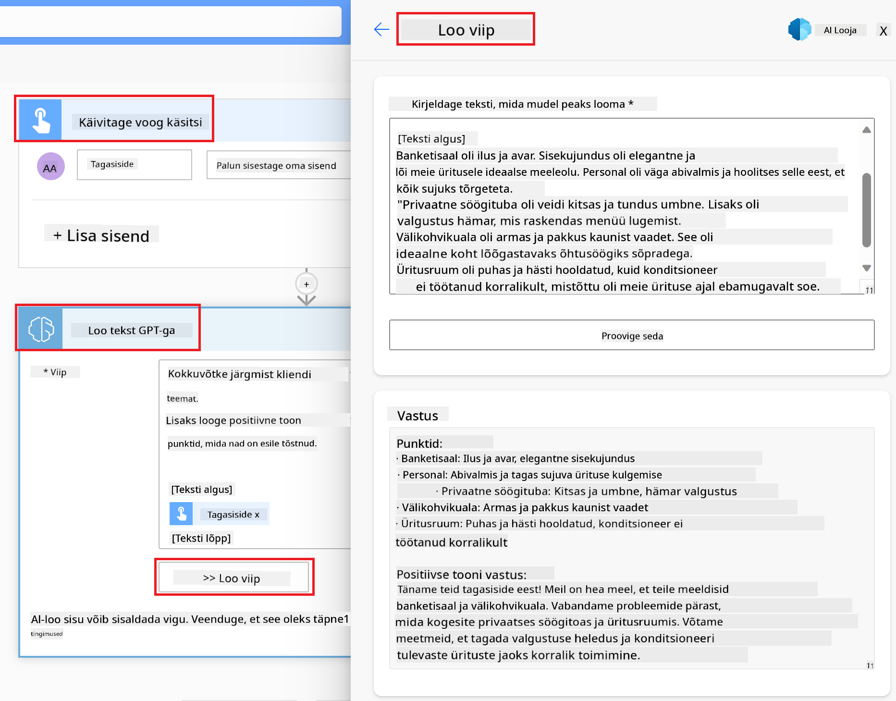

<!--
CO_OP_TRANSLATOR_METADATA:
{
  "original_hash": "f5ff3b6204a695a117d6f452403c95f7",
  "translation_date": "2025-10-11T11:20:03+00:00",
  "source_file": "10-building-low-code-ai-applications/README.md",
  "language_code": "et"
}
-->
# Madal koodiga AI rakenduste loomine

> _(Klõpsake ülaloleval pildil, et vaadata selle õppetunni videot)_

## Sissejuhatus

Nüüd, kui oleme õppinud, kuidas luua pildigeneratsiooni rakendusi, räägime madalast koodist. Generatiivset AI-d saab kasutada mitmesugustes valdkondades, sealhulgas madala koodiga arenduses, kuid mis on madal kood ja kuidas saame sellele AI-d lisada?

Rakenduste ja lahenduste loomine on muutunud traditsioonilistele arendajatele ja mitte-arendajatele lihtsamaks madala koodiga arendusplatvormide abil. Madala koodiga arendusplatvormid võimaldavad luua rakendusi ja lahendusi minimaalse koodiga või üldse ilma koodita. See saavutatakse visuaalse arenduskeskkonna abil, mis võimaldab rakenduste ja lahenduste loomiseks komponente lohistada ja paigutada. See võimaldab rakendusi ja lahendusi luua kiiremini ja väiksemate ressurssidega. Selles õppetunnis süveneme madala koodiga arendusse ja uurime, kuidas täiustada madala koodiga arendust AI abil, kasutades Power Platformi.

Power Platform pakub organisatsioonidele võimalust anda oma meeskondadele võimalus luua oma lahendusi intuitiivses madala koodiga või koodivabas keskkonnas. See keskkond aitab lihtsustada lahenduste loomise protsessi. Power Platformi abil saab lahendusi luua päevade või nädalate jooksul, mitte kuude või aastate jooksul. Power Platform koosneb viiest põhikomponendist: Power Apps, Power Automate, Power BI, Power Pages ja Copilot Studio.

Selles õppetunnis käsitletakse:

- Generatiivse AI tutvustust Power Platformis
- Copiloti tutvustust ja selle kasutamist
- Generatiivse AI kasutamist rakenduste ja voogude loomiseks Power Platformis
- AI mudelite mõistmist Power Platformis AI Builderi abil

## Õppeeesmärgid

Selle õppetunni lõpuks oskate:

- Mõista, kuidas Copilot töötab Power Platformis.

- Luua hariduse idufirma jaoks õpilaste ülesannete jälgimise rakenduse.

- Luua arve töötlemise voo, mis kasutab AI-d arvete info väljavõtmiseks.

- Rakendada parimaid praktikaid GPT AI mudeli tekstiloome kasutamisel.

Selles õppetunnis kasutatavad tööriistad ja tehnoloogiad on:

- **Power Apps**, õpilaste ülesannete jälgimise rakenduse jaoks, mis pakub madala koodiga arenduskeskkonda rakenduste loomiseks, et jälgida, hallata ja suhelda andmetega.

- **Dataverse**, õpilaste ülesannete jälgimise rakenduse andmete salvestamiseks, kus Dataverse pakub madala koodiga andmeplatvormi rakenduse andmete salvestamiseks.

- **Power Automate**, arve töötlemise voo jaoks, kus on madala koodiga arenduskeskkond töövoogude loomiseks, et automatiseerida arve töötlemise protsessi.

- **AI Builder**, arve töötlemise AI mudeli jaoks, kus kasutatakse eelnevalt loodud AI mudeleid arvete töötlemiseks meie idufirma jaoks.

## Generatiivne AI Power Platformis

Madala koodiga arenduse ja rakenduste täiustamine generatiivse AI-ga on Power Platformi peamine fookusala. Eesmärk on võimaldada kõigil luua AI-põhiseid rakendusi, saite, juhtpaneele ja automatiseerida protsesse AI abil, _ilma et oleks vaja andmeteaduse ekspertiisi_. See eesmärk saavutatakse generatiivse AI integreerimisega madala koodiga arenduskogemusse Power Platformis Copiloti ja AI Builderi kujul.

### Kuidas see töötab?

Copilot on AI-assistent, mis võimaldab teil luua Power Platformi lahendusi, kirjeldades oma nõudeid loomuliku keele abil vestluslike sammude kaudu. Näiteks saate juhendada oma AI-assistenti, milliseid välju teie rakendus kasutab, ja see loob nii rakenduse kui ka aluseks oleva andmemudeli või määrab, kuidas seadistada voogu Power Automate'is.

Copiloti juhitud funktsioone saab kasutada rakenduse ekraanidel, et võimaldada kasutajatel avastada teadmisi vestluslike interaktsioonide kaudu.

AI Builder on madala koodiga AI-võimalus, mis on saadaval Power Platformis ja võimaldab kasutada AI-mudeleid protsesside automatiseerimiseks ja tulemuste ennustamiseks. AI Builderi abil saate tuua AI oma rakendustesse ja voogudesse, mis ühenduvad teie andmetega Dataverse'is või erinevates pilveandmeallikates, nagu SharePoint, OneDrive või Azure.

Copilot on saadaval kõigis Power Platformi toodetes: Power Apps, Power Automate, Power BI, Power Pages ja Power Virtual Agents. AI Builder on saadaval Power Appsis ja Power Automate'is. Selles õppetunnis keskendume sellele, kuidas kasutada Copilotit ja AI Builderit Power Appsis ja Power Automate'is, et luua lahendus meie hariduse idufirma jaoks.

### Copilot Power Appsis

Osana Power Platformist pakub Power Apps madala koodiga arenduskeskkonda rakenduste loomiseks, et jälgida, hallata ja suhelda andmetega. See on rakenduste arendusteenuste komplekt koos skaleeritava andmeplatvormiga ja võimalusega ühendada pilveteenuseid ja kohapealseid andmeid. Power Apps võimaldab luua rakendusi, mis töötavad brauserites, tahvelarvutites ja telefonides ning mida saab jagada kolleegidega. Power Apps lihtsustab kasutajate jaoks rakenduste arendamist lihtsa liidesega, nii et iga ärikasutaja või professionaalne arendaja saab luua kohandatud rakendusi. Rakenduste arenduskogemust täiustatakse ka generatiivse AI-ga Copiloti kaudu.

Copiloti AI-assistendi funktsioon Power Appsis võimaldab teil kirjeldada, millist rakendust vajate ja millist teavet soovite, et teie rakendus jälgiks, koguks või kuvaks. Copilot genereerib teie kirjelduse põhjal reageeriva Canvas-rakenduse. Seejärel saate rakendust oma vajadustele vastavaks kohandada. AI Copilot genereerib ja soovitab ka Dataverse'i tabeli koos vajalike väljadega, et salvestada andmeid, mida soovite jälgida, ja mõned näidisandmed. Uurime, mis on Dataverse ja kuidas saate seda Power Appsis kasutada hiljem selles õppetunnis. Seejärel saate tabelit kohandada vastavalt oma vajadustele, kasutades AI Copiloti assistendi funktsiooni vestluslike sammude kaudu. See funktsioon on saadaval otse Power Appsi avalehelt.

### Copilot Power Automate'is

Osana Power Platformist võimaldab Power Automate kasutajatel luua automatiseeritud töövooge rakenduste ja teenuste vahel. See aitab automatiseerida korduvaid äriprotsesse, nagu suhtlus, andmete kogumine ja otsuste kinnitamine. Selle lihtne liides võimaldab igasuguse tehnilise tasemega kasutajatel (alates algajatest kuni kogenud arendajateni) automatiseerida tööülesandeid. Töövoogude arenduskogemust täiustatakse ka generatiivse AI-ga Copiloti kaudu.

Copiloti AI-assistendi funktsioon Power Automate'is võimaldab teil kirjeldada, millist voogu vajate ja milliseid toiminguid soovite, et teie voog teeks. Copilot genereerib teie kirjelduse põhjal voo. Seejärel saate voogu oma vajadustele vastavaks kohandada. AI Copilot genereerib ja soovitab ka toiminguid, mida vajate ülesande automatiseerimiseks. Uurime, mis on vood ja kuidas saate neid Power Automate'is kasutada hiljem selles õppetunnis. Seejärel saate toiminguid kohandada vastavalt oma vajadustele, kasutades AI Copiloti assistendi funktsiooni vestluslike sammude kaudu. See funktsioon on saadaval otse Power Automate'i avalehelt.

## Ülesanne: Hallake meie idufirma õpilaste ülesandeid ja arveid Copiloti abil

Meie idufirma pakub õpilastele veebikursusi. Idufirma on kiiresti kasvanud ja nüüd on neil raske kursuste nõudlusega sammu pidada. Idufirma on palganud teid Power Platformi arendajaks, et aidata neil luua madala koodiga lahendus, mis aitaks hallata õpilaste ülesandeid ja arveid. Lahendus peaks aitama neil jälgida ja hallata õpilaste ülesandeid rakenduse kaudu ning automatiseerida arve töötlemise protsessi töövoo kaudu. Teid on palutud kasutada generatiivset AI-d lahenduse arendamiseks.

Kui alustate Copiloti kasutamist, saate kasutada [Power Platform Copilot Prompt Library](https://github.com/pnp/powerplatform-prompts?WT.mc_id=academic-109639-somelezediko), et alustada juhistega. See raamatukogu sisaldab loetelu juhistest, mida saate kasutada rakenduste ja voogude loomiseks Copiloti abil. Samuti saate kasutada raamatukogu juhiseid, et saada aimu, kuidas kirjeldada oma nõudeid Copilotile.

### Looge meie idufirma jaoks õpilaste ülesannete jälgimise rakendus

Meie idufirma õpetajatel on olnud raskusi õpilaste ülesannete jälgimisega. Nad on kasutanud arvutustabelit ülesannete jälgimiseks, kuid see on muutunud keeruliseks, kuna õpilaste arv on suurenenud. Nad on palunud teil luua rakenduse, mis aitaks neil õpilaste ülesandeid jälgida ja hallata. Rakendus peaks võimaldama neil lisada uusi ülesandeid, vaadata ülesandeid, uuendada ülesandeid ja kustutada ülesandeid. Rakendus peaks võimaldama ka õpetajatel ja õpilastel vaadata, millised ülesanded on hinnatud ja millised mitte.

Te loote rakenduse Copiloti abil Power Appsis, järgides alltoodud samme:

1. Minge [Power Apps](https://make.powerapps.com?WT.mc_id=academic-105485-koreyst) avalehele.

1. Kasutage avalehel olevat tekstiala, et kirjeldada rakendust, mida soovite luua. Näiteks **_Soovin luua rakenduse õpilaste ülesannete jälgimiseks ja haldamiseks_**. Klõpsake **Saada** nuppu, et saata juhis AI Copilotile.

1. AI Copilot soovitab Dataverse'i tabelit koos vajalike väljadega, et salvestada andmeid, mida soovite jälgida, ja mõned näidisandmed. Seejärel saate tabelit kohandada vastavalt oma vajadustele, kasutades AI Copiloti assistendi funktsiooni vestluslike sammude kaudu.

   > **Oluline**: Dataverse on Power Platformi aluseks olev andmeplatvorm. See on madala koodiga andmeplatvorm rakenduse andmete salvestamiseks. See on täielikult hallatud teenus, mis salvestab andmeid turvaliselt Microsofti pilves ja on teie Power Platformi keskkonnas ette nähtud. Sellega kaasnevad sisseehitatud andmete haldamise võimalused, nagu andmete klassifikatsioon, andmete päritolu, peenhäälestatud juurdepääsukontroll ja palju muud. Lisateavet Dataverse'i kohta leiate [siit](https://docs.microsoft.com/powerapps/maker/data-platform/data-platform-intro?WT.mc_id=academic-109639-somelezediko).

   

1. Õpetajad soovivad saata e-kirju õpilastele, kes on oma ülesanded esitanud, et hoida neid kursis ülesannete edenemisega. Saate kasutada Copilotit, et lisada tabelisse uus väli õpilaste e-posti aadressi salvestamiseks. Näiteks saate kasutada järgmist juhist, et lisada tabelisse uus väli: **_Soovin lisada veeru õpilaste e-posti aadressi salvestamiseks_**. Klõpsake **Saada** nuppu, et saata juhis AI Copilotile.

1. AI Copilot genereerib uue välja ja seejärel saate välja kohandada vastavalt oma vajadustele.

1. Kui olete tabeli valmis saanud, klõpsake **Loo rakendus** nuppu, et rakendus luua.

1. AI Copilot genereerib teie kirjelduse põhjal reageeriva Canvas-rakenduse. Seejärel saate rakendust kohandada vastavalt oma vajadustele.

1. Selleks, et õpetajad saaksid õpilastele e-kirju saata, saate kasutada Copilotit, et lisada rakendusele uus ekraan. Näiteks saate kasutada järgmist juhist, et lisada rakendusele uus ekraan: **_Soovin lisada ekraani õpilastele e-kirjade saatmiseks_**. Klõpsake **Saada** nuppu, et saata juhis AI Copilotile.

1. AI Copilot genereerib uue ekraani ja seejärel saate ekraani kohandada vastavalt oma vajadustele.

1. Kui olete rakenduse valmis saanud, klõpsake **Salvesta** nuppu, et rakendus salvestada.

1. Rakenduse jagamiseks õpetajatega klõpsake **Jaga** nuppu ja seejärel klõpsake uuesti **Jaga** nuppu. Seejärel saate rakenduse õpetajatega jagada, sisestades nende e-posti aadressid.

> **Teie kodutöö**: Rakendus, mille te just lõite, on hea algus, kuid seda saab täiustada. E-posti funktsiooni puhul saavad õpetajad saata e-kirju õpilastele ainult käsitsi, sisestades nende e-posti aadressid. Kas saate kasutada Copilotit, et luua automatiseerimine, mis võimaldab õpetajatel saata e-kirju õpilastele automaatselt, kui nad esitavad oma ülesandeid? Teie vihje: õige juhisega saate kasutada Copilotit Power Automate'is, et seda luua.

### Looge meie idufirma jaoks arvete info tabel

Meie idufirma finantsmeeskonnal on olnud raskusi arvete jälgimisega. Nad on kasutanud arvutustabelit arvete jälgimiseks, kuid see on muutunud keeruliseks, kuna arvete arv on suurenenud. Nad on palunud teil luua tabeli, mis aitaks neil salvestada, jälgida ja hallata saadud arvete infot. Tabelit tuleks kasutada automatiseerimise loomiseks, mis väljavõtab kogu arvete info ja salvestab selle tabelisse. Tabel peaks võimaldama finantsmeeskonnal vaadata, millised arved on tasutud ja millised mitte.

Power Platformil on aluseks olev andmeplatvorm nimega Dataverse, mis võimaldab salvestada andmeid teie rakenduste ja lahenduste jaoks. Dataverse pakub madala koodiga andmeplatvormi rakenduse andmete salvestamiseks. See on täielikult hallatud teenus, mis salvestab andmeid turvaliselt Microsofti pilves ja on teie Power Platformi keskkonnas ette nähtud. Sellega kaasnevad sisseehitatud andmete haldamise võimalused, nagu andmete klassifikatsioon, andmete päritolu, peenhäälestatud juurdepääsukontroll ja palju muud. Lisateavet [Dataverse'i kohta leiate siit](https://docs.microsoft.com/powerapps/maker/data-platform/data-platform-intro?WT.mc_id=academic-109639-somelezediko).
Miks peaksime kasutama Dataverse'i oma idufirma jaoks? Dataverse'i standard- ja kohandatud tabelid pakuvad turvalist ja pilvepõhist salvestusvõimalust teie andmete jaoks. Tabelid võimaldavad teil salvestada erinevat tüüpi andmeid, sarnaselt sellele, kuidas võite kasutada mitut töölehte ühes Exceli töövihikus. Tabeleid saab kasutada andmete salvestamiseks, mis on spetsiifilised teie organisatsiooni või ärivajaduste jaoks. Mõned eelised, mida meie idufirma Dataverse'i kasutamisest saab, hõlmavad muu hulgas järgmist:

- **Lihtne hallata**: Metaandmed ja andmed salvestatakse pilves, seega ei pea te muretsema selle üle, kuidas neid hallatakse või salvestatakse. Saate keskenduda oma rakenduste ja lahenduste loomisele.

- **Turvaline**: Dataverse pakub turvalist ja pilvepõhist salvestusvõimalust teie andmete jaoks. Rollipõhise turvalisuse abil saate kontrollida, kes pääseb teie tabelites olevatele andmetele ja kuidas nad neid kasutada saavad.

- **Rikkalikud metaandmed**: Andmetüüpe ja seoseid kasutatakse otse Power Appsis.

- **Loogika ja valideerimine**: Ärireeglite, arvutatud väljade ja valideerimisreeglite abil saate rakendada äriloogikat ja säilitada andmete täpsust.

Nüüd, kui teate, mis on Dataverse ja miks peaksite seda kasutama, vaatame, kuidas saate Copiloti abil luua Dataverse'is tabeli, mis vastab meie finantsmeeskonna nõuetele.

> **Note**: Kasutate seda tabelit järgmises jaotises automatiseerimise loomiseks, mis eraldab kõik arveandmed ja salvestab need tabelisse.

Tabeli loomiseks Dataverse'is Copiloti abil järgige alltoodud samme:

1. Minge [Power Apps](https://make.powerapps.com?WT.mc_id=academic-105485-koreyst) avalehele.

2. Vasakpoolses navigeerimisribal valige **Tables** ja klõpsake **Describe the new Table**.

3. **Describe the new Table** ekraanil kasutage tekstiala, et kirjeldada tabelit, mida soovite luua. Näiteks **_Soovin luua tabeli arveandmete salvestamiseks_**. Klõpsake **Send** nuppu, et saata käsk AI Copilotile.

4. AI Copilot soovitab Dataverse'i tabelit koos väljadega, mida vajate andmete jälgimiseks, ja näidisandmetega. Seejärel saate tabelit kohandada vastavalt oma vajadustele, kasutades AI Copiloti abifunktsiooni vestluspõhiste sammude kaudu.

5. Finantsmeeskond soovib tarnijale e-kirja saata, et teavitada neid arve praegusest olekust. Saate Copiloti abil lisada tabelisse uue välja tarnija e-posti salvestamiseks. Näiteks saate kasutada järgmist käsku, et lisada tabelisse uus väli: **_Soovin lisada veeru tarnija e-posti salvestamiseks_**. Klõpsake **Send** nuppu, et saata käsk AI Copilotile.

6. AI Copilot genereerib uue välja ja seejärel saate välja kohandada vastavalt oma vajadustele.

7. Kui olete tabeliga valmis, klõpsake **Create** nuppu, et tabel luua.

## AI-mudelid Power Platformis koos AI Builderiga

AI Builder on madala koodiga AI-võimalus, mis on saadaval Power Platformis ja võimaldab teil kasutada AI-mudeleid, et aidata protsesse automatiseerida ja tulemusi ennustada. AI Builderi abil saate tuua AI oma rakendustesse ja voogudesse, mis ühenduvad teie andmetega Dataverse'is või erinevates pilveandmeallikates, nagu SharePoint, OneDrive või Azure.

## Eelvalmistatud AI-mudelid vs Kohandatud AI-mudelid

AI Builder pakub kahte tüüpi AI-mudeleid: eelvalmistatud AI-mudelid ja kohandatud AI-mudelid. Eelvalmistatud AI-mudelid on Microsofti poolt treenitud ja Power Platformis saadaval olevad valmis kasutamiseks AI-mudelid. Need aitavad teil lisada intelligentsust oma rakendustesse ja voogudesse, ilma et peaksite andmeid koguma ja seejärel oma mudeleid looma, treenima ja avaldama. Neid mudeleid saab kasutada protsesside automatiseerimiseks ja tulemuste ennustamiseks.

Mõned Power Platformis saadaval olevad eelvalmistatud AI-mudelid hõlmavad järgmist:

- **Põhifraaside eraldamine**: See mudel eraldab tekstist põhifraase.
- **Keele tuvastamine**: See mudel tuvastab teksti keele.
- **Sentimendi analüüs**: See mudel tuvastab tekstis positiivse, negatiivse, neutraalse või segatud sentimendi.
- **Visiitkaardi lugeja**: See mudel eraldab visiitkaartidelt teavet.
- **Teksti tuvastamine**: See mudel eraldab pilte tekstist.
- **Objektide tuvastamine**: See mudel tuvastab ja eraldab pilte objekte.
- **Dokumentide töötlemine**: See mudel eraldab vormidelt teavet.
- **Arvete töötlemine**: See mudel eraldab arvetelt teavet.

Kohandatud AI-mudelite abil saate tuua oma mudeli AI Builderisse, et see toimiks nagu iga AI Builderi kohandatud mudel, võimaldades teil mudelit treenida oma andmete abil. Neid mudeleid saab kasutada protsesside automatiseerimiseks ja tulemuste ennustamiseks nii Power Appsis kui Power Automates. Oma mudeli kasutamisel kehtivad teatud piirangud. Lisateavet nende [piirangute](https://learn.microsoft.com/ai-builder/byo-model#limitations?WT.mc_id=academic-105485-koreyst) kohta.

## Ülesanne #2 - Looge arve töötlemise voog meie idufirma jaoks

Finantsmeeskonnal on olnud raskusi arvete töötlemisega. Nad on kasutanud arvutustabelit arvete jälgimiseks, kuid see on muutunud keeruliseks, kuna arvete arv on suurenenud. Nad on palunud teil luua töövoo, mis aitaks neil arveid AI abil töödelda. Töövoog peaks võimaldama neil arvetelt teavet eraldada ja salvestada teabe Dataverse'i tabelisse. Töövoog peaks võimaldama neil ka saata finantsmeeskonnale e-kirja eraldatud teabega.

Nüüd, kui teate, mis on AI Builder ja miks peaksite seda kasutama, vaatame, kuidas saate kasutada AI Builderi arve töötlemise AI-mudelit, mida käsitlesime varem, et luua töövoog, mis aitab finantsmeeskonnal arveid töödelda.

Töövoo loomiseks, mis aitab finantsmeeskonnal arveid töödelda, kasutades AI Builderi arve töötlemise AI-mudelit, järgige alltoodud samme:

1. Minge [Power Automate](https://make.powerautomate.com?WT.mc_id=academic-105485-koreyst) avalehele.

2. Kasutage avalehel olevat tekstiala, et kirjeldada töövoogu, mida soovite luua. Näiteks **_Töötle arvet, kui see saabub minu postkasti_**. Klõpsake **Send** nuppu, et saata käsk AI Copilotile.

   

3. AI Copilot soovitab toiminguid, mida vajate ülesande automatiseerimiseks. Klõpsake **Next** nuppu, et liikuda järgmistele sammudele.

4. Järgmises etapis palub Power Automate teil seadistada voo jaoks vajalikud ühendused. Kui olete valmis, klõpsake **Create flow** nuppu, et voog luua.

5. AI Copilot genereerib voo ja seejärel saate voogu kohandada vastavalt oma vajadustele.

6. Uuendage voo käivitajat ja määrake **Folder** kaust, kuhu arved salvestatakse. Näiteks saate määrata kausta **Inbox**. Klõpsake **Show advanced options** ja määrake **Only with Attachments** väärtuseks **Yes**. See tagab, et voog käivitub ainult siis, kui kausta saabub e-kiri koos manusega.

7. Eemaldage voost järgmised toimingud: **HTML to text**, **Compose**, **Compose 2**, **Compose 3** ja **Compose 4**, kuna te ei kasuta neid.

8. Eemaldage voost **Condition** toiming, kuna te ei kasuta seda. See peaks välja nägema nagu järgmine ekraanipilt:

   

9. Klõpsake **Add an action** nuppu ja otsige **Dataverse**. Valige **Add a new row** toiming.

10. **Extract Information from invoices** toimingus uuendage **Invoice File**, et see osutaks e-kirja manuse sisule (**Attachment Content**). See tagab, et voog eraldab teavet arve manusest.

11. Valige tabel, mille loote varem. Näiteks saate valida **Invoice Information** tabeli. Valige dünaamiline sisu eelmisest toimingust, et täita järgmised väljad:

    - ID
    - Summa
    - Kuupäev
    - Nimi
    - Olek - Määrake **Olek** väärtuseks **Pending**.
    - Tarnija e-post - Kasutage **From** dünaamilist sisu **When a new email arrives** käivitajast.

    

12. Kui olete vooga valmis, klõpsake **Save** nuppu, et voog salvestada. Seejärel saate voogu testida, saates e-kirja koos arvega kausta, mille määrasite käivitajas.

> **Teie kodutöö**: Voog, mille just lõite, on hea algus, nüüd peate mõtlema, kuidas saate luua automatiseerimise, mis võimaldab meie finantsmeeskonnal saata tarnijale e-kirja, et teavitada neid arve praegusest olekust. Teie vihje: voog peab käivituma, kui arve olek muutub.

## Teksti genereerimise AI-mudeli kasutamine Power Automates

AI Builderi GPT teksti loomise mudel võimaldab teil genereerida teksti vastavalt käsklusele ja on Microsoft Azure OpenAI teenuse poolt toetatud. Selle funktsionaalsuse abil saate integreerida GPT (Generative Pre-Trained Transformer) tehnoloogiat oma rakendustesse ja voogudesse, et luua mitmesuguseid automatiseeritud voogusid ja informatiivseid rakendusi.

GPT-mudelid läbivad ulatusliku treeningu tohutul hulgal andmetel, võimaldades neil toota teksti, mis sarnaneb inimkeelele, kui neile antakse käsklus. Kui integreerida töövoo automatiseerimisega, saab AI-mudeleid nagu GPT kasutada mitmesuguste ülesannete sujuvamaks muutmiseks ja automatiseerimiseks.

Näiteks saate luua voogusid, mis automaatselt genereerivad teksti erinevateks kasutusjuhtudeks, nagu e-kirjade mustandid, tootekirjeldused ja palju muud. Samuti saate mudelit kasutada teksti genereerimiseks erinevates rakendustes, nagu vestlusrobotid ja klienditeenindusrakendused, mis võimaldavad klienditeeninduse agentidel tõhusalt ja tulemuslikult vastata klientide päringutele.

Et õppida, kuidas seda AI-mudelit Power Automates kasutada, läbige [Add intelligence with AI Builder and GPT](https://learn.microsoft.com/training/modules/ai-builder-text-generation/?WT.mc_id=academic-109639-somelezediko) moodul.

## Suurepärane töö! Jätkake õppimist

Pärast selle õppetunni lõpetamist vaadake meie [Generative AI Learning collection](https://aka.ms/genai-collection?WT.mc_id=academic-105485-koreyst), et jätkata oma generatiivse AI teadmiste arendamist!

Liikuge edasi 11. õppetundi, kus vaatame, kuidas [integreerida generatiivset AI-d funktsioonide kutsumisega](../11-integrating-with-function-calling/README.md?WT.mc_id=academic-105485-koreyst)!

---

**Lahtiütlus**:  
See dokument on tõlgitud AI tõlketeenuse [Co-op Translator](https://github.com/Azure/co-op-translator) abil. Kuigi püüame tagada täpsuse, palume arvestada, et automaatsed tõlked võivad sisaldada vigu või ebatäpsusi. Algne dokument selle algses keeles tuleks lugeda autoriteetseks allikaks. Olulise teabe puhul soovitame kasutada professionaalset inimtõlget. Me ei vastuta selle tõlke kasutamisest tulenevate arusaamatuste või valede tõlgenduste eest.