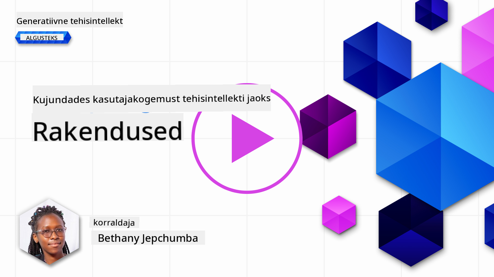
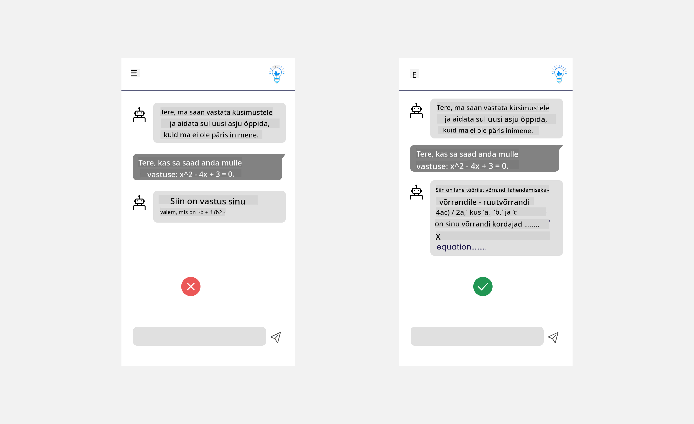
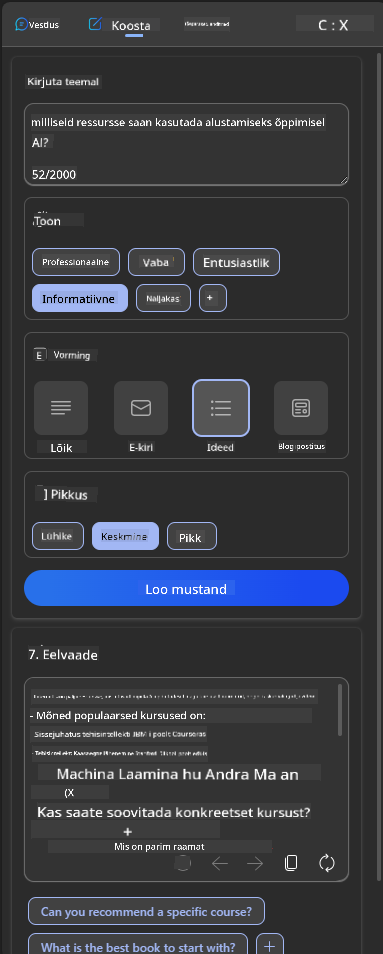

<!--
CO_OP_TRANSLATOR_METADATA:
{
  "original_hash": "747668e4c53d067369f06e9ec2e6313e",
  "translation_date": "2025-10-11T11:52:08+00:00",
  "source_file": "12-designing-ux-for-ai-applications/README.md",
  "language_code": "et"
}
-->
# UX-i kujundamine tehisintellekti rakenduste jaoks

> _(Klõpsake ülaloleval pildil, et vaadata selle õppetunni videot)_

Kasutajakogemus on rakenduste loomisel väga oluline aspekt. Kasutajad peavad saama teie rakendust tõhusalt kasutada, et ülesandeid täita. Tõhusus on üks asi, kuid rakendused tuleb kujundada ka nii, et neid saaks kasutada kõik, muutes need _ligipääsetavaks_. See peatükk keskendub sellele valdkonnale, et saaksite kujundada rakenduse, mida inimesed saavad ja tahavad kasutada.

## Sissejuhatus

Kasutajakogemus tähendab seda, kuidas kasutaja suhtleb konkreetse toote või teenusega, olgu see süsteem, tööriist või disain. Tehisintellekti rakenduste arendamisel keskenduvad arendajad mitte ainult tõhusa kasutajakogemuse tagamisele, vaid ka eetilisusele. Selles õppetunnis käsitleme, kuidas luua tehisintellekti (AI) rakendusi, mis vastavad kasutajate vajadustele.

Õppetund hõlmab järgmisi teemasid:

- Kasutajakogemuse tutvustus ja kasutajate vajaduste mõistmine
- Tehisintellekti rakenduste kujundamine usalduse ja läbipaistvuse jaoks
- Tehisintellekti rakenduste kujundamine koostöö ja tagasiside jaoks

## Õppeeesmärgid

Pärast selle õppetunni läbimist oskate:

- Mõista, kuidas luua tehisintellekti rakendusi, mis vastavad kasutajate vajadustele.
- Kujundada tehisintellekti rakendusi, mis edendavad usaldust ja koostööd.

### Eeltingimus

Võtke aega ja lugege rohkem [kasutajakogemuse ja disainmõtlemise kohta.](https://learn.microsoft.com/training/modules/ux-design?WT.mc_id=academic-105485-koreyst)

## Kasutajakogemuse tutvustus ja kasutajate vajaduste mõistmine

Meie väljamõeldud haridusettevõttes on kaks peamist kasutajat: õpetajad ja õpilased. Mõlemal kasutajal on unikaalsed vajadused. Kasutajakeskne disain seab kasutaja esikohale, tagades, et tooted on asjakohased ja kasulikud neile, kellele need on mõeldud.

Rakendus peaks olema **kasulik, usaldusväärne, ligipääsetav ja meeldiv**, et pakkuda head kasutajakogemust.

### Kasulikkus

Kasulik olemine tähendab, et rakendusel on funktsionaalsus, mis vastab selle kavandatud eesmärgile, näiteks hindamisprotsessi automatiseerimine või kordamiskaartide loomine. Rakendus, mis automatiseerib hindamisprotsessi, peaks suutma täpselt ja tõhusalt määrata õpilaste tööle hindeid vastavalt eelnevalt määratletud kriteeriumidele. Samamoodi peaks rakendus, mis loob kordamiskaarte, suutma luua asjakohaseid ja mitmekesiseid küsimusi oma andmete põhjal.

### Usaldusväärsus

Usaldusväärne olemine tähendab, et rakendus suudab oma ülesandeid järjepidevalt ja vigadeta täita. Kuid tehisintellekt, nagu inimesedki, pole täiuslik ja võib olla vigadele vastuvõtlik. Rakendused võivad kokku puutuda vigade või ootamatute olukordadega, mis vajavad inimsekkumist või parandust. Kuidas vigu käsitleda? Selle õppetunni viimases osas käsitleme, kuidas tehisintellekti süsteemid ja rakendused on kujundatud koostööks ja tagasisideks.

### Ligipääsetavus

Ligipääsetav olemine tähendab kasutajakogemuse laiendamist erinevate võimetega kasutajatele, sealhulgas puuetega inimestele, tagades, et keegi ei jää kõrvale. Järgides ligipääsetavuse juhiseid ja põhimõtteid, muutuvad tehisintellekti lahendused kaasavamaks, kasutajasõbralikumaks ja kasulikumaks kõigile kasutajatele.

### Meeldivus

Meeldiv olemine tähendab, et rakendust on nauditav kasutada. Atraktiivne kasutajakogemus võib avaldada positiivset mõju kasutajale, julgustades teda rakendust uuesti kasutama ja suurendades ettevõtte tulusid.

Mitte iga väljakutset ei saa lahendada tehisintellektiga. Tehisintellekt täiendab teie kasutajakogemust, olgu see siis käsitsi tehtavate ülesannete automatiseerimine või kasutajakogemuste isikupärastamine.

## Tehisintellekti rakenduste kujundamine usalduse ja läbipaistvuse jaoks

Usalduse loomine on tehisintellekti rakenduste kujundamisel kriitiline. Usaldus tagab, et kasutaja on kindel, et rakendus täidab ülesande, annab järjepidevalt tulemusi ja tulemused vastavad kasutaja vajadustele. Selle valdkonna riskiks on usaldamatus ja ülemäärane usaldus. Usaldamatus tekib siis, kui kasutajal on tehisintellekti süsteemi suhtes vähe või üldse mitte usaldust, mis viib rakenduse tagasilükkamiseni. Ülemäärane usaldus tekib siis, kui kasutaja hindab tehisintellekti süsteemi võimeid üle, usaldades seda liiga palju. Näiteks hindamise automatiseerimise süsteem ülemäärase usalduse korral võib viia selleni, et õpetaja ei kontrolli mõningaid töid, et veenduda hindamissüsteemi korrektsuses. See võib põhjustada ebaõiglasi või ebatäpseid hindeid õpilastele või kaotatud võimalusi tagasisideks ja parandamiseks.

Kaks viisi, kuidas tagada usalduse keskne roll disainis, on selgitatavus ja kontroll.

### Selgitatavus

Kui tehisintellekt aitab otsuseid teha, näiteks tulevastele põlvkondadele teadmisi edasi anda, on õpetajatele ja vanematele oluline mõista, kuidas tehisintellekti otsused tehakse. See on selgitatavus – arusaamine, kuidas tehisintellekti rakendused otsuseid teevad. Selgitatavuse kujundamine hõlmab detailide lisamist, mis toovad esile, kuidas tehisintellekt jõudis tulemuseni. Publik peab olema teadlik, et tulemus on genereeritud tehisintellekti, mitte inimese poolt. Näiteks selle asemel, et öelda "Alusta vestlust oma juhendajaga kohe", öelge "Kasuta tehisintellekti juhendajat, mis kohandub sinu vajadustega ja aitab sul õppida omas tempos."

Teine näide on see, kuidas tehisintellekt kasutab kasutaja ja isikuandmeid. Näiteks kasutaja, kelle persona on õpilane, võib oma persona põhjal olla piiratud. Tehisintellekt ei pruugi suuta vastuseid küsimustele avaldada, kuid võib aidata kasutajal mõelda, kuidas probleemi lahendada.

Viimane oluline osa selgitatavusest on selgituste lihtsustamine. Õpilased ja õpetajad ei pruugi olla tehisintellekti eksperdid, seega peaksid selgitused rakenduse võimete ja piirangute kohta olema lihtsad ja kergesti arusaadavad.

### Kontroll

Generatiivne tehisintellekt loob koostöö tehisintellekti ja kasutaja vahel, kus näiteks kasutaja saab muuta päringuid erinevate tulemuste saamiseks. Lisaks peaksid kasutajad saama pärast tulemuse genereerimist seda muuta, andes neile kontrolli tunde. Näiteks Bingis saate kohandada oma päringut formaadi, tooni ja pikkuse põhjal. Lisaks saate oma tulemust muuta ja kohandada, nagu allpool näidatud:

Teine Bingi funktsioon, mis võimaldab kasutajal rakenduse üle kontrolli omada, on võimalus andmete kasutamisest tehisintellekti poolt sisse ja välja lülitada. Koolirakenduse puhul võib õpilane soovida kasutada oma märkmeid ja õpetaja ressursse kordamismaterjalina.

> Tehisintellekti rakenduste kujundamisel on oluline tagada, et kasutajad ei usaldaks süsteemi üle, seades ebarealistlikke ootusi selle võimetele. Üks viis selle saavutamiseks on luua hõõrdumine päringute ja tulemuste vahel, tuletades kasutajale meelde, et tegemist on tehisintellektiga, mitte inimesega.

## Tehisintellekti rakenduste kujundamine koostöö ja tagasiside jaoks

Nagu varem mainitud, loob generatiivne tehisintellekt koostöö kasutaja ja tehisintellekti vahel. Enamik suhtlusi toimub nii, et kasutaja sisestab päringu ja tehisintellekt genereerib tulemuse. Mis juhtub, kui tulemus on vale? Kuidas rakendus käsitleb vigu, kui need tekivad? Kas tehisintellekt süüdistab kasutajat või võtab aega vea selgitamiseks?

Tehisintellekti rakendused peaksid olema loodud tagasiside saamiseks ja andmiseks. See mitte ainult ei aita tehisintellekti süsteemil paraneda, vaid loob ka kasutajatega usaldust. Tagasiside silmus peaks olema disainis kaasatud, näiteks lihtne pöidla üles või alla märk tulemusel.

Teine viis selle käsitlemiseks on süsteemi võimete ja piirangute selge kommunikeerimine. Kui kasutaja teeb vea, küsides midagi, mis ületab tehisintellekti võimeid, peaks olema viis seda käsitleda, nagu allpool näidatud.

Süsteemi vead on rakendustes tavalised, kus kasutaja võib vajada abi teabega, mis jääb tehisintellekti ulatusest välja, või rakendusel võib olla piirang, kui palju küsimusi/teemasid kasutaja saab kokkuvõtteid genereerida. Näiteks tehisintellekti rakendus, mis on treenitud piiratud teemade andmetega, näiteks ajalugu ja matemaatika, ei pruugi suuta vastata geograafia küsimustele. Selle leevendamiseks võib tehisintellekti süsteem anda vastuse nagu: "Vabandust, meie toode on treenitud järgmiste teemade andmetega....., ma ei saa vastata teie esitatud küsimusele."

Tehisintellekti rakendused pole täiuslikud, seega on nad vigadele vastuvõtlikud. Rakenduste kujundamisel peaksite tagama, et loote ruumi kasutajate tagasisideks ja vigade käsitlemiseks viisil, mis on lihtne ja kergesti arusaadav.

## Ülesanne

Võtke mõni tehisintellekti rakendus, mille olete seni loonud, ja kaaluge järgmiste sammude rakendamist oma rakenduses:

- **Meeldivus:** Mõelge, kuidas saaksite oma rakenduse meeldivamaks muuta. Kas lisate selgitusi igale poole? Kas julgustate kasutajat avastama? Kuidas sõnastate oma veateateid?

- **Kasulikkus:** Veebirakenduse loomine. Veenduge, et teie rakendust saab kasutada nii hiire kui ka klaviatuuriga.

- **Usaldus ja läbipaistvus:** Ärge usaldage tehisintellekti ja selle tulemusi täielikult, kaaluge, kuidas lisada protsessi inimene, et tulemusi kontrollida. Samuti kaaluge ja rakendage muid viise usalduse ja läbipaistvuse saavutamiseks.

- **Kontroll:** Andke kasutajale kontroll andmete üle, mida nad rakendusele esitavad. Rakendage viis, kuidas kasutaja saab andmete kogumisest tehisintellekti rakenduses sisse ja välja lülitada.

<!-- ## [Järgneva loengu viktoriin](../../../12-designing-ux-for-ai-applications/quiz-url) -->

## Jätkake õppimist!

Pärast selle õppetunni lõpetamist vaadake meie [Generatiivse tehisintellekti õppekollektsiooni](https://aka.ms/genai-collection?WT.mc_id=academic-105485-koreyst), et jätkata oma generatiivse tehisintellekti teadmiste arendamist!

Liikuge edasi 13. õppetundi, kus vaatame, kuidas [tehisintellekti rakendusi turvata](../13-securing-ai-applications/README.md?WT.mc_id=academic-105485-koreyst)!

---

**Lahtiütlus**:  
See dokument on tõlgitud, kasutades AI tõlketeenust [Co-op Translator](https://github.com/Azure/co-op-translator). Kuigi püüame tagada täpsust, palun arvestage, et automaatsed tõlked võivad sisaldada vigu või ebatäpsusi. Algne dokument selle algkeeles tuleks lugeda autoriteetseks allikaks. Olulise teabe puhul on soovitatav kasutada professionaalset inimtõlget. Me ei vastuta selle tõlke kasutamisest tulenevate arusaamatuste või valede tõlgenduste eest.