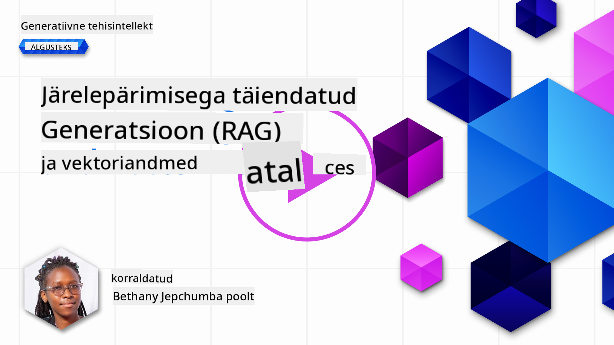
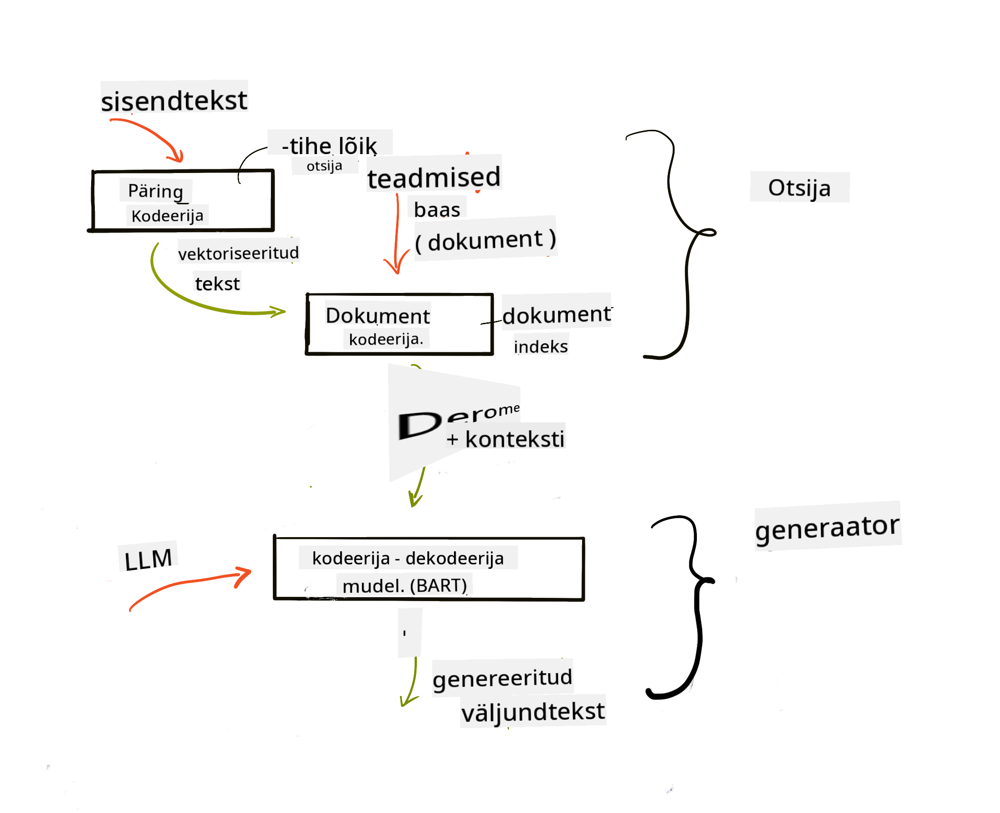

<!--
CO_OP_TRANSLATOR_METADATA:
{
  "original_hash": "e2861bbca91c0567ef32bc77fe054f9e",
  "translation_date": "2025-10-11T11:15:10+00:00",
  "source_file": "15-rag-and-vector-databases/README.md",
  "language_code": "et"
}
-->
# Andmetel põhinev generatsioon (RAG) ja vektorpõhised andmebaasid

[](https://aka.ms/gen-ai-lesson15-gh?WT.mc_id=academic-105485-koreyst)

Otsingurakenduste õppetunnis õppisime lühidalt, kuidas integreerida oma andmeid suurtesse keelemudelitesse (LLM). Selles õppetükis süveneme rohkem andmete sidumise kontseptsiooni LLM-rakenduses, protsessi mehhanismidesse ja andmete salvestamise meetoditesse, sealhulgas nii sisukokkuvõtete kui ka tekstide salvestamisse.

> **Video tuleb peagi**

## Sissejuhatus

Selles õppetükis käsitleme järgmist:

- Sissejuhatus RAG-i, mis see on ja miks seda tehisintellektis kasutatakse.

- Arusaamine, mis on vektorpõhised andmebaasid, ja ühe loomine meie rakenduse jaoks.

- Praktiline näide, kuidas RAG-i rakendusse integreerida.

## Õpieesmärgid

Pärast selle õppetüki läbimist suudad:

- Selgitada RAG-i tähtsust andmete otsimisel ja töötlemisel.

- Seadistada RAG-rakendust ja siduda oma andmeid LLM-iga.

- Tõhusalt integreerida RAG-i ja vektorpõhiseid andmebaase LLM-rakendustesse.

## Meie stsenaarium: LLM-ide täiustamine oma andmetega

Selles õppetükis soovime lisada oma märkmeid haridusalasesse idufirmasse, mis võimaldab vestlusrobotil saada rohkem teavet erinevate teemade kohta. Kasutades oma märkmeid, saavad õppijad paremini õppida ja erinevaid teemasid mõista, mis muudab eksamiteks valmistumise lihtsamaks. Stsenaariumi loomiseks kasutame:

- `Azure OpenAI:` LLM, mida kasutame oma vestlusroboti loomiseks.

- `AI algajatele mõeldud õppetund närvivõrkudest:` see on andmestik, millele me oma LLM-i põhistame.

- `Azure AI Search` ja `Azure Cosmos DB:` vektorpõhine andmebaas, kuhu salvestame oma andmed ja loome otsinguindeksi.

Kasutajad saavad oma märkmetest luua harjutusteste, kordamiskaarte ja koostada lühikokkuvõtteid. Alustamiseks vaatame, mis on RAG ja kuidas see töötab:

## Andmetel põhinev generatsioon (RAG)

LLM-i toega vestlusrobot töötleb kasutaja sisendeid, et genereerida vastuseid. See on loodud interaktiivseks ja suhtleb kasutajatega erinevatel teemadel. Kuid selle vastused on piiratud antud konteksti ja algse treeningandmestikuga. Näiteks GPT-4 teadmiste lõppkuupäev on september 2021, mis tähendab, et tal puudub teadmine pärast seda perioodi toimunud sündmustest. Lisaks ei sisalda LLM-ide treeningandmed konfidentsiaalset teavet, nagu isiklikud märkmed või ettevõtte tootekäsiraamat.

### Kuidas RAG-id (andmetel põhinev generatsioon) töötavad


Oletame, et soovite juurutada vestlusrobotit, mis loob teie märkmetest teste, siis vajate ühendust teadmistebaasiga. Siin tulebki appi RAG. RAG-id töötavad järgmiselt:

- **Teadmistebaas:** Enne andmete otsimist tuleb need dokumendid sisestada ja eeltöödelda, tavaliselt jagades suured dokumendid väiksemateks osadeks, teisendades need tekstisisestusteks ja salvestades need andmebaasi.

- **Kasutaja päring:** kasutaja esitab küsimuse.

- **Otsing:** Kui kasutaja esitab küsimuse, otsib sisestusmudel meie teadmistebaasist asjakohast teavet, et pakkuda rohkem konteksti, mis lisatakse sisendile.

- **Täiendatud generatsioon:** LLM täiustab oma vastust saadud andmete põhjal. See võimaldab genereeritud vastusel põhineda mitte ainult eelnevalt treenitud andmetel, vaid ka lisatud konteksti asjakohasel teabel. Saadud andmeid kasutatakse LLM-i vastuste täiendamiseks. Seejärel tagastab LLM kasutaja küsimusele vastuse.



RAG-ide arhitektuur on rakendatud transformeerijate abil, mis koosnevad kahest osast: kodeerijast ja dekodeerijast. Näiteks kui kasutaja esitab küsimuse, kodeeritakse sisendtekst vektoriteks, mis hõlmavad sõnade tähendust, ja vektorid dekodeeritakse meie dokumendiindeksisse, et genereerida kasutaja päringu põhjal uus tekst. LLM kasutab nii kodeerija-dekodeerija mudelit väljundi genereerimiseks.

Kaks lähenemisviisi RAG-i rakendamisel vastavalt pakutud artiklile: [Retrieval-Augmented Generation for Knowledge intensive NLP (natural language processing software) Tasks](https://arxiv.org/pdf/2005.11401.pdf?WT.mc_id=academic-105485-koreyst) on:

- **_RAG-Sequence_** kasutab saadud dokumente, et ennustada kasutaja päringule parim võimalik vastus.

- **RAG-Token** kasutab dokumente järgmise sõna genereerimiseks ja seejärel otsib vastuse kasutaja päringule.

### Miks kasutada RAG-e?

- **Teabe rikkus:** tagab, et tekstivastused on ajakohased ja asjakohased. See parandab seega domeenispetsiifiliste ülesannete täitmist, pääsedes ligi sisemisele teadmistebaasile.

- Vähendab väljamõeldisi, kasutades **kontrollitavat teavet** teadmistebaasis, et pakkuda kasutaja päringutele konteksti.

- See on **kuluefektiivne**, kuna on ökonoomsem võrreldes LLM-i peenhäälestamisega.

## Teadmistebaasi loomine

Meie rakendus põhineb meie isiklikel andmetel, st AI algajatele mõeldud õppekava närvivõrkude õppetunnil.

### Vektorpõhised andmebaasid

Vektorpõhine andmebaas erineb traditsioonilistest andmebaasidest, kuna see on spetsialiseerunud andmete salvestamisele, haldamisele ja otsimisele vektorite kujul. See salvestab dokumentide numbrilised esitlused. Andmete jagamine numbrilisteks vektoriteks muudab meie AI-süsteemile andmete mõistmise ja töötlemise lihtsamaks.

Salvestame oma vektorid vektorpõhisesse andmebaasi, kuna LLM-idel on piirang, kui palju märke nad sisendina vastu võtavad. Kuna kogu vektoreid ei saa LLM-ile edastada, peame need jagama osadeks ja kui kasutaja esitab küsimuse, tagastatakse vektorid, mis on küsimusega kõige sarnasemad, koos sisendiga. Osadeks jagamine vähendab ka LLM-i kaudu edastatavate märkide arvu kulusid.

Mõned populaarsed vektorpõhised andmebaasid on Azure Cosmos DB, Clarifyai, Pinecone, Chromadb, ScaNN, Qdrant ja DeepLake. Azure Cosmos DB mudeli saab luua Azure CLI abil järgmise käsuga:

```bash
az login
az group create -n <resource-group-name> -l <location>
az cosmosdb create -n <cosmos-db-name> -r <resource-group-name>
az cosmosdb list-keys -n <cosmos-db-name> -g <resource-group-name>
```

### Tekstist vektoriteks

Enne andmete salvestamist peame need teisendama vektoriteks, et neid andmebaasis salvestada. Kui töötate suurte dokumentide või pikkade tekstidega, saate need jagada osadeks vastavalt oodatavatele päringutele. Osadeks jagamine võib toimuda lause või lõigu tasemel. Kuna osadeks jagamine tuletab tähendusi ümbritsevatest sõnadest, saate osale lisada ka mõne muu konteksti, näiteks dokumendi pealkirja või mõne teksti enne või pärast osa. Andmeid saab osadeks jagada järgmiselt:

```python
def split_text(text, max_length, min_length):
    words = text.split()
    chunks = []
    current_chunk = []

    for word in words:
        current_chunk.append(word)
        if len(' '.join(current_chunk)) < max_length and len(' '.join(current_chunk)) > min_length:
            chunks.append(' '.join(current_chunk))
            current_chunk = []

    # If the last chunk didn't reach the minimum length, add it anyway
    if current_chunk:
        chunks.append(' '.join(current_chunk))

    return chunks
```

Kui andmed on osadeks jagatud, saame need seejärel vektoriteks teisendada, kasutades erinevaid vektormudeleid. Mõned mudelid, mida saate kasutada, on: word2vec, ada-002 OpenAI poolt, Azure Computer Vision ja paljud teised. Mudeli valik sõltub kasutatavatest keeltest, kodeeritava sisu tüübist (tekst/pildid/heli), sisendi suurusest ja vektori väljundi pikkusest.

Näide OpenAI `text-embedding-ada-002` mudeli abil vektoriks teisendatud tekstist:


## Otsing ja vektorotsing

Kui kasutaja esitab küsimuse, teisendab otsija selle vektoriks, kasutades päringu kodeerijat, seejärel otsib meie dokumendiotsingu indeksist sisendiga seotud vektoreid. Kui see on tehtud, teisendab see nii sisendvektori kui ka dokumendivektorid tekstiks ja edastab need LLM-ile.

### Otsing

Otsing toimub siis, kui süsteem püüab kiiresti leida indeksist dokumente, mis vastavad otsingukriteeriumidele. Otsija eesmärk on leida dokumendid, mida kasutatakse konteksti pakkumiseks ja LLM-i andmetega sidumiseks.

Andmebaasis otsingut saab teha mitmel viisil, näiteks:

- **Märksõnaotsing** - kasutatakse tekstipõhisteks otsinguteks.

- **Semantiline otsing** - kasutab sõnade semantilist tähendust.

- **Vektorotsing** - teisendab dokumendid tekstist vektoriteks, kasutades vektormudeleid. Otsing toimub, pärides dokumente, mille vektorid on kasutaja küsimusele kõige lähemal.

- **Hübriidne** - märksõna- ja vektorotsingu kombinatsioon.

Otsinguga võib tekkida probleeme, kui andmebaasis pole päringule sarnast vastust. Sel juhul tagastab süsteem parima võimaliku teabe, mida nad saavad. Siiski saate kasutada selliseid taktikaid nagu määrata maksimaalne kaugus asjakohasuse jaoks või kasutada hübriidotsingut, mis ühendab nii märksõna- kui ka vektorotsingu. Selles õppetükis kasutame hübriidotsingut, mis ühendab nii vektori- kui ka märksõnaotsingu. Salvestame oma andmed andmeraamistikku, mille veerud sisaldavad nii osasid kui ka vektoreid.

### Vektorite sarnasus

Otsija otsib teadmistebaasist vektoreid, mis on üksteisele lähedal, lähimad naabrid, kuna need on sarnased tekstid. Kui kasutaja esitab päringu, teisendatakse see esmalt vektoriks ja seejärel sobitatakse sarnaste vektoritega. Levinud mõõdik, mida kasutatakse erinevate vektorite sarnasuse leidmiseks, on kosinuse sarnasus, mis põhineb kahe vektori vahelisel nurgal.

Sarnasuse mõõtmiseks võib kasutada ka teisi alternatiive, näiteks Eukleidese kaugust, mis on sirgjoon vektorite otspunktide vahel, ja skalaarkorrutist, mis mõõdab kahe vektori vastavate elementide korrutiste summat.

### Otsinguindeks

Otsingu tegemisel peame looma oma teadmistebaasi jaoks otsinguindeksi enne otsingu sooritamist. Indeks salvestab meie vektorid ja suudab kiiresti leida kõige sarnasemad osad isegi suures andmebaasis. Indeksi saame luua kohapeal, kasutades:

```python
from sklearn.neighbors import NearestNeighbors

embeddings = flattened_df['embeddings'].to_list()

# Create the search index
nbrs = NearestNeighbors(n_neighbors=5, algorithm='ball_tree').fit(embeddings)

# To query the index, you can use the kneighbors method
distances, indices = nbrs.kneighbors(embeddings)
```

### Tulemuste ümberjärjestamine

Pärast andmebaasi päringut võib olla vajalik tulemuste sorteerimine kõige asjakohasemate järgi. Ümberjärjestamise LLM kasutab masinõpet, et parandada otsingutulemuste asjakohasust, järjestades need kõige asjakohasemast. Azure AI Search kasutamisel toimub ümberjärjestamine automaatselt, kasutades semantilist ümberjärjestajat. Näide, kuidas ümberjärjestamine töötab lähimate naabrite abil:

```python
# Find the most similar documents
distances, indices = nbrs.kneighbors([query_vector])

index = []
# Print the most similar documents
for i in range(3):
    index = indices[0][i]
    for index in indices[0]:
        print(flattened_df['chunks'].iloc[index])
        print(flattened_df['path'].iloc[index])
        print(flattened_df['distances'].iloc[index])
    else:
        print(f"Index {index} not found in DataFrame")
```

## Kõik kokku viimine

Viimane samm on LLM-i lisamine, et saada vastuseid, mis põhinevad meie andmetel. Seda saab rakendada järgmiselt:

```python
user_input = "what is a perceptron?"

def chatbot(user_input):
    # Convert the question to a query vector
    query_vector = create_embeddings(user_input)

    # Find the most similar documents
    distances, indices = nbrs.kneighbors([query_vector])

    # add documents to query  to provide context
    history = []
    for index in indices[0]:
        history.append(flattened_df['chunks'].iloc[index])

    # combine the history and the user input
    history.append(user_input)

    # create a message object
    messages=[
        {"role": "system", "content": "You are an AI assistant that helps with AI questions."},
        {"role": "user", "content": history[-1]}
    ]

    # use chat completion to generate a response
    response = openai.chat.completions.create(
        model="gpt-4",
        temperature=0.7,
        max_tokens=800,
        messages=messages
    )

    return response.choices[0].message

chatbot(user_input)
```

## Meie rakenduse hindamine

### Hindamiskriteeriumid

- Antud vastuste kvaliteet, tagades, et need kõlavad loomulikult, sujuvalt ja inimlikult.

- Andmete alusel vastamine: hinnates, kas vastus pärineb esitatud dokumentidest.

- Asjakohasus: hinnates, kas vastus vastab ja on seotud esitatud küsimusega.

- Sujuvus - kas vastus on grammatiliselt loogiline.

## RAG-i (andmetel põhinev generatsioon) ja vektorpõhiste andmebaaside kasutusvõimalused

RAG-i ja vektorpõhiseid andmebaase saab kasutada mitmesugustes olukordades, näiteks:

- Küsimuste ja vastuste süsteemid: ettevõtte andmete sidumine vestlusega, mida töötajad saavad kasutada küsimuste esitamiseks.

- Soovitussüsteemid: süsteemi loomine, mis sobitab kõige sarnasemaid väärtusi, nt filme, restorane ja palju muud.

- Vestlusrobotite teenused: saate salvestada vestluste ajalugu ja isikupärastada vestlust kasutaja andmete põhjal.

- Piltide otsing vektorite põhjal, mis on kasulik pildituvastuses ja anomaaliate tuvastamises.

## Kokkuvõte

Oleme käsitlenud RAG-i põhialuseid, alates andmete lisamisest rakendusse kuni kasutaja päringu ja väljundini. RAG-i loomise lihtsustamiseks saate kasutada selliseid raamistikke nagu Semantic Kernel, Langchain või Autogen.

## Ülesanne

Et jätkata andmetel põhineva generatsiooni (RAG) õppimist, saate luua:

- Looge rakenduse kasutajaliides, kasutades oma valitud raamistikku.

- Kasutage mõnda raamistikku, näiteks LangChain või Semantic Kernel, ja looge oma rakendus uuesti.

Palju õnne õppetüki lõpetamise puhul 👏.

## Õppimine ei lõpe siin, jätka teekonda

Pärast selle õppetüki lõpetamist vaadake meie [Generatiivse tehisintellekti õppekollektsiooni](https://aka.ms/genai-collection?WT.mc_id=academic-105485-koreyst), et jätkata oma generatiivse tehisintellekti teadmiste arendamist!

---

**Lahtiütlus**:  
See dokument on tõlgitud, kasutades AI tõlketeenust [Co-op Translator](https://github.com/Azure/co-op-translator). Kuigi püüame tagada täpsust, palume arvestada, et automaatsed tõlked võivad sisaldada vigu või ebatäpsusi. Algne dokument selle algkeeles tuleks lugeda autoriteetseks allikaks. Olulise teabe puhul soovitame kasutada professionaalset inimtõlget. Me ei vastuta selle tõlke kasutamisest tulenevate arusaamatuste või valede tõlgenduste eest.