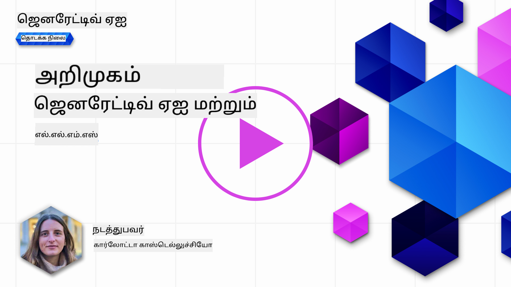
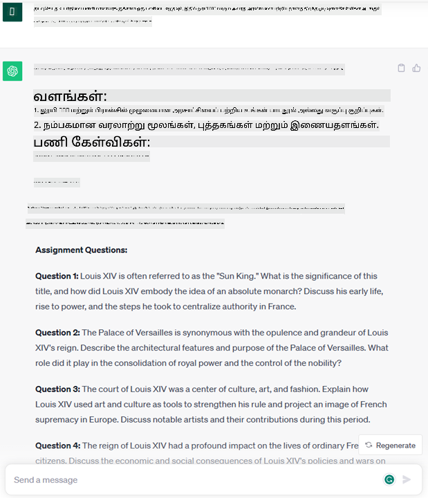

<!--
CO_OP_TRANSLATOR_METADATA:
{
  "original_hash": "f53ba0fa49164f9323043f1c6b11f2b1",
  "translation_date": "2025-10-11T11:17:39+00:00",
  "source_file": "01-introduction-to-genai/README.md",
  "language_code": "ta"
}
-->
# ஜெனரேட்டிவ் AI மற்றும் பெரிய மொழி மாதிரிகள் அறிமுகம்

_(இந்த பாடத்தின் வீடியோவைப் பார்க்க மேலே உள்ள படத்தை கிளிக் செய்யவும்)_

ஜெனரேட்டிவ் AI என்பது உரை, படங்கள் மற்றும் பிற வகையான உள்ளடக்கங்களை உருவாக்கும் திறன் கொண்ட செயற்கை நுண்ணறிவு. இதை ஒரு அற்புதமான தொழில்நுட்பமாக மாற்றுவது என்னவென்றால், இது AI-ஐ அனைவருக்கும் எளிதாகக் கிடைக்கச் செய்கிறது; இயற்கை மொழியில் எழுதப்பட்ட ஒரு வாக்கியத்தைப் போன்று ஒரு உரை உந்துதலுடன் இதைப் பயன்படுத்தலாம். நீங்கள் Java அல்லது SQL போன்ற ஒரு மொழியைப் படிக்க வேண்டிய அவசியமில்லை; உங்கள் மொழியைப் பயன்படுத்தி, நீங்கள் என்ன விரும்புகிறீர்கள் என்பதைச் சொல்லுங்கள், அதற்கான ஒரு பரிந்துரை AI மாதிரியில் இருந்து வெளிவரும். இதற்கான பயன்பாடுகள் மற்றும் தாக்கங்கள் மிகப்பெரியது; நீங்கள் அறிக்கைகளை எழுதலாம் அல்லது புரிந்துகொள்ளலாம், பயன்பாடுகளை உருவாக்கலாம் மற்றும் பலவற்றை சில விநாடிகளில் முடிக்கலாம்.

இந்த பாடத்திட்டத்தில், எங்கள் ஸ்டார்ட்அப் கல்வி உலகில் புதிய சூழல்களைத் திறக்க ஜெனரேட்டிவ் AI-ஐ எவ்வாறு பயன்படுத்துகிறது மற்றும் அதன் பயன்பாட்டின் சமூக விளைவுகள் மற்றும் தொழில்நுட்ப வரையறைகளுடன் தொடர்புடைய சவால்களை எவ்வாறு எதிர்கொள்கிறோம் என்பதை ஆராய்வோம்.

## அறிமுகம்

இந்த பாடத்தில் நீங்கள் கற்றுக்கொள்ளப்போகிறீர்கள்:

- வணிக சூழலின் அறிமுகம்: எங்கள் ஸ்டார்ட்அப் யோசனை மற்றும் நோக்கம்.
- ஜெனரேட்டிவ் AI மற்றும் தற்போதைய தொழில்நுட்ப நிலைக்கு எவ்வாறு வந்தோம்.
- பெரிய மொழி மாதிரியின் உள் செயல்பாடுகள்.
- பெரிய மொழி மாதிரிகளின் முக்கிய திறன்கள் மற்றும் நடைமுறை பயன்பாடுகள்.

## கற்றல் இலக்குகள்

இந்த பாடத்தை முடித்த பிறகு, நீங்கள் புரிந்துகொள்வீர்கள்:

- ஜெனரேட்டிவ் AI என்ன மற்றும் பெரிய மொழி மாதிரிகள் எவ்வாறு செயல்படுகின்றன.
- கல்வி சூழல்களை மையமாகக் கொண்டு, பெரிய மொழி மாதிரிகளை பல்வேறு பயன்பாடுகளுக்கு எவ்வாறு பயன்படுத்தலாம்.

## சூழல்: எங்கள் கல்வி ஸ்டார்ட்அப்

ஜெனரேட்டிவ் செயற்கை நுண்ணறிவு (AI) என்பது AI தொழில்நுட்பத்தின் உச்சம், ஒருமுறை சாத்தியமற்றது என்று நினைக்கப்பட்ட எல்லைகளை தாண்டுகிறது. ஜெனரேட்டிவ் AI மாதிரிகள் பல திறன்களையும் பயன்பாடுகளையும் கொண்டுள்ளன, ஆனால் இந்த பாடத்திட்டத்திற்காக, இது ஒரு கற்பனை ஸ்டார்ட்அப்பின் மூலம் கல்வியை எவ்வாறு புரட்சிகரமாக மாற்றுகிறது என்பதை ஆராய்வோம். இந்த ஸ்டார்ட்அப்பை _எங்கள் ஸ்டார்ட்அப்_ என்று குறிப்பிடுவோம். எங்கள் ஸ்டார்ட்அப் கல்வி துறையில் செயல்படுகிறது, அதன் தைரியமான நோக்கக் கூற்றாக:

> _கற்றலின் அணுகுமுறையை உலகளாவிய அளவில் மேம்படுத்தி, கல்விக்கு சமமான அணுகலை உறுதிசெய்து, ஒவ்வொரு கற்றவரின் தேவைகளுக்கு ஏற்ப தனிப்பயன் கற்றல் அனுபவங்களை வழங்குதல்._

எங்கள் ஸ்டார்ட்அப் குழு, இந்த இலக்கை அடைய, தற்போதைய காலத்தின் மிக சக்திவாய்ந்த கருவிகளில் ஒன்றான பெரிய மொழி மாதிரிகளை (LLMs) பயன்படுத்தாமல் முடியாது என்பதை அறிந்துள்ளது.

ஜெனரேட்டிவ் AI இன்று நாம் கற்றல் மற்றும் கற்பித்தல் முறையை புரட்சிகரமாக மாற்றும் என்று எதிர்பார்க்கப்படுகிறது, மாணவர்கள் 24 மணி நேரமும் விரிவான தகவல்களையும் உதாரணங்களையும் வழங்கும் மெய்நிகர் ஆசிரியர்களை பயன்படுத்த முடியும், மற்றும் ஆசிரியர்கள் தங்கள் மாணவர்களை மதிப்பீடு செய்யவும் கருத்துகளை வழங்கவும் புதுமையான கருவிகளைப் பயன்படுத்த முடியும்.

முதலில், இந்த பாடத்திட்டத்தில் நாம் பயன்படுத்தப்போகும் சில அடிப்படை கருத்துகள் மற்றும் சொற்களை வரையறுக்கலாம்.

## ஜெனரேட்டிவ் AI எவ்வாறு உருவானது?

சமீபத்தில் ஜெனரேட்டிவ் AI மாதிரிகள் அறிவிக்கப்பட்டதால் ஏற்பட்ட அசாதாரண _ஹைப்_ இருந்தாலும், இந்த தொழில்நுட்பம் பல தசாப்தங்களாக உருவாக்கப்பட்டு வருகிறது, 60களில் முதல் ஆராய்ச்சி முயற்சிகள் தொடங்கியது. இன்று AI மனித அறிவாற்றல் திறன்களைப் பெற்றுள்ளது, உரையாடல் போன்றவை, உதாரணமாக [OpenAI ChatGPT](https://openai.com/chatgpt) அல்லது [Bing Chat](https://www.microsoft.com/edge/features/bing-chat?WT.mc_id=academic-105485-koreyst) மூலம் காட்டப்படுகிறது, இது Bing உரையாடல்களுக்கு GPT மாதிரியைப் பயன்படுத்துகிறது.

சிறிது பின்னோக்குச் செல்வோம், AI-யின் முதல் மாதிரிகள் தட்டச்சு செய்யப்பட்ட சாட்பாட்கள், நிபுணர்களின் குழுவிலிருந்து எடுக்கப்பட்ட அறிவு அடிப்படையை நம்பியவை மற்றும் கணினியில் பிரதிநிதித்துவம் பெற்றவை. அறிவு அடிப்படையில் உள்ள பதில்கள் உள்ளீட்டு உரையில் தோன்றும் முக்கிய வார்த்தைகளால் தூண்டப்பட்டன.
ஆனால், இந்த அணுகுமுறை, தட்டச்சு செய்யப்பட்ட சாட்பாட்களைப் பயன்படுத்துவது, நன்றாக அளவிட முடியாது என்பது விரைவில் தெளிவாகியது.

### AI-க்கு புள்ளியியல் அணுகுமுறை: மெஷின் லெர்னிங்

90களில் உரை பகுப்பாய்வுக்கு புள்ளியியல் அணுகுமுறை பயன்படுத்தப்பட்டதில் ஒரு திருப்புமுனை ஏற்பட்டது. இது _மெஷின் லெர்னிங்_ என்று அழைக்கப்படும் புதிய ஆல்காரிதங்களை உருவாக்க வழிவகுத்தது, இது தரவிலிருந்து முறைமைகளை கற்றுக்கொள்வதற்கான திறனை கொண்டது, வெளிப்படையாக நிரலிடப்படாமல். இந்த அணுகுமுறை இயந்திரங்களுக்கு மனித மொழி புரிந்துகொள்ளும் திறனை ஒத்திசைக்க அனுமதித்தது: ஒரு புள்ளியியல் மாதிரி உரை-லேபிள் இணைப்புகளில் பயிற்சி பெறுகிறது, இது ஒரு முன்பே வரையறுக்கப்பட்ட லேபிளுடன் தெரியாத உள்ளீட்டு உரையை வகைப்படுத்த அனுமதிக்கிறது.

### நரம்பியல் வலைகள் மற்றும் நவீன மெய்நிகர் உதவியாளர்கள்

சமீப ஆண்டுகளில், பெரிய அளவிலான தரவுகளையும் சிக்கலான கணக்கீடுகளையும் கையாளும் திறன் கொண்ட ஹார்ட்வேரின் தொழில்நுட்ப வளர்ச்சி, AI ஆராய்ச்சியை ஊக்குவித்தது, _நரம்பியல் வலைகள்_ அல்லது _டீப் லெர்னிங்_ ஆல்காரிதங்கள் என்று அழைக்கப்படும் மேம்பட்ட மெஷின் லெர்னிங் ஆல்காரிதங்களை உருவாக்க வழிவகுத்தது.

நரம்பியல் வலைகள் (முக்கியமாக மீள்நிலை நரம்பியல் வலைகள் – RNNs) இயற்கை மொழி செயலாக்கத்தை குறிப்பிடத்தக்க அளவில் மேம்படுத்தியது, ஒரு வாக்கியத்தில் ஒரு வார்த்தையின் சூழலின் மதிப்பீட்டை மதிப்பீடு செய்வதன் மூலம் உரையின் அர்த்தத்தை மேலும் அர்த்தமுள்ள முறையில் பிரதிநிதித்துவப்படுத்த அனுமதித்தது.

இந்த தொழில்நுட்பம் இந்த நூற்றாண்டின் முதல் தசாப்தத்தில் பிறந்த மெய்நிகர் உதவியாளர்களை இயக்கியது, மனித மொழியை விளக்குவதில் மிகவும் திறமையானது, ஒரு தேவையை அடையாளம் காண்கிறது, மற்றும் அதை பூர்த்தி செய்ய ஒரு நடவடிக்கையைச் செய்கிறது – முன்பே வரையறுக்கப்பட்ட ஸ்கிரிப்டுடன் பதிலளிப்பது அல்லது 3வது தரப்பு சேவையை நுகர்வது போன்றவை.

### தற்போதைய நாள், ஜெனரேட்டிவ் AI

இப்போது நாம் ஜெனரேட்டிவ் AI-க்கு வந்துள்ளோம், இது டீப் லெர்னிங்Subset ஆகக் கருதப்படுகிறது.

AI துறையில் பல தசாப்தங்களாக ஆராய்ச்சி செய்த பிறகு, _Transformer_ என்று அழைக்கப்படும் ஒரு புதிய மாதிரி கட்டமைப்பு RNNs-இன் வரம்புகளை மீறியது, உள்ளீடாக மிக நீண்ட உரை வரிசைகளைப் பெற முடியும். Transformers கவன механизмம் அடிப்படையாகக் கொண்டது, மாதிரிக்கு அது பெறும் உள்ளீடுகளுக்கு வெவ்வேறு எடைகளை வழங்க அனுமதிக்கிறது, உரை வரிசையில் அவற்றின் வரிசையைப் பொருட்படுத்தாமல், மிக முக்கியமான தகவல் உள்ளடங்கிய இடங்களில் 'மேலும் கவனம் செலுத்துகிறது'.

சமீபத்திய ஜெனரேட்டிவ் AI மாதிரிகள் – பெரிய மொழி மாதிரிகள் (LLMs) என்றும் அழைக்கப்படுகின்றன, ஏனெனில் அவை உரை உள்ளீடுகளுடன் மற்றும் வெளியீடுகளுடன் வேலை செய்கின்றன – உண்மையில் இந்த கட்டமைப்பை அடிப்படையாகக் கொண்டவை. இந்த மாதிரிகள் – புத்தகங்கள், கட்டுரைகள் மற்றும் வலைத்தளங்கள் போன்ற பல்வேறு மூலங்களிலிருந்து லேபிள் இல்லாத தரவின் மிகப்பெரிய அளவில் பயிற்சி பெறுகின்றன – பல்வேறு பணிகளுக்கு ஏற்றதாகவும், மனித மொழியில் படைப்பாற்றலுடன் கூடியதாகவும் உள்ள உரையை உருவாக்கவும் முடியும். எனவே, அவை ஒரு இயந்திரத்தின் திறனை 'உள்ளீட்டு உரையை' புரிந்துகொள்ள' குறிப்பிடத்தக்க அளவில் மேம்படுத்தியது மட்டுமல்ல, மனித மொழியில் ஒரு அசல் பதிலை உருவாக்கும் திறனை இயக்கியது.

## பெரிய மொழி மாதிரிகள் எவ்வாறு செயல்படுகின்றன?

அடுத்த அத்தியாயத்தில், ஜெனரேட்டிவ் AI மாதிரிகளின் பல்வேறு வகைகளை ஆராயப்போகிறோம், ஆனால் தற்போது OpenAI GPT (Generative Pre-trained Transformer) மாதிரிகளை மையமாகக் கொண்டு பெரிய மொழி மாதிரிகள் எவ்வாறு செயல்படுகின்றன என்பதைப் பார்ப்போம்.

- **Tokenizer, உரையை எண்களாக மாற்றுதல்**: பெரிய மொழி மாதிரிகள் ஒரு உரையை உள்ளீடாகப் பெறுகின்றன மற்றும் ஒரு உரையை வெளியீடாக உருவாக்குகின்றன. இருப்பினும், புள்ளியியல் மாதிரிகள் என்பதால், அவை உரை வரிசைகளுக்கு மாறாக எண்களுடன் சிறப்பாக வேலை செய்கின்றன. அதனால், மாதிரிக்கு உள்ளீடாக வரும் ஒவ்வொரு உரையும், மைய மாதிரியில் பயன்படுத்தப்படும் முன், ஒரு tokenizer மூலம் செயல்படுத்தப்படுகிறது. ஒரு token என்பது ஒரு உரை துண்டு – மாறுபடும் எழுத்துக்களின் எண்ணிக்கையைக் கொண்டது, எனவே tokenizer-இன் முக்கிய பணியாக உள்ளீட்டை token-களின் வரிசையாகப் பிரிப்பது உள்ளது. பின்னர், ஒவ்வொரு token-க்கும் token index-இன் மூலம் வரைபடம் செய்யப்படுகிறது, இது அசல் உரை துண்டின் முழுமையான எண் குறியாகும்.

- **வெளியீட்டு token-களை முன்னறிவிப்பு**: n token-களை உள்ளீடாகக் கொடுத்தால் (ஒவ்வொரு மாதிரிக்கும் அதிகபட்ச n மாறுபடும்), மாதிரி ஒரு token-ஐ வெளியீடாக முன்னறிவிக்க முடியும். இந்த token பின்னர் அடுத்த iteration-இன் உள்ளீட்டில் இணைக்கப்படுகிறது, விரிவடையும் சாளர முறைமையில், ஒரு பதிலாக ஒரு (அல்லது பல) வாக்கியத்தைப் பெறும் சிறந்த பயனர் அனுபவத்தை இயக்குகிறது. இதுதான் நீங்கள் ChatGPT-யுடன் விளையாடியிருந்தால், சில நேரங்களில் அது ஒரு வாக்கியத்தின் நடுவில் நிற்கும் போல தோன்றும் என்று கவனித்திருக்கலாம்.

- **தேர்வு செயல்முறை, probability distribution**: வெளியீட்டு token மாதிரியின் பயிற்சியின் அடிப்படையில் கணக்கிடப்பட்ட தற்போதைய உரை வரிசைக்குப் பிறகு நிகழும் probability அடிப்படையில் தேர்ந்தெடுக்கப்படுகிறது. இருப்பினும், resulting distribution-இல் probability அதிகமாக உள்ள token எப்போதும் தேர்ந்தெடுக்கப்படாது. இந்த தேர்வுக்கு ஒரு randomness அளவைக் கூடுதலாக சேர்க்கப்படுகிறது, மாதிரி deterministic அல்லாத முறையில் செயல்படுவதற்காக - அதே உள்ளீட்டுக்கு அதே வெளியீட்டை நாம் பெறமாட்டோம். இந்த randomness அளவு படைப்பாற்றல் சிந்தனை செயல்முறையை ஒத்திசைக்க சேர்க்கப்படுகிறது, மற்றும் temperature என்ற மாதிரி parameter-ஐப் பயன்படுத்தி fine-tune செய்ய முடியும்.

## எங்கள் ஸ்டார்ட்அப் பெரிய மொழி மாதிரிகளை எவ்வாறு பயன்படுத்த முடியும்?

பெரிய மொழி மாதிரியின் உள் செயல்பாடுகளை நன்கு புரிந்துகொண்ட பிறகு, அவை மிகவும் திறமையாக செயல்படும் பொதுவான பணிகளின் சில நடைமுறை உதாரணங்களை, எங்கள் வணிக சூழலுக்கு ஒரு பார்வையுடன் பார்க்கலாம்.
நாம் கூறியதுபோல், பெரிய மொழி மாதிரியின் முக்கிய திறன் _இயற்கை மொழியில் எழுதப்பட்ட ஒரு உரை உள்ளீட்டிலிருந்து தொடங்கி, முற்றிலும் புதிய உரையை உருவாக்குதல்_.

ஆனால் எந்த வகையான உரை உள்ளீடு மற்றும் வெளியீடு?
பெரிய மொழி மாதிரியின் உள்ளீடு _prompt_ என்று அழைக்கப்படுகிறது, மற்றும் வெளியீடு _completion_ என்று அழைக்கப்படுகிறது, இது தற்போதைய உள்ளீட்டை முடிக்க அடுத்த token-ஐ உருவாக்கும் மாதிரி செயல்முறையை குறிக்கிறது. prompt என்ன மற்றும் எங்கள் மாதிரியில் இருந்து அதிகபட்சத்தைப் பெற அதை எவ்வாறு வடிவமைக்க வேண்டும் என்பதை நாம் விரிவாக ஆராயப்போகிறோம். ஆனால் தற்போது, prompt-ல் அடங்கும்:

- **வழிமுறைகள்**: மாதிரியில் இருந்து எதிர்பார்க்கும் வெளியீட்டின் வகையை குறிப்பிடும் ஒரு வழிமுறை. இந்த வழிமுறையில் சில நேரங்களில் சில உதாரணங்கள் அல்லது கூடுதல் தரவுகள் அடங்கலாம்.

  1. கட்டுரை, புத்தகம், தயாரிப்பு மதிப்பீடுகள் மற்றும் பலவற்றின் சுருக்கம், மற்றும் அமைப்பற்ற தரவிலிருந்து insights-ஐ எடுப்பது.
    
    
  
  2. ஒரு கட்டுரை, ஒரு கட்டுரை, ஒரு பணிக்கட்டளை அல்லது பலவற்றின் படைப்பாற்றல் யோசனை மற்றும் வடிவமைப்பு.
      
     

- **கேள்வி**: ஒரு முகவரியுடன் உரையாடலின் வடிவத்தில் கேட்கப்பட்டது.
  
  

- **உரையை முடிக்க**: இது மறைமுகமாக எழுத்து உதவியை கேட்கும்.
  
  

- **குறியீடு**: குறிப்பிட்ட பணியைச் செய்ய ஒரு குறியீட்டை உருவாக்க அல்லது விளக்க மற்றும் ஆவணப்படுத்த கேட்கும் ஒரு கருத்துடன் சேர்த்து.
  
  

மேலே உள்ள உதாரணங்கள் மிகவும் எளிமையானவை மற்றும் பெரிய மொழி மாதிரிகளின் திறன்களின் முழுமையான விளக்கமாக இருக்க intended இல்லை. அவை குறிப்பாக கல்வி சூழல்களை மட்டுமல்லாமல், ஜெனரேட்டிவ் AI-ஐ பயன்படுத்துவதற்கான சாத்தியத்தை காட்ட intended.

மேலும், ஜெனரேட்டிவ் AI மாதிரியின் வெளியீடு முழுமையானது அல்ல, மற்றும் சில நேரங்களில் மாதிரியின் படைப்பாற்றல் அதன் எதிர்மாறாக செயல்படலாம், இது மனித பயனர் உண்மையை mystify செய்யும் வார்த்தைகளின் கலவையாக விளக்கப்படும் அல்லது offensive ஆக இருக்கலாம். ஜெனரேட்டிவ் AI புத்திசாலி அல்ல - குறைந்தபட்சம் புத்திசாலித்தனத்தின் விரிவான வரையறையில், critical மற்றும் creative reasoning அல்லது emotional intelligence உட்பட; இது deterministic அல்ல, மற்றும் இது trustworthy அல்ல, ஏனெனில் fabrication-கள், தவறான references, உள்ளடக்கம் மற்றும் statements, சரியான தகவலுடன் சேர்க்கப்பட்டு, persuasive மற்றும் confident முறையில் வழங்கப்படலாம். பின்வரும் பாடங்களில், இந்த எல்லா வரையறைகளையும் கையாளப்போகிறோம், மற்றும் அவற்றை mitigate செய்ய நாம் என்ன செய்ய முடியும் என்பதைப் பார்ப்போம்.

## பணிக்கட்டளை

உங்கள் பணிக்கட்டளை [ஜெனரேட்டிவ் AI](https://en.wikipedia.org/wiki/Generative_artificial_intelligence?WT.mc_id=academic-105485-koreyst) பற்றி மேலும் படிக்கவும் மற்றும் இன்று ஜெனரேட்டிவ் AI இல்லாத ஒரு பகுதியை அடையாளம் காணவும். பழைய முறையில் செய்வதிலிருந்து தாக்கம் எப்படி மாறும், நீங்கள் முன்பு செய்ய முடியாததை செய்ய முடியுமா, அல்லது நீங்கள் வேகமாக இருக்கிறீர்களா? உங்கள் கனவு AI ஸ்டார்ட்அப் எப்படி இருக்கும் என்பதை 300 வார்த்தைகளில் ஒரு சுருக்கம் எழுதவும், "சிக்கல்", "நான் AI-ஐ எவ்வாறு பயன்படுத்துவேன்", "தாக்கம்" மற்றும் விருப்பமாக ஒரு வணிக திட்டம் போன்ற தலைப்புகளைச் சேர்க்கவும்
Lesson 2-க்கு செல்லுங்கள், அங்கு நாம் [விவிதமான LLM வகைகளை ஆராய்ந்து ஒப்பிடுவது](../02-exploring-and-comparing-different-llms/README.md?WT.mc_id=academic-105485-koreyst) எப்படி என்பதை பார்க்கப் போகிறோம்!

---

**குறிப்பு**:  
இந்த ஆவணம் [Co-op Translator](https://github.com/Azure/co-op-translator) என்ற AI மொழிபெயர்ப்பு சேவையைப் பயன்படுத்தி மொழிபெயர்க்கப்பட்டுள்ளது. நாங்கள் துல்லியத்திற்காக முயற்சிக்கின்றோம், ஆனால் தானியங்கி மொழிபெயர்ப்புகளில் பிழைகள் அல்லது தவறுகள் இருக்கக்கூடும் என்பதை தயவுசெய்து கவனத்தில் கொள்ளுங்கள். அதன் தாய்மொழியில் உள்ள மூல ஆவணம் அதிகாரப்பூர்வ ஆதாரமாக கருதப்பட வேண்டும். முக்கியமான தகவல்களுக்கு, தொழில்முறை மனித மொழிபெயர்ப்பு பரிந்துரைக்கப்படுகிறது. இந்த மொழிபெயர்ப்பைப் பயன்படுத்துவதால் ஏற்படும் எந்த தவறான புரிதல்கள் அல்லது தவறான விளக்கங்களுக்கு நாங்கள் பொறுப்பல்ல.