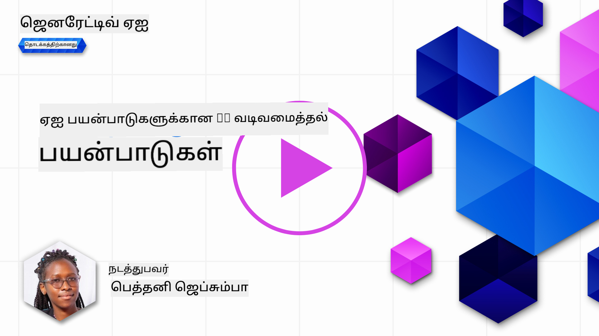
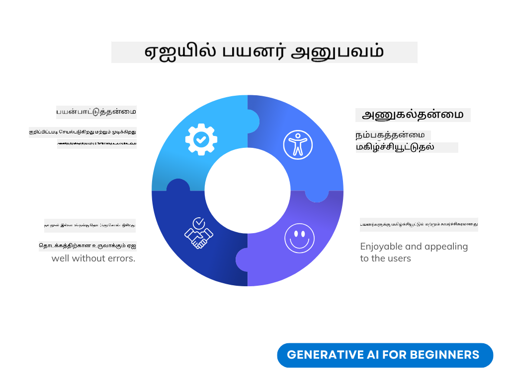
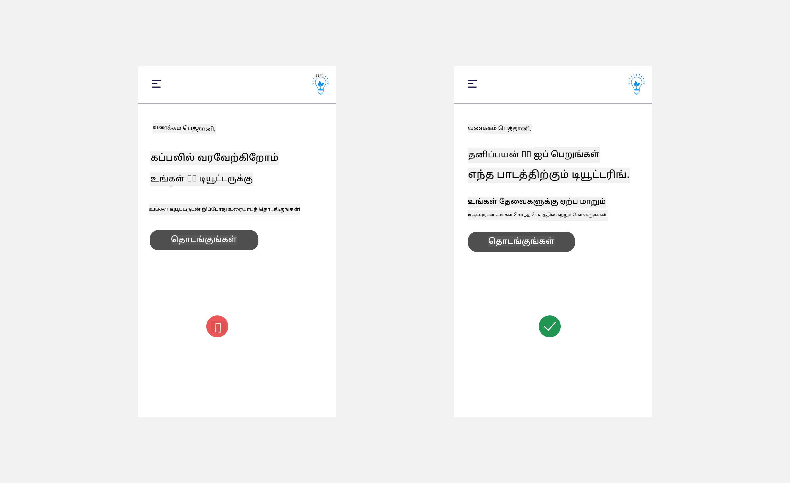
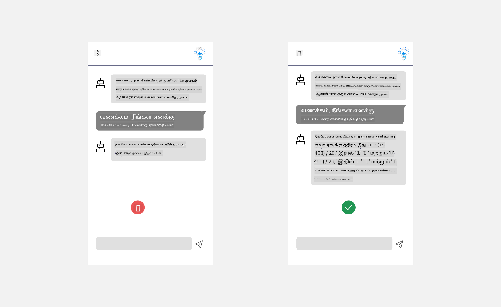
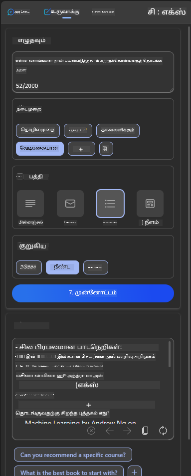

<!--
CO_OP_TRANSLATOR_METADATA:
{
  "original_hash": "747668e4c53d067369f06e9ec2e6313e",
  "translation_date": "2025-10-11T11:51:34+00:00",
  "source_file": "12-designing-ux-for-ai-applications/README.md",
  "language_code": "ta"
}
-->
# AI பயன்பாடுகளுக்கான UX வடிவமைப்பு

> _(இந்த பாடத்தின் வீடியோவைப் பார்க்க மேலே உள்ள படத்தை கிளிக் செய்யவும்)_

பயனர் அனுபவம் என்பது பயன்பாடுகளை உருவாக்குவதில் மிகவும் முக்கியமான அம்சமாகும். உங்கள் பயன்பாட்டை பயனர்கள் செயல்பாடுகளைச் செய்ய திறமையாகப் பயன்படுத்த முடியும். திறமையாக இருப்பது ஒரு விஷயமாக இருந்தாலும், அனைவரும் பயன்படுத்தக்கூடிய வகையில் பயன்பாடுகளை வடிவமைக்க வேண்டும், அதாவது _அணுகல் வசதி_ கொண்டதாக. இந்த அத்தியாயம் இந்த பகுதியை மையமாகக் கொண்டுள்ளது, இதனால் நீங்கள் மக்கள் பயன்படுத்த விரும்பும் பயன்பாட்டை வடிவமைக்க முடியும்.

## அறிமுகம்

பயனர் அனுபவம் என்பது ஒரு பயனர் ஒரு குறிப்பிட்ட தயாரிப்பு அல்லது சேவையை (சிஸ்டம், கருவி அல்லது வடிவமைப்பு) எப்படி தொடர்பு கொண்டு பயன்படுத்துகிறார்கள் என்பதைக் குறிக்கிறது. AI பயன்பாடுகளை உருவாக்கும்போது, டெவலப்பர்கள் பயனர் அனுபவத்தை பயனுள்ளதாகவும் நெறிமுறையுடனும் இருக்கச் செய்வதற்கே değil, நெறிமுறைகளுக்கு இணங்கவும் கவனம் செலுத்துகிறார்கள். இந்த பாடத்தில், பயனர் தேவைகளை பூர்த்தி செய்யும் செயற்கை நுண்ணறிவு (AI) பயன்பாடுகளை உருவாக்குவது எப்படி என்பதை நாம் கற்கிறோம்.

இந்த பாடத்தில் கீழ்க்கண்ட பகுதிகள் உள்ளடக்கமாக இருக்கும்:

- பயனர் அனுபவம் மற்றும் பயனர் தேவைகளைப் புரிந்துகொள்வது
- நம்பகத்தன்மை மற்றும் வெளிப்படைத்தன்மைக்காக AI பயன்பாடுகளை வடிவமைத்தல்
- ஒத்துழைப்பு மற்றும் கருத்துக்களுக்காக AI பயன்பாடுகளை வடிவமைத்தல்

## கற்கும் இலக்குகள்

இந்த பாடத்தை முடித்த பிறகு, நீங்கள்:

- பயனர் தேவைகளை பூர்த்தி செய்யும் AI பயன்பாடுகளை உருவாக்குவது எப்படி என்பதைப் புரிந்துகொள்வீர்கள்.
- நம்பகத்தன்மை மற்றும் ஒத்துழைப்பை ஊக்குவிக்கும் AI பயன்பாடுகளை வடிவமைப்பீர்கள்.

### முன் அறிவு

[பயனர் அனுபவம் மற்றும் வடிவமைப்பு சிந்தனை](https://learn.microsoft.com/training/modules/ux-design?WT.mc_id=academic-105485-koreyst) பற்றி மேலும் படிக்க சில நேரம் ஒதுக்கவும்.

## பயனர் அனுபவம் மற்றும் பயனர் தேவைகளைப் புரிந்துகொள்வது

எங்கள் கற்பனை கல்வி ஸ்டார்ட்அப் நிறுவனத்தில், இரண்டு முக்கிய பயனர்கள் உள்ளனர்: ஆசிரியர்கள் மற்றும் மாணவர்கள். இந்த இரண்டு பயனர்களுக்கும் தனித்துவமான தேவைகள் உள்ளன. பயனர் மையமாக்கப்பட்ட வடிவமைப்பு, தயாரிப்புகள் அதன் நோக்கத்திற்கு பொருத்தமாகவும் பயனுள்ளதாகவும் இருப்பதை உறுதிப்படுத்துகிறது.

பயன்பாடு **பயனுள்ளதாக, நம்பகமாக, அணுகல் வசதி கொண்ட மற்றும் மகிழ்ச்சிகரமாக** இருக்க வேண்டும், இது ஒரு நல்ல பயனர் அனுபவத்தை வழங்கும்.

### பயன்பாடு

பயனுள்ளதாக இருப்பது என்பது பயன்பாட்டின் செயல்பாடு அதன் நோக்கத்திற்கேற்ப பொருந்த வேண்டும் என்பதைக் குறிக்கிறது, உதாரணமாக மதிப்பீடு செயல்முறையை தானியங்கி செய்ய அல்லது மறுபார்வைக்கு ஃப்ளாஷ்கார்டுகளை உருவாக்க. மதிப்பீடு செயல்முறையை தானியங்கி செய்யும் பயன்பாடு, முன்கூட்டியே வரையறுக்கப்பட்ட அளவுகோல்களின் அடிப்படையில் மாணவர்களின் பணிக்கு துல்லியமாகவும் திறமையாகவும் மதிப்பெண்களை வழங்க வேண்டும். அதேபோல், மறுபார்வை ஃப்ளாஷ்கார்டுகளை உருவாக்கும் பயன்பாடு அதன் தரவின் அடிப்படையில் பொருத்தமான மற்றும் பலதரப்பட்ட கேள்விகளை உருவாக்க வேண்டும்.

### நம்பகத்தன்மை

நம்பகமாக இருப்பது என்பது பயன்பாடு அதன் பணியை தொடர்ந்து மற்றும் பிழையின்றி செய்ய வேண்டும் என்பதைக் குறிக்கிறது. ஆனால், மனிதர்களைப் போலவே AIவும் முழுமையானது அல்ல, மேலும் பிழைகளுக்கு ஆளாகக்கூடும். பயன்பாடுகள் பிழைகள் அல்லது எதிர்பாராத சூழல்களை சந்திக்கலாம், இது மனித தலையீடு அல்லது திருத்தத்தை தேவைப்படுத்தும். பிழைகளை நீங்கள் எப்படி கையாள்கிறீர்கள்? இந்த பாடத்தின் கடைசி பகுதியில், AI அமைப்புகள் மற்றும் பயன்பாடுகள் ஒத்துழைப்பு மற்றும் கருத்துக்களுக்காக எப்படி வடிவமைக்கப்படுகின்றன என்பதை நாம் கற்கிறோம்.

### அணுகல் வசதி

அணுகல் வசதி என்பது பல திறன்களைக் கொண்ட பயனர்களுக்கு, உட்பட மாற்றுத்திறன்களைக் கொண்டவர்களுக்கு, பயனர் அனுபவத்தை விரிவாக்குவதை குறிக்கிறது, இதனால் யாரும் புறக்கணிக்கப்பட மாட்டார்கள். அணுகல் வசதி வழிகாட்டுதல்கள் மற்றும் கொள்கைகளை பின்பற்றுவதன் மூலம், AI தீர்வுகள் அனைவருக்கும் உள்ளடக்கமாகவும், பயன்படக்கூடியதாகவும், பயனுள்ளதாகவும் மாறுகின்றன.

### மகிழ்ச்சிகரமானது

மகிழ்ச்சிகரமானது என்பது பயன்பாட்டை பயன்படுத்துவதில் மகிழ்ச்சியாக இருக்க வேண்டும் என்பதைக் குறிக்கிறது. ஒரு கவர்ச்சிகரமான பயனர் அனுபவம் பயனரை பயன்பாட்டிற்கு திரும்ப ஊக்குவிக்கவும், வணிக வருவாயை அதிகரிக்கவும் நேர்மறையான தாக்கத்தை ஏற்படுத்த முடியும்.

ஒவ்வொரு சவாலையும் AI மூலம் தீர்க்க முடியாது. AI உங்கள் பயனர் அனுபவத்தை மேம்படுத்துவதற்காக வருகிறது, அது கையேடு செயல்பாடுகளை தானியங்கி செய்யவோ அல்லது பயனர் அனுபவங்களை தனிப்பயனாக்கவோ இருக்கட்டும்.

## நம்பகத்தன்மை மற்றும் வெளிப்படைத்தன்மைக்காக AI பயன்பாடுகளை வடிவமைத்தல்

AI பயன்பாடுகளை வடிவமைக்கும் போது நம்பகத்தன்மையை உருவாக்குவது மிகவும் முக்கியம். நம்பகத்தன்மை என்பது ஒரு பயனர் பயன்பாடு வேலை செய்யும், தொடர்ந்து முடிவுகளை வழங்கும் மற்றும் பயனர் தேவைகளுக்கு பொருந்தும் முடிவுகளை வழங்கும் என்பதில் நம்பிக்கை கொண்டிருப்பதை உறுதிப்படுத்துகிறது. இந்த பகுதியில் உள்ள ஒரு அபாயம் நம்பகமின்மையும் அதிக நம்பகத்தன்மையும் ஆகும். நம்பகமின்மை என்பது ஒரு பயனர் AI அமைப்பில் குறைந்த அல்லது எந்த நம்பிக்கையும் இல்லாதது, இது பயனர் உங்கள் பயன்பாட்டை நிராகரிக்க வழிவகுக்கும். அதிக நம்பகத்தன்மை என்பது ஒரு பயனர் AI அமைப்பின் திறனை அதிகமாக மதிப்பீடு செய்வது, இது பயனர்கள் AI அமைப்பை மிக அதிகமாக நம்புவதற்கு வழிவகுக்கும். உதாரணமாக, ஒரு தானியங்கி மதிப்பீட்டு அமைப்பு அதிக நம்பகத்தன்மை உள்ள சூழலில் ஆசிரியர் சில காகிதங்களை மீண்டும் சரிபார்க்காமல், மதிப்பீட்டு அமைப்பு நன்றாக வேலை செய்கிறது என்பதை உறுதிப்படுத்தாமல் இருக்கலாம். இது மாணவர்களுக்கு அநியாயமான அல்லது தவறான மதிப்பெண்களை அல்லது கருத்து மற்றும் மேம்பாட்டிற்கான வாய்ப்புகளை தவறவிடலாம்.

நம்பகத்தன்மையை வடிவமைப்பின் மையமாக வைக்க இரண்டு வழிகள் விளக்கத்தன்மை மற்றும் கட்டுப்பாடு ஆகும்.

### விளக்கத்தன்மை

AI எதிர்கால தலைமுறைகளுக்கு அறிவு வழங்க உதவும்போது, AI முடிவுகள் எவ்வாறு எடுக்கப்படுகின்றன என்பதை ஆசிரியர்கள் மற்றும் பெற்றோர்கள் புரிந்துகொள்வது மிகவும் முக்கியம். இது விளக்கத்தன்மை - AI பயன்பாடுகள் முடிவுகளை எவ்வாறு எடுக்கின்றன என்பதைப் புரிந்துகொள்வது. விளக்கத்தன்மைக்காக வடிவமைப்பது என்பது AI வெளியீட்டிற்கு எவ்வாறு வந்தது என்பதை விளக்கும் விவரங்களைச் சேர்ப்பதை உள்ளடக்கியது. வெளியீடு மனிதனால் உருவாக்கப்படவில்லை, AI மூலம் உருவாக்கப்பட்டது என்பதை பார்வையாளர்கள் அறிந்திருக்க வேண்டும். உதாரணமாக, "உங்கள் டியூட்டருடன் இப்போது உரையாடத் தொடங்குங்கள்" என்பதற்குப் பதிலாக "உங்கள் தேவைகளுக்கு ஏற்ப AI டியூட்டரைப் பயன்படுத்தி, உங்கள் வேகத்தில் கற்றுக்கொள்ள உதவுங்கள்" என்று கூறுங்கள்.

AI பயனர் மற்றும் தனிப்பட்ட தரவுகளை எவ்வாறு பயன்படுத்துகிறது என்பதற்கான மற்றொரு உதாரணம். உதாரணமாக, மாணவர் என்ற தன்மை கொண்ட பயனருக்கு அவர்களின் தன்மையின் அடிப்படையில் வரையறைகள் இருக்கலாம். AI கேள்விகளுக்கான பதில்களை வெளிப்படுத்த முடியாது, ஆனால் அவர்கள் ஒரு பிரச்சினையை எவ்வாறு தீர்க்க முடியும் என்பதை அவர்கள் சிந்திக்க வழிநடத்த உதவலாம்.

விளக்கத்தன்மையின் கடைசி முக்கிய பகுதியாக விளக்கங்களை எளிமைப்படுத்துவது உள்ளது. மாணவர்கள் மற்றும் ஆசிரியர்கள் AI நிபுணர்கள் அல்ல, எனவே பயன்பாடு என்ன செய்ய முடியும் அல்லது முடியாது என்பதற்கான விளக்கங்கள் எளிமையாகவும் புரிந்துகொள்ள எளிதாகவும் இருக்க வேண்டும்.

### கட்டுப்பாடு

ஜெனரேட்டிவ் AI பயனர் மற்றும் AI இடையே ஒத்துழைப்பை உருவாக்குகிறது, உதாரணமாக ஒரு பயனர் வெவ்வேறு முடிவுகளுக்காக உந்துதல்களை மாற்ற முடியும். மேலும், ஒரு வெளியீடு உருவாக்கப்பட்ட பிறகு, பயனர்கள் முடிவுகளை மாற்ற முடியும், இது அவர்களுக்கு கட்டுப்பாட்டின் உணர்வை வழங்குகிறது. உதாரணமாக, Bing-ஐப் பயன்படுத்தும்போது, நீங்கள் உங்கள் உந்துதலை வடிவம், தொனி மற்றும் நீளம் அடிப்படையில் தனிப்பயனாக்க முடியும். மேலும், உங்கள் வெளியீட்டில் மாற்றங்களைச் சேர்த்து வெளியீட்டை மாற்ற முடியும், கீழே காட்டப்பட்டுள்ளது:

Bing-இல் உள்ள மற்றொரு அம்சம், பயனர் பயன்பாட்டின் மீது கட்டுப்பாட்டை வைத்திருக்க உதவுவது, AI பயன்படுத்தும் தரவிலிருந்து சேர்க்கவும் நீக்கவும் செய்யும் திறன். ஒரு பள்ளி பயன்பாட்டில், ஒரு மாணவர் தனது குறிப்புகளையும் ஆசிரியர்களின் வளங்களையும் மறுபார்வை பொருளாகப் பயன்படுத்த விரும்பலாம்.

> AI பயன்பாடுகளை வடிவமைக்கும் போது, அதன் திறன்களுக்கு தகுந்த நம்பிக்கையை உருவாக்குவதில் நோக்கமுடையது முக்கியம். இதைச் செய்ய ஒரு வழி, உந்துதல்களுக்கும் முடிவுகளுக்கும் இடையே ஒரு தடையை உருவாக்குவது. இது AI மற்றும் மனிதன் ஒரே மாதிரியானது அல்ல என்பதை பயனருக்கு நினைவூட்டுகிறது.

## ஒத்துழைப்பு மற்றும் கருத்துக்களுக்காக AI பயன்பாடுகளை வடிவமைத்தல்

முன்னதாக குறிப்பிடப்பட்டபடி, ஜெனரேட்டிவ் AI பயனர் மற்றும் AI இடையே ஒத்துழைப்பை உருவாக்குகிறது. பெரும்பாலான தொடர்புகள் ஒரு பயனர் உந்துதலை உள்ளிடுவதும் AI ஒரு வெளியீட்டை உருவாக்குவதும் ஆகும். வெளியீடு தவறாக இருந்தால் என்ன? பிழைகள் ஏற்பட்டால் பயன்பாடு அதை எப்படி கையாளுகிறது? AI பயனரை குற்றம் சாட்டுகிறதா அல்லது பிழையை விளக்க நேரம் எடுத்துக்கொள்கிறதா?

AI பயன்பாடுகள் கருத்துக்களைப் பெறவும் வழங்கவும் உருவாக்கப்பட வேண்டும். இது AI அமைப்பு மேம்பட உதவுவதுடன், பயனர்களுடன் நம்பகத்தன்மையை உருவாக்கவும் உதவுகிறது. ஒரு கருத்து மடக்கு வடிவமைப்பில் சேர்க்கப்பட வேண்டும், ஒரு எளிய "தலைகீழ் அல்லது மேலே" சின்னம் வெளியீட்டில் இருக்கலாம்.

இதைக் கையாளும் மற்றொரு வழி, அமைப்பின் திறன்கள் மற்றும் வரையறைகளை தெளிவாகச் சொல்லுவது. ஒரு பயனர் AI திறன்களுக்கு அப்பாற்பட்டதை கோரும்போது, அதை கையாள ஒரு வழி இருக்க வேண்டும், கீழே காட்டப்பட்டுள்ளது:

அமைப்பு பிழைகள் பயன்பாடுகளுடன் பொதுவானவை, அங்கு பயனர் AI-யின் வரம்புக்கு வெளியே உள்ள தகவலுக்கு உதவி தேவைப்படலாம் அல்லது பயன்பாட்டில் ஒரு பயனர் உருவாக்கும் கேள்விகள்/பாடங்கள் எண்ணிக்கையில் ஒரு வரம்பு இருக்கலாம். உதாரணமாக, வரையறுக்கப்பட்ட பாடங்களில் (உதாரணமாக, வரலாறு மற்றும் கணிதம்) தரவுடன் பயிற்சி பெற்ற AI பயன்பாடு புவியியல் தொடர்பான கேள்விகளை கையாள முடியாது. இதைத் தவிர்க்க, AI அமைப்பு "மன்னிக்கவும், எங்கள் தயாரிப்பு பின்வரும் பாடங்களில் தரவுடன் பயிற்சி பெற்றுள்ளது....., நீங்கள் கேட்ட கேள்விக்கு பதிலளிக்க முடியாது" போன்ற பதிலை வழங்க முடியும்.

AI பயன்பாடுகள் முழுமையானவை அல்ல, எனவே அவை தவறுகளைச் செய்ய வாய்ப்பு உள்ளது. உங்கள் பயன்பாடுகளை வடிவமைக்கும் போது, பயனர்களிடமிருந்து கருத்துக்களைப் பெறவும், பிழைகளை எளிமையாகவும் விளக்கமாகவும் கையாளவும் இடத்தை உருவாக்க வேண்டும்.

## பணிக்கான பணிகள்

நீங்கள் இதுவரை உருவாக்கிய எந்த AI பயன்பாடுகளையும் எடுத்துக்கொண்டு, உங்கள் பயன்பாட்டில் கீழே உள்ள படிகளை செயல்படுத்தவும்:

- **மகிழ்ச்சிகரமானது:** உங்கள் பயன்பாட்டை மேலும் மகிழ்ச்சிகரமாக மாற்ற நீங்கள் என்ன செய்ய முடியும் என்பதைப் பரிசீலிக்கவும். நீங்கள் எங்கு எங்கு விளக்கங்களைச் சேர்க்கிறீர்கள்? பயனரை ஆராய்ச்சிக்க ஊக்குவிக்கிறீர்களா? உங்கள் பிழை செய்திகளை எப்படி வார்த்தைகளால் கூறுகிறீர்கள்?

- **பயன்பாடு:** ஒரு வலை பயன்பாட்டை உருவாக்குதல். உங்கள் பயன்பாடு மவுஸ் மற்றும் விசைப்பலகை இரண்டையும் பயன்படுத்தி வழிநடத்தக்கூடியதாக இருக்க வேண்டும்.

- **நம்பகத்தன்மை மற்றும் வெளிப்படைத்தன்மை:** AI மற்றும் அதன் வெளியீட்டில் முழுமையாக நம்பிக்கை வைக்காதீர்கள், வெளியீட்டை சரிபார்க்க ஒரு மனிதனைச் சேர்ப்பது எப்படி என்பதைப் பரிசீலிக்கவும். மேலும், நம்பகத்தன்மை மற்றும் வெளிப்படைத்தன்மையை அடைய மற்ற வழிகளைப் பரிசீலித்து செயல்படுத்தவும்.

- **கட்டுப்பாடு:** பயன்பாட்டிற்கு தரவை வழங்கும் பயனருக்கு கட்டுப்பாட்டை வழங்குங்கள். AI பயன்பாட்டில் தரவுகளை சேகரிக்க பயனர் சேர்க்கவும் நீக்கவும் செய்யும் வழியை செயல்படுத்துங்கள்.

<!-- ## [பாடத்திற்குப் பிந்தைய வினாடி வினா](../../../12-designing-ux-for-ai-applications/quiz-url) -->

## உங்கள் கற்றலைத் தொடருங்கள்!

இந்த பாடத்தை முடித்த பிறகு, எங்கள் [ஜெனரேட்டிவ் AI கற்றல் தொகுப்பை](https://aka.ms/genai-collection?WT.mc_id=academic-105485-koreyst) பாருங்கள், உங்கள் ஜெனரேட்டிவ் AI அறிவை மேலும் மேம்படுத்த!

பாடம் 13-க்கு செல்லுங்கள், அங்கு [AI பயன்பாடுகளை பாதுகாப்பது](../13-securing-ai-applications/README.md?WT.mc_id=academic-105485-koreyst) எப்படி என்பதைப் பார்ப்போம்!

---

**குறிப்பு**:  
இந்த ஆவணம் [Co-op Translator](https://github.com/Azure/co-op-translator) என்ற AI மொழிபெயர்ப்பு சேவையைப் பயன்படுத்தி மொழிபெயர்க்கப்பட்டுள்ளது. நாங்கள் துல்லியத்திற்காக முயற்சிக்கின்றோம், ஆனால் தானியங்கி மொழிபெயர்ப்புகளில் பிழைகள் அல்லது தவறான தகவல்கள் இருக்கக்கூடும் என்பதை தயவுசெய்து கவனத்தில் கொள்ளுங்கள். அதன் தாய்மொழியில் உள்ள மூல ஆவணம் அதிகாரப்பூர்வ ஆதாரமாக கருதப்பட வேண்டும். முக்கியமான தகவல்களுக்கு, தொழில்முறை மனித மொழிபெயர்ப்பு பரிந்துரைக்கப்படுகிறது. இந்த மொழிபெயர்ப்பைப் பயன்படுத்துவதால் ஏற்படும் எந்த தவறான புரிதல்கள் அல்லது தவறான விளக்கங்களுக்கு நாங்கள் பொறுப்பல்ல.