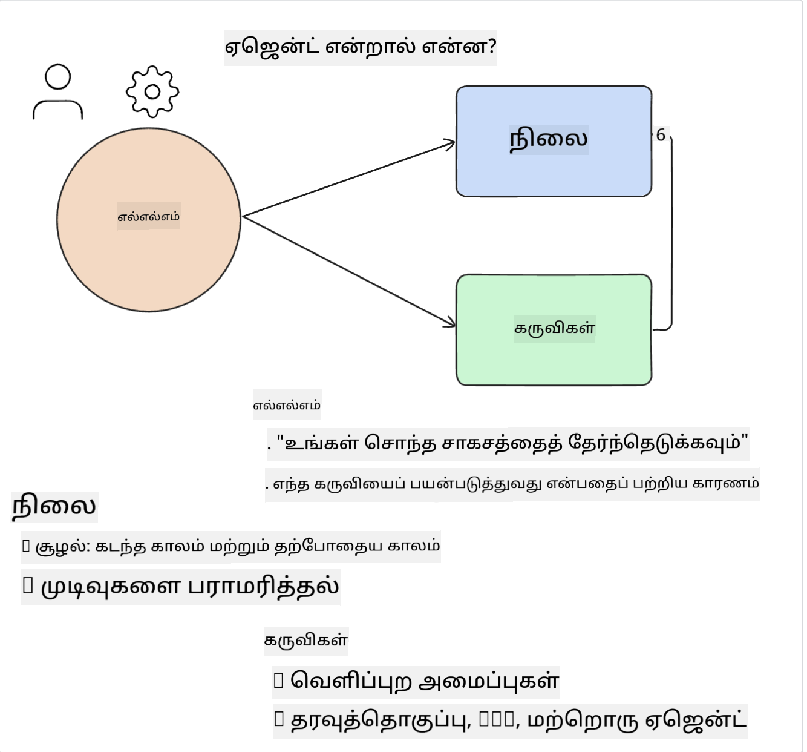
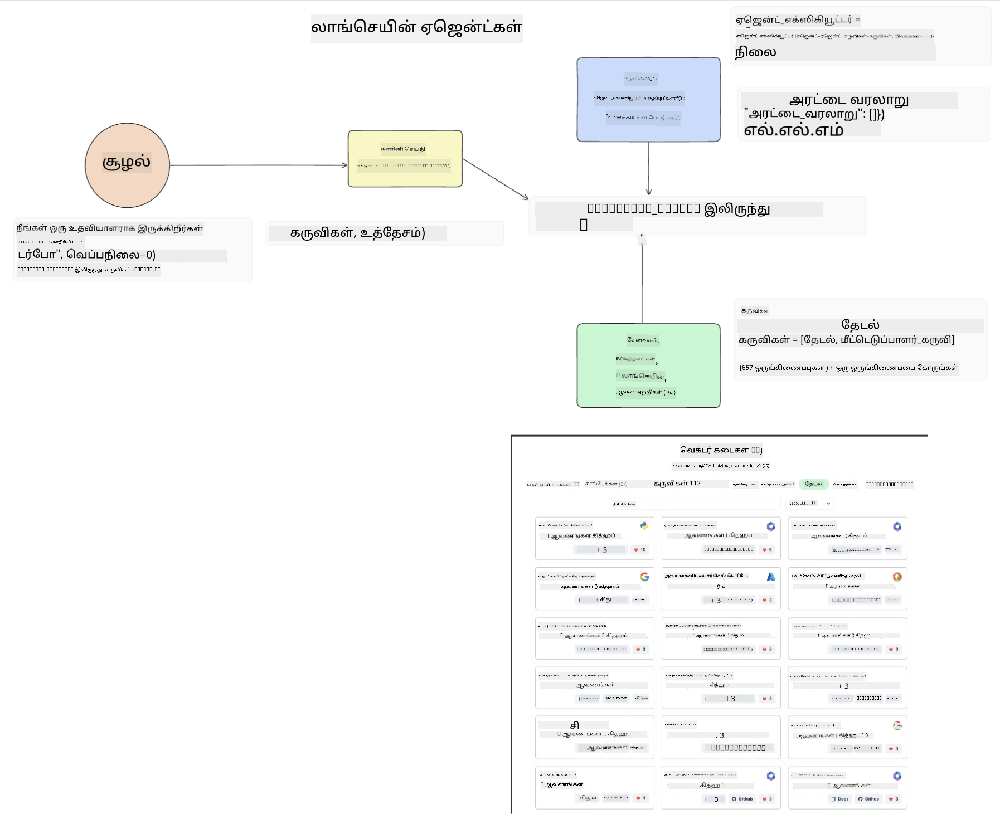

<!--
CO_OP_TRANSLATOR_METADATA:
{
  "original_hash": "11f03c81f190d9cbafd0f977dcbede6c",
  "translation_date": "2025-10-11T11:34:12+00:00",
  "source_file": "17-ai-agents/README.md",
  "language_code": "ta"
}
-->
[](https://aka.ms/gen-ai-lesson17-gh?WT.mc_id=academic-105485-koreyst)

## அறிமுகம்

AI Agents என்பது Generative AI இல் ஒரு சுவாரஸ்யமான முன்னேற்றத்தை பிரதிநிதித்துவப்படுத்துகிறது, இது பெரிய மொழி மாதிரிகளை (LLMs) உதவியாளர்களிலிருந்து நடவடிக்கை எடுக்கக்கூடிய முகவர்களாக உருவாக்க உதவுகிறது. AI Agent frameworks மூலம் டெவலப்பர்கள் LLMக்களுக்கு கருவிகள் மற்றும் நிலை மேலாண்மைக்கு அணுகலை வழங்கும் பயன்பாடுகளை உருவாக்க முடிகிறது. இந்த frameworks மேலும் தெளிவை மேம்படுத்துகிறது, இதன் மூலம் பயனர்கள் மற்றும் டெவலப்பர்கள் LLMக்கள் திட்டமிட்ட நடவடிக்கைகளை கண்காணிக்க முடிகிறது, இதனால் அனுபவ மேலாண்மை மேம்படுகிறது.

இந்த பாடம் கீழ்க்காணும் பகுதிகளை உள்ளடக்குகிறது:

- AI Agent என்றால் என்ன என்பதைப் புரிந்துகொள்வது - AI Agent என்பது என்ன?
- நான்கு வெவ்வேறு AI Agent Frameworkக்களை ஆராய்வது - அவற்றை தனித்துவமாக ஆக்குவது என்ன?
- இந்த AI Agentக்களை வெவ்வேறு பயன்பாடுகளில் பயன்படுத்துவது - எப்போது AI Agentக்களை பயன்படுத்த வேண்டும்?

## கற்றல் இலக்குகள்

இந்த பாடத்தை முடித்த பிறகு, நீங்கள்:

- AI Agentக்கள் என்ன மற்றும் அவற்றை எப்படி பயன்படுத்தலாம் என்பதை விளக்க முடியும்.
- சில பிரபலமான AI Agent Frameworkக்களின் வேறுபாடுகளைப் புரிந்துகொண்டு, அவற்றின் வேறுபாடுகளை அறிய முடியும்.
- AI Agentக்கள் எப்படி செயல்படுகின்றன என்பதைப் புரிந்து கொண்டு அவற்றுடன் பயன்பாடுகளை உருவாக்க முடியும்.

## AI Agentக்கள் என்றால் என்ன?

AI Agentக்கள் Generative AI உலகில் மிகவும் சுவாரஸ்யமான துறையாகும். இந்த சுவாரஸ்யத்துடன், சில நேரங்களில் சொற்களின் குழப்பமும் அவற்றின் பயன்பாடும் ஏற்படுகிறது. விஷயங்களை எளிமையாகவும், AI Agentக்களை குறிப்பிடும் பெரும்பாலான கருவிகளை உள்ளடக்கியதாகவும் வைத்திருக்க, நாம் இந்த வரையறையைப் பயன்படுத்தப் போகிறோம்:

AI Agentக்கள் பெரிய மொழி மாதிரிகளுக்கு (LLMs) **நிலை** மற்றும் **கருவிகள்** அணுகலை வழங்குவதன் மூலம் பணிகளைச் செய்ய அனுமதிக்கின்றன.



இந்த சொற்களை வரையறுக்கலாம்:

**பெரிய மொழி மாதிரிகள்** - இந்த பாடத்தில் GPT-3.5, GPT-4, Llama-2 போன்ற மாதிரிகள் குறிப்பிடப்படுகின்றன.

**நிலை** - இது LLM செயல்படும் சூழலை குறிக்கிறது. LLM தனது கடந்த செயல்பாடுகளின் சூழல் மற்றும் தற்போதைய சூழலைப் பயன்படுத்தி, அடுத்தடுத்த நடவடிக்கைகளுக்கான முடிவெடுப்பை வழிநடத்துகிறது. AI Agent Frameworkக்கள் டெவலப்பர்களுக்கு இந்த சூழலை எளிதாக பராமரிக்க உதவுகின்றன.

**கருவிகள்** - பயனர் கேட்ட பணியை முடிக்கவும், LLM திட்டமிட்ட செயல்பாடுகளை நிறைவேற்றவும், LLMக்கு கருவிகள் தேவை. கருவிகளின் சில உதாரணங்கள் ஒரு தரவுத்தொகுப்பு, API, வெளிப்புற பயன்பாடு அல்லது மற்றொரு LLM ஆக இருக்கலாம்!

இந்த வரையறைகள் உங்களுக்கு முன்னோக்கி நல்ல அடிப்படை தருவதாக இருக்கும், அவற்றை எப்படி செயல்படுத்துகிறோம் என்பதைப் பார்ப்போம். சில வெவ்வேறு AI Agent Frameworkக்களை ஆராய்வோம்:

## LangChain Agents

[LangChain Agents](https://python.langchain.com/docs/how_to/#agents?WT.mc_id=academic-105485-koreyst) என்பது மேலே கொடுக்கப்பட்ட வரையறைகளின் ஒரு செயல்பாடாகும்.

**நிலையை** மேலாண்மை செய்ய, இது `AgentExecutor` எனப்படும் ஒரு உள்ளமைக்கப்பட்ட செயல்பாட்டைப் பயன்படுத்துகிறது. இது வரையறுக்கப்பட்ட `agent` மற்றும் அதற்கு கிடைக்கும் `tools`ஐ ஏற்றுக்கொள்கிறது.

`Agent Executor` மேலும் உரையாடல் வரலாற்றைச் சேமிக்கிறது, உரையாடலின் சூழலை வழங்க.



LangChain ஒரு [கருவிகளின் பட்டியலை](https://integrations.langchain.com/tools?WT.mc_id=academic-105485-koreyst) வழங்குகிறது, இது உங்கள் பயன்பாட்டில் இறக்குமதி செய்ய LLMக்கு அணுகலை வழங்குகிறது. இவை சமூகத்தால் மற்றும் LangChain குழுவால் உருவாக்கப்பட்டவை.

இந்த கருவிகளை வரையறுத்து `Agent Executor`க்கு அனுப்பலாம்.

AI Agentக்களைப் பற்றி பேசும்போது தெளிவும் முக்கியமான அம்சமாகும். LLM எந்த கருவியை பயன்படுத்துகிறது மற்றும் ஏன் என்பதை பயன்பாட்டு டெவலப்பர்கள் புரிந்துகொள்ள வேண்டும். இதற்காக, LangChain குழு LangSmithஐ உருவாக்கியுள்ளது.

## AutoGen

அடுத்த AI Agent Framework [AutoGen](https://microsoft.github.io/autogen/?WT.mc_id=academic-105485-koreyst) ஆகும். AutoGen முக்கியமாக உரையாடல்களை மையமாகக் கொண்டது. Agents இரண்டும் **உரையாடக்கூடிய** மற்றும் **தனிப்பயனாக்கக்கூடிய**வையாக உள்ளன.

**உரையாடக்கூடியது -** LLMக்கள் மற்றொரு LLM உடன் உரையாடலைத் தொடங்கி தொடர முடியும், ஒரு பணியை முடிக்க. இது `AssistantAgents` உருவாக்கி, அதற்கு ஒரு குறிப்பிட்ட system message கொடுப்பதன் மூலம் செய்யப்படுகிறது.

```python

autogen.AssistantAgent( name="Coder", llm_config=llm_config, ) pm = autogen.AssistantAgent( name="Product_manager", system_message="Creative in software product ideas.", llm_config=llm_config, )

```

**தனிப்பயனாக்கக்கூடியது** - Agents LLMக்களாக மட்டுமல்லாமல், ஒரு பயனர் அல்லது கருவியாகவும் வரையறுக்கப்படலாம். டெவலப்பராக, நீங்கள் `UserProxyAgent`ஐ வரையறுக்க முடியும், இது ஒரு பணியை முடிக்க பயனரின் கருத்தை பெறுவதற்கான பொறுப்பை ஏற்கிறது. இந்த கருத்து பணியின் செயல்பாட்டை தொடரவோ அல்லது நிறுத்தவோ செய்ய முடியும்.

```python
user_proxy = UserProxyAgent(name="user_proxy")
```

### நிலை மற்றும் கருவிகள்

நிலையை மாற்றவும் மேலாண்மை செய்யவும், Assistant Agent Python code உருவாக்கி பணியை முடிக்கிறது.

இது செயல்முறையின் ஒரு உதாரணம்:


#### System Message மூலம் வரையறுக்கப்பட்ட LLM

```python
system_message="For weather related tasks, only use the functions you have been provided with. Reply TERMINATE when the task is done."
```

இந்த system message இந்த குறிப்பிட்ட LLMக்கு அதன் பணிக்குத் தொடர்புடைய செயல்பாடுகளை வழிநடத்துகிறது. AutoGen மூலம், நீங்கள் பல AssistantAgentsஐ வெவ்வேறு system messageக்களுடன் வரையறுக்க முடியும்.

#### பயனர் மூலம் உரையாடல் தொடங்கப்படுகிறது

```python
user_proxy.initiate_chat( chatbot, message="I am planning a trip to NYC next week, can you help me pick out what to wear? ", )

```

Human எனப்படும் user_proxyஇன் இந்த செய்தி Agent செயல்பாடுகளை ஆராய தொடங்கும்.

#### செயல்பாடு நிறைவேற்றப்படுகிறது

```bash
chatbot (to user_proxy):

***** Suggested tool Call: get_weather ***** Arguments: {"location":"New York City, NY","time_periond:"7","temperature_unit":"Celsius"} ******************************************************** --------------------------------------------------------------------------------

>>>>>>>> EXECUTING FUNCTION get_weather... user_proxy (to chatbot): ***** Response from calling function "get_weather" ***** 112.22727272727272 EUR ****************************************************************

```

ஆரம்ப உரையாடல் செயல்படுத்தப்பட்ட பிறகு, Agent பயன்படுத்த வேண்டிய கருவியை பரிந்துரைக்கும். இந்தச் சூழலில், இது `get_weather` எனப்படும் ஒரு செயல்பாடு. உங்கள் அமைப்பின் அடிப்படையில், இந்த செயல்பாடு Agent மூலம் தானாகவே செயல்படுத்தப்படலாம் அல்லது பயனர் உள்ளீட்டின் அடிப்படையில் செயல்படுத்தப்படலாம்.

AutoGen code samples பற்றிய [பட்டியலை](https://microsoft.github.io/autogen/docs/Examples/?WT.mc_id=academic-105485-koreyst) நீங்கள் காணலாம், இது எப்படி ஆரம்பிக்க வேண்டும் என்பதை மேலும் ஆராய உதவும்.

## Taskweaver

அடுத்த Agent Framework [Taskweaver](https://microsoft.github.io/TaskWeaver/?WT.mc_id=academic-105485-koreyst) ஆகும். இது "code-first" Agent என அழைக்கப்படுகிறது, ஏனெனில் இது `strings` உடன் மட்டுமல்லாமல் Python DataFrames உடன் வேலை செய்ய முடியும். இது தரவுகள் பகுப்பாய்வு மற்றும் உருவாக்க பணிகளுக்கு மிகவும் பயனுள்ளதாக இருக்கும். இது வரைபடங்கள் மற்றும் கோட்பட்டங்கள் உருவாக்குதல் அல்லது சீரற்ற எண்களை உருவாக்குதல் போன்றவற்றாக இருக்கலாம்.

### நிலை மற்றும் கருவிகள்

உரையாடலின் நிலையை மேலாண்மை செய்ய, Taskweaver `Planner` எனும் கருத்தை பயன்படுத்துகிறது. `Planner` என்பது LLM ஆகும், இது பயனர்களின் கோரிக்கையை எடுத்துக்கொண்டு, அதை நிறைவேற்ற தேவையான பணிகளை வரைபடமாக்குகிறது.

பணிகளை முடிக்க, `Planner` கருவிகளின் தொகுப்பான `Plugins`க்கு அணுகலை வழங்குகிறது. இது Python classes அல்லது பொதுவான code interpreter ஆக இருக்கலாம். இந்த plugins embeddings ஆக சேமிக்கப்படுகின்றன, இதனால் LLM சரியான pluginஐ தேடுவதில் சிறப்பாக இருக்கும்.


இது anomaly detectionஐ கையாள ஒரு plugin உதாரணம்:

```python
class AnomalyDetectionPlugin(Plugin): def __call__(self, df: pd.DataFrame, time_col_name: str, value_col_name: str):
```

Code செயல்படுத்துவதற்கு முன் சரிபார்க்கப்படுகிறது. Taskweaverஇல் நிலையை மேலாண்மை செய்ய மற்றொரு அம்சம் `experience`. Experience உரையாடலின் சூழலை நீண்ட காலத்திற்கு YAML கோப்பில் சேமிக்க அனுமதிக்கிறது. இது LLM முந்தைய உரையாடல்களுக்கு வெளிப்படுவதால் குறிப்பிட்ட பணிகளில் காலப்போக்கில் மேம்பட உதவுகிறது.

## JARVIS

கடைசி Agent Framework [JARVIS](https://github.com/microsoft/JARVIS?tab=readme-ov-file?WT.mc_id=academic-105485-koreyst) ஆகும். JARVISஐ தனித்துவமாக ஆக்குவது என்னவென்றால், இது உரையாடலின் `state`ஐ LLM மூலம் மேலாண்மை செய்கிறது, மற்றும் `tools` மற்ற AI மாதிரிகள் ஆகும். ஒவ்வொரு AI மாதிரிகளும் குறிப்பிட்ட பணிகளைச் செய்ய சிறப்பு பெற்ற மாதிரிகள் ஆகும், உதாரணமாக பொருள் கண்டறிதல், transcription அல்லது பட விளக்கம்.


LLM, ஒரு பொதுவான மாதிரியாக, பயனரின் கோரிக்கையைப் பெறுகிறது மற்றும் குறிப்பிட்ட பணியை மற்றும் அதை நிறைவேற்ற தேவையான arguments/dataஐ அடையாளம் காண்கிறது.

```python
[{"task": "object-detection", "id": 0, "dep": [-1], "args": {"image": "e1.jpg" }}]
```

LLM பின்னர் கோரிக்கையை JSON போன்ற வடிவத்தில் மாற்றுகிறது, இது சிறப்பு பெற்ற AI மாதிரிகள் புரிந்துகொள்ள முடியும். AI மாதிரி பணியின் அடிப்படையில் தனது முன்னறிவிப்பை திருப்பியதும், LLM பதிலைப் பெறுகிறது.

ஒரு பணியை முடிக்க பல மாதிரிகள் தேவைப்பட்டால், பயனருக்கு பதிலை உருவாக்குவதற்கு முன், அந்த மாதிரிகளின் பதில்களை LLM ஒருங்கிணைக்கும்.

கீழே உள்ள உதாரணம் ஒரு பயனர் ஒரு படத்தில் உள்ள பொருட்களின் விளக்கம் மற்றும் எண்ணிக்கையை கோரும்போது இது எப்படி செயல்படும் என்பதை காட்டுகிறது:

## பணிக்கட்டளை

AI Agentக்களை மேலும் கற்றுக்கொள்வதற்காக AutoGen மூலம் நீங்கள் உருவாக்கலாம்:

- கல்வி தொடக்க நிறுவனத்தின் வெவ்வேறு துறைகளுடன் ஒரு வணிகக் கூட்டத்தை ஒத்திகை செய்யும் ஒரு பயன்பாடு.
- LLMக்கள் வெவ்வேறு ஆளுமைகள் மற்றும் முன்னுரிமைகளைப் புரிந்துகொள்ள வழிநடத்தும் system messageக்களை உருவாக்கி, பயனருக்கு புதிய தயாரிப்பு யோசனையை முன்மொழிய அனுமதிக்கவும்.
- LLM பின்னர் ஒவ்வொரு துறையிலிருந்தும் தொடர்ச்சியான கேள்விகளை உருவாக்கி, யோசனையை மற்றும் தயாரிப்பு யோசனையை மேம்படுத்தவும்.

## கற்றல் இங்கு நிற்காது, பயணத்தை தொடருங்கள்

இந்த பாடத்தை முடித்த பிறகு, [Generative AI Learning collection](https://aka.ms/genai-collection?WT.mc_id=academic-105485-koreyst)ஐ பாருங்கள், Generative AI அறிவை மேலும் மேம்படுத்த!

---

**அறிவிப்பு**:  
இந்த ஆவணம் [Co-op Translator](https://github.com/Azure/co-op-translator) என்ற AI மொழிபெயர்ப்பு சேவையை பயன்படுத்தி மொழிபெயர்க்கப்பட்டுள்ளது. நாங்கள் துல்லியத்திற்காக முயற்சித்தாலும், தானியங்கி மொழிபெயர்ப்புகளில் பிழைகள் அல்லது துல்லியக்குறைபாடுகள் இருக்கக்கூடும் என்பதை கவனத்தில் கொள்ளவும். அதன் சொந்த மொழியில் உள்ள மூல ஆவணம் அதிகாரப்பூர்வ ஆதாரமாக கருதப்பட வேண்டும். முக்கியமான தகவல்களுக்கு, தொழில்முறை மனித மொழிபெயர்ப்பு பரிந்துரைக்கப்படுகிறது. இந்த மொழிபெயர்ப்பைப் பயன்படுத்துவதால் ஏற்படும் எந்த தவறான புரிதல்களுக்கும் அல்லது தவறான விளக்கங்களுக்கும் நாங்கள் பொறுப்பல்ல.